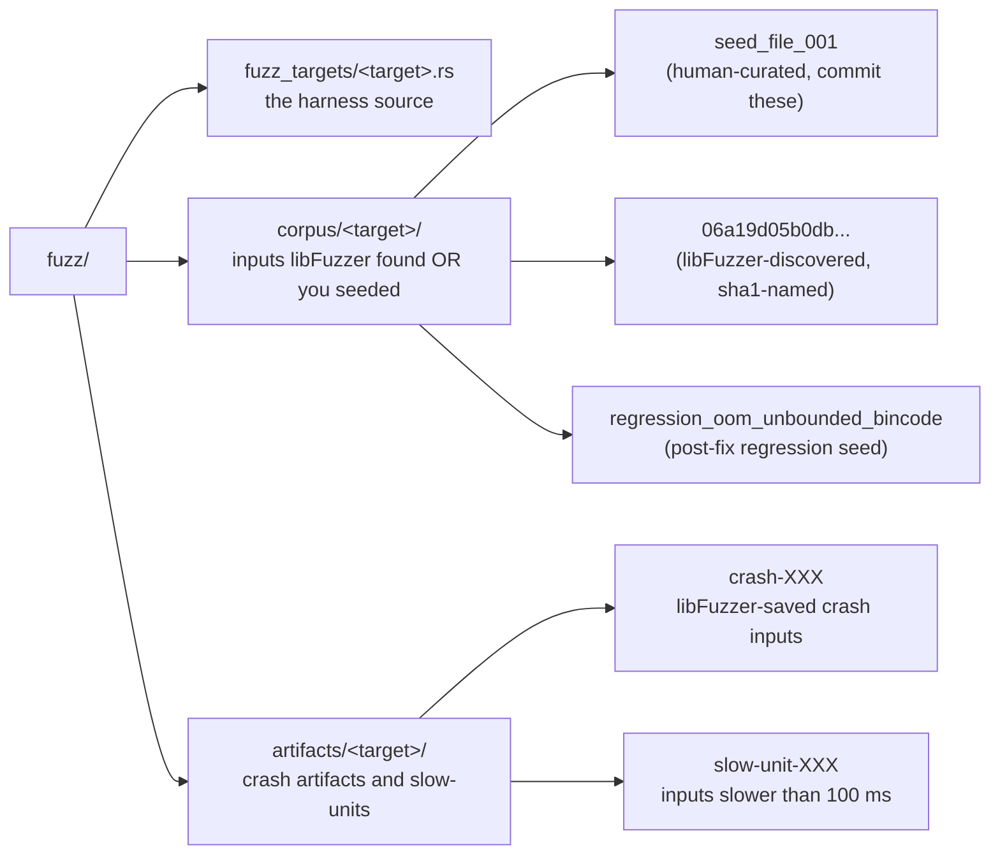

# Fuzzing

LUKSbox ships **two parallel fuzz setups**:

| | `fuzz/` (cargo-fuzz) | `fuzz-afl/` (cargo-afl) |
|---|---|---|
| Engine | libFuzzer | AFL++ |
| Use case | Local dev, fast iteration | Server, sustained, multi-core |
| Install | `cargo install cargo-fuzz` | `cargo install --version 0.15 afl` |
| Toolchain | nightly Rust (libFuzzer needs sanitizer) | stable Rust |
| Multicore | one process | master + N slaves, queue-sync |
| Per-iteration overhead | very low (in-process) | fork-and-exec (mitigated by persistent mode) |
| Where corpus lives | `fuzz/corpus/<target>/` | `fuzz-afl/seeds/<target>/` |
| Crash artifacts | `fuzz/artifacts/<target>/` | `fuzz-afl/runs/<target>/<stamp>/sync/*/crashes/` |

**Both setups share zero code intentionally.** Different fuzz engines
have different mutator personalities, bugs found by one but not the
other are common. We already had three: argon2-on-disk-DoS (libfuzzer
flagged via small-input grammar), cred_id-OOM (code-review found, both
setups verify), bincode-decode-OOM (found by libfuzzer's
`auth_then_process` target at 75 K iterations).

The orchestration approach we recommend: **libfuzzer for the inner
dev loop**, **AFL++ for the nightly / weekly server campaign**,
**both reading the same human-curated regression seeds**.

---

## Quick start, common operations

```bash
# Install the CLI tools (one-time per machine)
cargo install cargo-fuzz                     # libfuzzer
cargo install --locked --version 0.15 afl    # AFL++ (cargo-afl wrapper)

# List available targets (same names in both setups)
ls fuzz/fuzz_targets/      # cargo-fuzz
ls fuzz-afl/src/bin/        # cargo-afl

# Run one target locally for 60 seconds (libfuzzer)
cd /path/to/luksbox
cargo +nightly fuzz run header_parse -- -max_total_time=60

# Run one target on a server for 1 hour, 8 cores (AFL++)
./scripts/fuzz_server.sh header_parse 8 3600

# Run every target sequentially overnight (8h x 6 targets, 16 cores each)
./scripts/fuzz_server.sh all 16 28800
```

---

## Available targets

Targets in **bold** appear in both setups under the same name (the
shared subset that the orchestration scripts and CI both know
about). A target listed only in `fuzz/` is libfuzzer-only.

| Target | Parser tested | Attack surface | libfuzzer | AFL++ |
|---|---|---|---|---|
| **`header_parse`** | `Header::from_bytes` (8 KB header) | Magic / version / slot table / offsets | OK | OK |
| **`keyslot_parse`** | `Keyslot::from_bytes` (512 B slot) | Kind, KDF params, V1/V2/V3 layout selector, cred_id length cap (128 B for V1/V2, 352 B for V3), aad_version-driven offset dispatch | OK | OK |
| **`metadata_parse`** | `metadata::read_metadata` pre-AEAD | Nonce, ct_len framing | OK | OK |
| `header_roundtrip` | `Header::from_bytes` -> `to_bytes` -> `from_bytes` | Serializer/parser asymmetry. Asserts `aad_version`, `fido2_cred_id`, and `fido2_hmac_salt` round-trip byte-identical (catches V1/V2 vs V3 layout drift between read and write paths). | OK | - |
| **`hybrid_sidecar_parse`** | `hybrid_sidecar::read` (v1/v2) | Per-entry level byte -> variable entry size dispatch | OK | OK |
| `hybrid_sidecar_adversarial` | `hybrid_sidecar::read` driven against a real vault | Duplicate-slot-idx, overrun, level-byte-mutation rejection | OK | - |
| **`seed_file_parse`** | `seed_file::read` (`.kyber` files) | Magic, version, on-disk Argon2id params | OK | OK |
| **`auth_then_process`** | post-AEAD bincode-decode of `DirectoryTree` (with fixed MVK) | Decoder length-cap, BTreeMap construction, UTF-8 child names | OK | OK |
| `vfs_ops` | `Vfs::{mkdir,create,rename,unlink,lookup,readdir,write,flush}` with attacker-controlled name strings | UTF-8 garbage, embedded NUL, slashes, oversized, control chars, `..`, reserved Windows names | OK | - |
| `webauthn_device_path` | `luksbox_fido2::webauthn_paths` device-path classifier | Windows-style FIDO HID path strings | OK | - |
| `winfsp_path_parse` | `luksbox_mount::winfsp_path` parsers | Cross-platform path normalization (no FFI) | OK | - |
| **`deniable_header_parse`** | v2 deniable open path (`try_open_envelope_v2` + `complete_open_v2`) | No-oracle property: every failure collapses to `Error::OpaqueUnlockFailed` | OK | OK |
| **`slot_payload_decode`** | `SlotPayload::decode` (bypasses Argon2id) | Per-field caps, reserved-bytes-zero check, joint material budget, in-buffer offset arithmetic | OK | OK |
| **`slot_payload_roundtrip`** | `SlotPayload::new` -> `encode` -> `decode` with attacker-controlled length triples | Encoder/decoder symmetry; constructor rejections always justified | OK | OK |
| **`chunk_aead_decrypt`** | `aead::open` at the production chunk callsite with constructed AAD (`file_id || chunk_idx || generation`) | Per-chunk decrypt with attacker-controlled nonce + ct + tag (raw block device / NFS middlebox / ZFS snapshot rollback threat). Every read from a mounted vault flows through this AEAD call; previously only fuzzed transitively via `vfs_ops` with locally-produced ct. Added 2026-05. | OK | OK |
| **`anchor_parse`** | `anchor::read_and_verify` (48 B standard) + `anchor::deniable_read_and_verify` (256 B deniable) | Random bytes through both readers; truncation, magic-match-but-garbage, AEAD-fail. Added after the O_NOFOLLOW hardening in 2026-05 - defenses are most useful when fuzzed. | OK | OK |
| **`deniable_envelope_multi_slot`** | `try_open_envelope_v2` on real headers with fuzzer-selected slot occupancy | Multi-slot deniable open: builds a valid deniable header with a fuzzer-chosen subset of the 8 slots enrolled under a shared envelope passphrase, then drives the envelope-discovery loop with an attacker-supplied passphrase / cipher. Catches regressions to a NON-OPAQUE error variant or a panic on the multi-slot path. Added Round 12 (R12-01). | OK | OK |

`auth_then_process` is special: it requires a known MVK to encrypt
fuzz bytes into a "valid" metadata blob, then exercises the decoder
that runs **after** AEAD verification. The other parser targets
exercise attacker-pre-auth surfaces.

The three deniable-v2 targets (`slot_payload_decode`,
`slot_payload_roundtrip`, `deniable_header_parse`) were added after
the 2026-05 cryptographic audit. They cover the trust boundary the
audit hardened - `slot_payload_decode` directly fuzzes the structural
validator on AEAD-verified envelope plaintext, `slot_payload_roundtrip`
catches encoder/decoder asymmetries that would corrupt legitimate
vaults across save/load, and `deniable_header_parse` exercises the
full envelope-open flow with attacker-controlled passphrase + header
buffer + cipher choice.

The two 2026-05 additions (`chunk_aead_decrypt` and `anchor_parse`,
added after the post-audit hardening pass) cover surfaces that
previously had no direct fuzz coverage - every read from a mounted
vault flows through `chunk_aead_decrypt`'s callsite, and the anchor
readers gained `O_NOFOLLOW` + a GUI preflight that benefit from
adversarial coverage.

The Round 12 addition (`deniable_envelope_multi_slot`) is structurally
different from the existing `deniable_header_parse` target: instead
of feeding 36 KiB of fuzzer-controlled bytes, it builds a real, valid
deniable header at the start of each iteration with a fuzzer-chosen
slot occupancy bitmap, then drives the envelope-discovery loop with
an attacker passphrase / cipher. This covers the kind-disambiguation
path through `try_open_envelope_v2` that the (currently leaky, see
R12-01) constant-time invariant must protect. The timing-leak proper
is measured separately by the dudect bench
`crates/luksbox-format/benches/dudect_deniable_envelope.rs` - run
`cargo bench --bench dudect_deniable_envelope -p luksbox-format` to
reproduce.

### Constant-time verification (dudect benches)

| Bench | What it pins | How to run |
|---|---|---|
| `dudect_hmac_verify` | `Header::verify_hmac`, `subtle::ConstantTimeEq` | `cargo bench --bench dudect_hmac_verify -p luksbox-core` |
| `dudect_aead_open` | AEAD-open rejection path, no MAC-comparison oracle | `cargo bench --bench dudect_aead_open -p luksbox-core` |
| `dudect_slot_unlock` | Keyslot post-Argon2id unwrap | `cargo bench --bench dudect_slot_unlock -p luksbox-core` |
| `dudect_deniable_envelope` | Deniable envelope discovery loop (Round 12 R12-01) | `cargo bench --bench dudect_deniable_envelope -p luksbox-format` |
| `dudect_reference_leaky` | Known-leaky control for t-stat calibration | `cargo bench --bench dudect_reference_leaky -p luksbox-core` |

The acceptance bar is |t| < 3.0 sustained across 5 K - 50 K samples
per class. `dudect_deniable_envelope` is expected to FAIL on the
current branch (large |t|) until the R12-01 fix lands; the bench is
the regression gate the fix needs to satisfy.

### Dual-engine policy + shared corpus

libFuzzer (sancov-driven, in-process) and AFL++ (queue + havoc,
fork-based) find different bug classes on the same target. The repo
keeps both engines wired for the highest-grammar-density targets
(everything marked OK in both columns of the table above) and shares
the corpus directories between them:

- libFuzzer reads/writes `fuzz/corpus/<target>/`
- AFL++ reads `fuzz-afl/seeds/<target>/` as initial corpus and writes
  discovered inputs to `fuzz-afl/runs/<target>/<stamp>/sync/`
- Cross-pollination: after a campaign, copy interesting AFL-discovered
  inputs into the libFuzzer corpus (and vice versa) with
  `rsync -a --ignore-existing`. This lets each engine warm-start from
  the other's frontier.

When promoting a regression seed for a fixed bug, **always copy into
both directories** (see "Triage" above for the exact `cp` lines) so
the next campaign on either engine confirms the fix.

---

## cargo-fuzz (libfuzzer) workflow

### Setup

```bash
# 1. nightly Rust (libFuzzer needs sanitizer, only available on nightly)
rustup install nightly

# 2. cargo-fuzz CLI
cargo install cargo-fuzz

# 3. (Linux) clang for sanitizer linking
sudo apt install clang
```

### Running a target

```bash
cd /path/to/luksbox

# Run forever, Ctrl-C to stop
cargo +nightly fuzz run header_parse

# Run for 60 seconds
cargo +nightly fuzz run header_parse -- -max_total_time=60

# Run with multiple workers (one process per core; libfuzzer in-process model)
cargo +nightly fuzz run header_parse -- -fork=8 -max_total_time=300

# Replay a single saved input (e.g. to verify a fix)
cargo +nightly fuzz run header_parse fuzz/corpus/header_parse/regression_X -- -runs=1
```

### Output layout



### Triage a crash

```bash
# Reproduce
cargo +nightly fuzz run <target> fuzz/artifacts/<target>/crash-XXX -- -runs=1

# Get a stack trace
RUST_BACKTRACE=1 cargo +nightly fuzz run <target> fuzz/artifacts/<target>/crash-XXX -- -runs=1

# Minimize the input to the smallest reproducer
cargo +nightly fuzz tmin <target> fuzz/artifacts/<target>/crash-XXX
# -> writes minimized input back into fuzz/artifacts/<target>/

# Inspect the bytes
xxd fuzz/artifacts/<target>/crash-XXX
```

### Add a regression seed after fixing a bug

```bash
# Promote the minimized crash into the persistent corpus.
# Use a descriptive name so future-you knows what the seed targets.
mv fuzz/artifacts/<target>/crash-XXX fuzz/corpus/<target>/regression_<short-name>
git add fuzz/corpus/<target>/regression_<short-name>
git commit -m "fuzz: regression seed for <short-name>"
```

The next campaign will fuzz starting from that seed (cheap insurance
against re-introducing the bug).

### Add a new fuzz target

```bash
# 1. Write the harness
cat > fuzz/fuzz_targets/my_new_target.rs <<'EOF'
#![no_main]
use libfuzzer_sys::fuzz_target;
use luksbox_format::my_module;

fuzz_target!(|data: &[u8]| {
    let _ = my_module::parse(data);
});
EOF

# 2. Wire it into fuzz/Cargo.toml
cat >> fuzz/Cargo.toml <<'EOF'

[[bin]]
name = "my_new_target"
path = "fuzz_targets/my_new_target.rs"
test = false
doc = false
bench = false
EOF

# 3. Seed the corpus with valid + adversarial inputs
mkdir fuzz/corpus/my_new_target
echo -n "valid-shape-1" > fuzz/corpus/my_new_target/seed_001
# ... add more seeds covering edge cases

# 4. Run it
cargo +nightly fuzz run my_new_target -- -max_total_time=60
```

For complex targets the seed-corpus generation is best done in a
small Rust helper (see how `fuzz/corpus/auth_then_process/`'s seeds
were built, using real `bincode::serde::encode_to_vec` to produce
structurally valid starting points).

The header / keyslot / metadata seeds are generated by
[`crates/luksbox-format/examples/gen_fuzz_seeds.rs`](crates/luksbox-format/examples/gen_fuzz_seeds.rs).
Re-run it whenever the on-disk format changes (e.g. a new keyslot
layout version, a new cipher suite, a new metadata format), so the
seed corpus reflects the current production shapes:

```bash
cargo run -p luksbox-format --example gen_fuzz_seeds
```

Current seeds give libFuzzer / AFL a head start exploring:

| Target | Seeds | Coverage |
|---|---|---|
| `keyslot_parse` | `seed_empty`, `seed_pp`, `seed_fido` (V2 legacy, 17 B cred_id), `seed_fido_v3_yubikey` (V3, 64 B cred_id), `seed_fido_v3_titan` (V3, 288 B cred_id) | Empty slot fast-path, passphrase slot, all three AAD-version layouts, both ends of the realistic cred_id size spectrum |
| `header_parse` | `seed_aes`, `seed_chacha`, `seed_fido`, `seed_v3_multi` (passphrase + V3-small-cred + V3-large-cred in one header) | Both AEAD ciphers, both single- and multi-slot headers, mixed legacy / V3 slot-version headers |
| `header_roundtrip` | Same seeds as `header_parse` | The strengthened roundtrip check (asserts aad_version + fido2_cred_id + fido2_hmac_salt round-trip byte-identical) catches any V1/V2 vs V3 read/write drift |

### Feeding a corpus from another source

If you have inputs from elsewhere (network capture, fuzz-corpus
archive, peer project), drop them into `fuzz/corpus/<target>/`:

```bash
cp /path/to/external/inputs/* fuzz/corpus/<target>/
cargo +nightly fuzz run <target> -- -max_total_time=300
```

libFuzzer's coverage-guided minimisation will quickly drop redundant
inputs that don't cover new branches. Use `cargo fuzz cmin <target>`
to manually shrink the corpus (saves disk).

---

## cargo-afl (AFL++) workflow

See header of [`scripts/fuzz_server.sh`](scripts/fuzz_server.sh) for
the abridged playbook; full details below.

### Setup (server, one-time)

Tested on Debian/Ubuntu. RHEL analogues exist.

```bash
# 1. Toolchain
sudo apt install -y build-essential clang llvm pkg-config libfido2-dev
curl --proto '=https' --tlsv1.2 -sSf https://sh.rustup.rs | sh -s -- -y
. "$HOME/.cargo/env"

# 2. cargo-afl (uses AFL++ under the hood)
cargo install --locked --version 0.15 afl

# 3. Kernel tuning. Required (afl-fuzz refuses to start otherwise):
echo core | sudo tee /proc/sys/kernel/core_pattern

# Recommended (1.5-2x throughput):
echo performance | sudo tee \
  /sys/devices/system/cpu/cpu*/cpufreq/scaling_governor

# 4. ulimit for many parallel workers + their forks
ulimit -n 65536
```

If you can't change `core_pattern` (some hosting providers forbid
it), set `AFL_I_DONT_CARE_ABOUT_MISSING_CRASHES=1` before running.

### Build the harnesses

```bash
cd fuzz-afl
cargo afl build --release
ls target/release/         # one executable per harness, 30-50 MB each
```

Build-time flags pinned in `fuzz-afl/Cargo.toml` (debug-assertions,
overflow-checks, no LTO, codegen-units=1) for max instrumentation
density. The crate is **out of the workspace** so its build flags
don't contaminate the main `cargo build`/`cargo test`.

### Run a campaign

```bash
# Args: target, cores, runtime_seconds (0 = forever)
./scripts/fuzz_server.sh header_parse 8 3600          # 1 h on 8 cores
./scripts/fuzz_server.sh auth_then_process 16 86400   # 24 h on 16 cores
./scripts/fuzz_server.sh hybrid_sidecar_parse 4 0     # forever, Ctrl-C to stop
./scripts/fuzz_server.sh all 8 1800                   # 30 min x 6 targets
./scripts/fuzz_server.sh list                         # available targets
```

The script:

1. Pre-flight checks (toolchain present; warns about kernel/governor).
2. Builds the harnesses (idempotent).
3. Spawns 1 master + (cores-1) slaves via `afl-fuzz -M/-S`, all
   writing to a shared sync dir so AFL's queue-sync picks up new
   corpus inputs from siblings every few seconds.
4. Periodic `afl-whatsup` snapshots to `campaign.log`.
5. Ctrl-C -> cleanup -> final crashes/hangs count.

`AFL_AUTORESUME=1` is set, so re-running the same target picks up
where the previous campaign left off. Delete `fuzz-afl/runs/<target>/`
for a clean restart.

### Output layout

```
fuzz-afl/runs/<target>/<UTC-timestamp>/
+-- master.log                  stdout from master fuzzer
+-- slave_*.log                 stdout from each slave
+-- campaign.log                aggregated whatsup + final summary
+-- sync/
    +-- master/
    |   +-- queue/              corpus discovered by master
    |   +-- crashes/            inputs that crashed (THIS IS THE BUG)
    |   +-- hangs/              inputs exceeding the per-input timeout
    |   +-- fuzzer_stats        machine-readable progress
    |   +-- plot_data           for `afl-plot`
    +-- slave_1/, slave_2/, ...   same shape per slave
```

### Triage an AFL crash

```bash
# Reproduce
fuzz-afl/target/release/<target> < fuzz-afl/runs/.../sync/master/crashes/id:000000,*

# Stack trace
RUST_BACKTRACE=1 fuzz-afl/target/release/<target> \
    < fuzz-afl/runs/.../sync/master/crashes/id:000000,*

# Minimize
afl-tmin -i fuzz-afl/runs/.../sync/master/crashes/id:000000,* \
         -o /tmp/minimized \
         -- fuzz-afl/target/release/<target>
xxd /tmp/minimized
```

Once you've patched, **promote the minimized input to BOTH corpora**:

```bash
cp /tmp/minimized fuzz/corpus/<target>/regression_<short-name>
cp /tmp/minimized fuzz-afl/seeds/<target>/regression_<short-name>
git add fuzz/corpus/<target>/regression_<short-name> \
        fuzz-afl/seeds/<target>/regression_<short-name>
git commit -m "fuzz: regression seed for <short-name>"
```

### Multi-machine campaigns

AFL++'s sync-dir is rsync-friendly:

```bash
# Sync every 30 min from worker -> master
while sleep 1800; do
    rsync -a --delete-after fuzz-afl/runs/<target>/<stamp>/sync/ \
          master-host:/path/to/luksbox/fuzz-afl/runs/<target>/<stamp>/sync/
done
```

AFL's queue-sync handles dedup naturally, workers automatically pick
up corpus discovered on other hosts within a few seconds of seeing
the new files.

### Tuning for long campaigns

```bash
# 1. Pin the cargo target dir to a fast NVMe disk. AFL's per-input
#    fork bottleneck is filesystem syscalls.
export CARGO_TARGET_DIR=/fast-nvme/luksbox-fuzz-target
(cd fuzz-afl && cargo afl build --release)

# 2. Persistent mode is auto-enabled by `afl::fuzz!` macro, gives 10x
#    throughput vs naive fork-per-input. Nothing to configure.

# 3. Skip CPU 0 if your host runs other things on it
taskset -c 1-15 ./scripts/fuzz_server.sh header_parse 15 86400
```

---

## What's already been found

Documented in detail in [the audit history on the website](https://luksbox.penthertz.com/docs/security/audit/).
Three vulnerabilities, three fixes, 26 regression tests:

1. **Argon2id DoS** via hostile on-disk KDF parameters. Found via
   code-review during fuzz-target writing. Patched at
   `Keyslot::from_bytes` and `seed_file::read` with a safe-envelope
   predicate.
2. **cred_id OOM** via rogue/MITM FIDO2 device returning a hostile
   `credentialIdLength`. Found via code-review of FFI boundary.
   Patched in `HidAuthenticator::enroll` with a 4 KiB cap.
3. **Bincode-decode OOM** via hostile post-AEAD metadata blob.
   **Found by libFuzzer at iteration 75 000** (within 30 seconds of
   running the new `auth_then_process` target). Patched in
   `Vfs::open` with a 64 MiB decoder cap.

All three have regression seeds in `fuzz/corpus/<target>/regression_*`
and `fuzz-afl/seeds/<target>/regression_*`. Both fuzz setups exercise
them on every campaign.

---

## CI integration

The repo's [`.github/workflows/ci.yml`](.github/workflows/ci.yml) runs
on every push and PR:

- Workspace tests (including the 26 security regression tests).
- `cargo fmt --check` and `cargo clippy -D warnings`.
- A 5-minute libFuzzer smoke pass per target, surfaces any
  trivially-reachable new bug introduced by a PR.

The longer (hours-to-days) AFL++ campaigns are intentionally NOT in
CI, they need dedicated hardware and don't fit the per-PR latency
budget. Run them manually on your server using
`scripts/fuzz_server.sh` as scheduled.

A separate [`.github/workflows/fuzz-nightly.yml`](.github/workflows/fuzz-nightly.yml)
runs each libFuzzer target for 30 min nightly, a middle ground
between "every-PR smoke" and "weekly server campaign".
