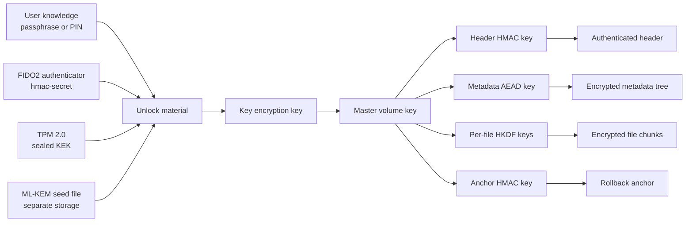
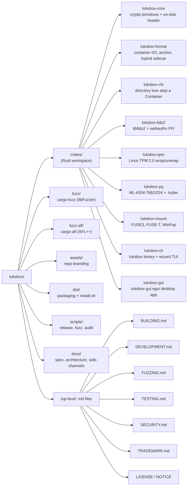

<!-- markdownlint-disable MD041 -->

<p align="center">
  <a href="https://luksbox.penthertz.com/">
    
  </a>
</p>

<h1 align="center">LUKSbox</h1>

<p align="center">
  <strong>Encrypted vaults that survive the next decade.</strong><br>
  Open-source, FIDO2 + TPM 2.0 native, post-quantum-ready.<br>
  <em>Store sensitive files in the cloud or on shared media without trusting the host.</em>
</p>

<p align="center">
  <a href="https://penthertz.com" title="By Penthertz">
    Built by
    
  </a>
</p>

<p align="center">
  <a href="https://luksbox.penthertz.com/"><strong>Website</strong></a> |
  <a href="https://luksbox.penthertz.com/docs/"><strong>Docs</strong></a> |
  <a href="https://luksbox.penthertz.com/docs/security/architecture/"><strong>Security</strong></a> |
  <a href="https://luksbox.penthertz.com/docs/security/tests/"><strong>Fuzzing</strong></a> |
  <a href="https://luksbox.penthertz.com/compare/"><strong>Compare</strong></a>
</p>

<p align="center">
  <a href="LICENSE"></a>
  <a href="https://www.rust-lang.org/"></a>
  
</p>

---

## What it solves

You probably already store sensitive files where you don't fully
control the storage: cloud sync (iCloud, Drive, Dropbox, OneDrive,
S3, Backblaze), NAS units, USB sticks that travel, backup tapes that
end up at a recycler. The provider promises encryption-at-rest "with
their keys." LUKSbox encrypts the file before it ever leaves your
machine, under **your** keys, in a single container that is opaque to
the provider and tamper-evident on the way back.

A LUKSbox vault is one file (`.lbx`), optionally with a separate
header (`.hdr`) and post-quantum sidecar (`.kyber`) that you keep on
different storage. Drop it on any cloud or shared medium. The
provider sees one indistinguishable-from-random blob and cannot
decrypt it even under legal compulsion. Mount it locally as a real
drive when you need to use it.

| Concern | Plain cloud upload | Cloud + provider encryption | LUKSbox vault on cloud |
|---|---|---|---|
| Provider can read your files | Yes | Yes (they hold the key) | **No** |
| Government request to provider exposes data | Yes | Yes | **No** |
| Silent file tamper detected | No | Sometimes (TLS in transit only) | **Yes** (per-chunk AEAD) |
| Whole-vault rollback detected | No | No | **Yes** (anchor sidecar) |
| "Harvest now, decrypt later" (post-quantum) | Vulnerable | Vulnerable | **ML-KEM-768/1024 hybrid slot** |
| Hardware-key requirement to open | N/A | Provider-specific | **FIDO2 / TPM / Windows Hello** |
| Vault file looks like random data | No | No | **Yes** (with detached header) |
| Source you can audit | No | No | **Yes** (Apache-2.0) |

The full per-tool comparison (vs LUKS2 / VeraCrypt / age / gocryptfs /
Cryptomator / BitLocker / FileVault) lives at
<https://luksbox.penthertz.com/compare/>.

> **A LUKSbox vault is a *travelling* copy, not a *master* copy.**
> Use it for the cloud, a USB stick, a vault you share with a
> colleague or client, anywhere you would not put plaintext. Like
> every encrypted container it is a single point of failure: if the
> `.lbx` file is corrupted or every keyslot becomes inaccessible,
> the data is gone. The forensic toolkit (`header-backup`, `check`,
> `extract --tolerate-errors`) helps in many damage scenarios but
> cannot recover bytes that are no longer on disk or no longer
> AEAD-tagged. Always keep an unencrypted copy somewhere you trust
> for any file you cannot afford to lose.

---

## Status

This is a **pre-1.0** release. The on-disk format is locked, the
cryptographic primitives are NIST/RFC standards built on RustCrypto,
and 9 internal audit rounds have shipped. External paid audit and
broader real-world deployment are the next milestones. The
cloud-storage threat model, provider can't read your data even under
subpoena, is what LUKSbox is built for and what it does today.

| Surface | State |
|---|---|
| `cargo test --workspace` | 200+ passing, 0 failing, 0 ignored |
| `cargo audit` (Linux/macOS) | 0 vulns / 0 unsound / 0 unmaintained |
| `cargo audit` (Windows) | 1 unmaintained (`registry`, transitive via WinFsp) |
| Internal audit rounds | 9 documented at <https://luksbox.penthertz.com/docs/security/audit/> (per-round details kept internal) |
| Third-party audit | not yet performed; engagement scope package available on request to `security@penthertz.com` |
| Fuzz iterations across 10 libFuzzer harnesses | 30M+ |

---

## How a vault is opened



The Master Volume Key (MVK) is the root secret. Keyslots do not
encrypt files directly; they wrap the MVK. Once a valid keyslot
unwraps the MVK, every other key in the vault is derived from it via
HKDF-SHA256 with a per-purpose `info` string. Lose the keyslot
material, lose the MVK; revoke a slot and that material is
permanently unable to recover the MVK from this vault.

For the full architecture map (on-disk graph, unlock sequence,
concurrency / crash-safety pipeline, on-disk footprint), see
<https://luksbox.penthertz.com/docs/security/architecture/>.

---

## Security mechanisms

| Mechanism | What it does | Where it lives |
|---|---|---|
| AES-256-GCM-SIV (default) / AES-256-GCM / ChaCha20-Poly1305 | AEAD on every file chunk and on the metadata blob | `crates/luksbox-core/src/aead.rs` |
| HMAC-SHA256 over the entire 8 KiB header | Detects header tampering once a keyslot unwraps the MVK | `crates/luksbox-core/src/header.rs` |
| HKDF-SHA256 with per-purpose `info` strings | Derives every subkey from the MVK; uniqueness verified by regression test | `crates/luksbox-core/src/key.rs` |
| Argon2id (default 256 MiB / 3 / 4) | Stretches passphrases; cost params bounded by parser to reject DoS attempts | `crates/luksbox-core/src/kdf.rs` |
| FIDO2 hmac-secret (CTAP2 sec.6.5) | Hardware-backed unlock, wrap mode or direct mode | `crates/luksbox-fido2/` |
| TPM 2.0 sealed KEK (Linux) | Bind a vault to the local chip; optional PIN; fused TPM+FIDO2 mode | `crates/luksbox-tpm/` |
| ML-KEM-768 / ML-KEM-1024 (FIPS 203) | Post-quantum half of every hybrid keyslot; classical+PQ mixed via HKDF | `crates/luksbox-pq/` |
| Per-chunk AAD (`file_id || chunk_index || generation`) | Detects chunk substitution, position swap, and replay of older chunks at the same position | `crates/luksbox-vfs/src/chunk.rs` |
| Detached header sidecar (`.hdr`) | Vault file alone is opaque random, no magic, no version, no keyslots | `crates/luksbox-format/src/container.rs` |
| Anchor sidecar (`.anchor`) | External rollback detection via MVK-keyed HMAC over a generation counter | `crates/luksbox-format/src/anchor.rs` |
| Lock-before-read open | Concurrent enrolls / revokes can't race on the keyslot table | `crates/luksbox-format/src/container.rs::open` |
| Post-lock path-inode re-stat | Catches narrow open-then-rename TOCTOU swaps with `Error::PathSubstituted` | `crates/luksbox-format/src/container.rs::verify_path_inode` |
| Atomic temp + rename + parent-dir fsync | All sidecar writes survive power loss; works on POSIX (`fsync` on dir handle) and Windows (`FILE_FLAG_BACKUP_SEMANTICS` + `FlushFileBuffers`) | `crates/luksbox-core/src/file_util.rs` |
| `O_NOFOLLOW` on plaintext extraction | `luksbox get` refuses pre-existing symlink destinations to defeat attacker-staged symlink-target overwrites | `crates/luksbox-core/src/file_util.rs::secure_create_or_truncate` |
| `memfd_secret(2)` for the unlocked MVK on Linux 5.14+ | Excludes the MVK from coredumps and hibernate images; `mlock` + `Zeroize` fallback elsewhere | `crates/luksbox-core/src/secret_box.rs` |
| Workspace-wide `Zeroizing` audit on every secret-bearing intermediate | AEAD plaintext, HKDF I/O, ML-KEM shared, CLI/GUI PIN copies all scrub on drop | covered across `luksbox-core`, `luksbox-pq`, `luksbox-tpm`, `luksbox-cli` |

The full attack matrix (defended vs not defended) is at
<https://luksbox.penthertz.com/docs/security/threat-model/>.

---

## Quick start

```bash
# Create a vault (defaults: AES-256-GCM-SIV, Argon2id interactive)
luksbox create my-vault.lbx

# Mount it on a drive letter / mountpoint
luksbox mount my-vault.lbx /mnt/v       # Linux/macOS
luksbox mount my-vault.lbx Z:           # Windows

# Add a FIDO2 hardware factor
luksbox enroll my-vault.lbx --kind fido2

# Add a TPM 2.0 keyslot bound to this machine (Linux)
luksbox enroll my-vault.lbx --kind tpm2

# Hybrid post-quantum: needs a separate `.kyber` seed file
luksbox create my-vault.lbx --kind hybrid-pq \
    --pq-hybrid /media/usb/my.kyber

# v3 format: no per-vault size ceiling (default v2 caps around 10 GiB).
# Old LUKSbox binaries refuse v3 vaults -- opt in only when you need
# bigger vaults than the v2 default can hold.
luksbox create my-vault.lbx --format v3

# Migrate an existing v2 vault to v3 (source untouched)
luksbox migrate-to-v3 old-v2.lbx --dst new-v3.lbx

# Interactive walkthrough, no flags to remember
luksbox wizard
```

Three interfaces, one on-disk format: the `luksbox` CLI for scripts,
the `luksbox wizard` interactive TUI, and the `luksbox-gui` desktop
application. See <https://luksbox.penthertz.com/docs/> for per-flow
walkthroughs.

---

## Install

| Platform | Method |
|---|---|
| Debian / Ubuntu / Mint | `.deb` from [Releases](https://github.com/penthertz/LUKSbox/releases), `sudo apt install ./luksbox_*_amd64.deb` |
| Fedora / RHEL / Rocky | `.rpm` from Releases, `sudo dnf install ./luksbox-*.x86_64.rpm` |
| macOS | `.dmg` from Releases, drag to /Applications, install macFUSE on first run |
| Windows | `LUKSboxSetup.exe` from Releases (bundles WinFsp); IT admins can use the bare `.msi` and install WinFsp separately |
| From source | `cargo build --release -p luksbox-cli -p luksbox-gui` after the deps in [`BUILDING.md`](BUILDING.md) |

The `.deb` and `.rpm` packages now Recommend `tpm-udev` + `tpm2-tools`
(Debian / Ubuntu) and `tpm2-tss` + `tpm2-tools` (Fedora / RHEL /
openSUSE), so installing them via `apt` / `dnf` brings the
`/dev/tpm*` udev rules and the `tss` system group along for the ride.
After install you still need to add yourself to the group once and
log back in, that is the Debian / Fedora convention for any package
that grants new device access:

```bash
sudo usermod -aG tss "$USER"
# log out + log back in, then verify:
id | tr , '\n' | grep tss
```

The Linux release tarball's `dist/install.sh --tpm-setup` does the
same thing for users who installed via tarball instead of `apt` /
`dnf` and don't have `tpm-udev` / `tpm2-tss` already.

---

## Help find bugs

LUKSbox is a young codebase. The cryptography rests on standardised
primitives and well-audited Rust libraries (RustCrypto, libfido2,
tss-esapi), but the integration layer and the on-disk format are
ours. We **want** external eyes on this.

### Run the fuzzers

Every parser that touches attacker-controlled bytes has a libFuzzer
harness in [`fuzz/`](fuzz/) and an AFL++ harness in
[`fuzz-afl/`](fuzz-afl/). PR CI runs each libFuzzer target for 5
minutes on the persistent corpus; a dedicated server runs the AFL++
campaigns for hours per release.

```bash
cargo install cargo-fuzz
cd fuzz
cargo +nightly fuzz run header_parse -- -max_total_time=300
```

The current target list (`header_parse`, `keyslot_parse`,
`metadata_parse`, `hybrid_sidecar_parse`, `seed_file_parse`,
`auth_then_process`, `header_roundtrip`, `winfsp_path_parse`,
`webauthn_device_path`, `vfs_ops`) plus per-target invariants is in
[`FUZZING.md`](FUZZING.md).

### Add corpus seeds

The fastest way to push fuzzing further is dropping a real-world input
file into [`fuzz/corpus/<target_name>/`](fuzz/corpus/) and opening a
PR. Examples that would help today:

- Real headers from old vault layouts (V1 / V2) for `header_parse`
- Authenticator-specific cred IDs (Google Titan, SoloKey stateless,
  Trezor) for `keyslot_parse`
- Edge-case Windows paths (UNC, network share, long path with
  device-namespace prefix) for `winfsp_path_parse`
- Truncated / extended `.hybrid` sidecars for `hybrid_sidecar_parse`

### Add a new fuzz target

If a parser doesn't have a harness yet and you can imagine an attacker
shaping its input, please add one. See the harness template in
[`FUZZING.md`](FUZZING.md).

### Suggest a regression test

If you spot a code path where invariants aren't tested but feel like
they should be, file a regular GitHub issue (label
`security-regression`) with the invariant in plain English. We write
the test and credit the suggestion in the changelog.

### Run the AFL++ campaign

[`scripts/fuzz_server.sh`](scripts/fuzz_server.sh) runs an AFL++
campaign indefinitely against any target. If you have spare cycles
and want to find something the libFuzzer 5-minute PR run misses, this
is the lever.

---

## Reporting issues

| Category | Channel | Priority |
|---|---|---|
| **Suspected vulnerability** (key recovery, plaintext disclosure, authentication bypass, FUSE/WinFsp escape, integer / memory unsafety reachable via a crafted vault file) | Email `security@penthertz.com` (PGP key in [`SECURITY.md`](SECURITY.md)). 72-hour acknowledgement SLA. **Do not** open a public issue. | **P0**, fix + advisory + coordinated disclosure |
| **Crash on a malformed input** that you can reproduce | GitHub issue with the input file attached and the crashing target name. Use the `fuzz-crash` label. | **P1**, reproducer + regression test in next release |
| **Functional bug** (CLI/GUI/wizard misbehaviour, mount problem, recovery-flow gap, on-disk format edge case) | GitHub issue with reproduction steps. Use the `bug` label. | **P2**, triaged within a week |
| **Documentation issue** (wrong claim, missing instruction, broken link, unclear wording) | GitHub issue or PR. Use the `docs` label. | **P3**, fixed in the next docs pass |
| **Feature request** | GitHub issue. Use the `feature` label. State your threat model so we can decide whether it fits the project's scope. | **P3**, discussed; may end up on the [roadmap](docs/TPM_FUTURE_IMPROVEMENTS.md) or declined with reason |
| **Audit assignment** (you want a scoped mandate to review a specific surface) | Email `security@penthertz.com`. We hand you a focused scope (e.g. unsafe Rust in the FIDO2 FFI, CLI argument parser, FUSE adapter) plus a write-up template. | scheduled |

Suspected vulnerabilities take priority over everything else. We
respond within 72 hours and credit reporters in the public changelog
+ in any advisory we publish.

---

## Repository layout



---

## Documentation

The full documentation lives at <https://luksbox.penthertz.com/>:

| Section | Contents |
|---|---|
| [Documentation hub](https://luksbox.penthertz.com/docs/) | Install + per-flow walkthroughs (CLI / TUI / GUI) |
| [Keyslots](https://luksbox.penthertz.com/docs/keyslots/) | Passphrase, FIDO2, TPM 2.0, hybrid post-quantum |
| [Security](https://luksbox.penthertz.com/docs/security/) | Architecture (with diagrams), threat model, cryptography, tests, audit, disclosure |
| [Compare](https://luksbox.penthertz.com/compare/) | LUKSbox vs LUKS2 / VeraCrypt / age / gocryptfs / Cryptomator / BitLocker / FileVault |
| [FAQ](https://luksbox.penthertz.com/docs/faq/) | Cloud use, maturity, licensing, hardware support, recovery |

In-repo references for contributors:

- [`SECURITY.md`](SECURITY.md), disclosure policy + threat model summary
- [`BUILDING.md`](BUILDING.md), per-platform build instructions
- [`TESTING.md`](TESTING.md), test taxonomy + how to run each tier
- [`FUZZING.md`](FUZZING.md), fuzz harness setup + target list
- [`DEVELOPMENT.md`](DEVELOPMENT.md), maintainer dev workflow + release process
- [`docs/CRYPTO_SPEC.md`](docs/CRYPTO_SPEC.md), per-operation cryptographic walkthrough
- [`docs/SECURITY_ARCHITECTURE.md`](docs/SECURITY_ARCHITECTURE.md), security architecture map (mirrors the website page)
- [`docs/HARDWARE_SIDE_CHANNEL_NOTES.md`](docs/HARDWARE_SIDE_CHANNEL_NOTES.md), published side-channel attacks against FIDO2 silicon
- [`docs/TPM_LINUX_PERMISSIONS.md`](docs/TPM_LINUX_PERMISSIONS.md), end-user playbook for `/dev/tpmrm0` access
- [`docs/PROJECT_OVERVIEW.md`](docs/PROJECT_OVERVIEW.md), project overview + comparison vs LUKS2 / VeraCrypt
- [`docs/TPM_FUTURE_IMPROVEMENTS.md`](docs/TPM_FUTURE_IMPROVEMENTS.md), TPM roadmap (Windows TBS, PCR sealing)

---

## License

Source code is licensed under the
[Apache License, Version 2.0](LICENSE). LUKSbox is **OSI-approved
open source**: read the source, audit the cryptography, build it
yourself, modify it, redistribute it, and use it in any product
including commercial offerings that compete with LUKSbox. The Apache
2.0 grant includes an explicit patent license from every contributor,
which matters for a cryptography project.

What's explicitly NOT granted by the copyright license is the right
to use the LUKSbox or Penthertz **trademarks** in your derived work;
see [TRADEMARK.md](TRADEMARK.md). You can fork the code and ship it;
you cannot call your fork "LUKSbox" or imply endorsement by Penthertz.

The [NOTICE](NOTICE) file contains the attribution that downstream
redistributors must propagate (per the license's Notices section).

The [DISCLAIMER](DISCLAIMER.md) restates the no-warranty / no-liability
clauses (LICENSE sections 7 and 8), the data-loss reality of any
encrypted container, and the export-control responsibility, in plain
English. Read it once before relying on LUKSbox to protect material
information.

---

## Author

Maintained by **Sébastien Dudek**, Penthertz
([penthertz.com](https://penthertz.com),
[@PentHertz](https://x.com/PentHertz),
`security@penthertz.com`).
See [`SECURITY.md`](SECURITY.md) sec.1 for the responsible-disclosure flow.
