# LUKSbox cryptographic specification

A scenario-by-scenario walkthrough of what happens cryptographically
for every user-facing action. Plain English, no proofs, no math
notation beyond what a working programmer reads in code.

If you're looking for the threat model or the policy boilerplate,
read `SECURITY.md`. This document answers a different question: "I'm
about to click 'Open Vault' - what *exactly* happens to my key?"

---

## Table of contents

1. [Primitives reference card](#1-primitives-reference-card)
2. [Names and notation](#2-names-and-notation)
3. [What's on disk](#3-whats-on-disk)
4. [Scenario: create a passphrase vault](#4-scenario-create-a-passphrase-vault)
5. [Scenario: create a FIDO2-only vault](#5-scenario-create-a-fido2-only-vault)
6. [Scenario: create a FIDO2 + passphrase vault](#6-scenario-create-a-fido2--passphrase-vault)
7. [Scenario: create a Windows Hello vault](#7-scenario-create-a-windows-hello-vault)
8. [Scenario: create a hybrid post-quantum vault](#8-scenario-create-a-hybrid-post-quantum-vault)
9. [Scenario: open a vault (any passphrase slot)](#9-scenario-open-a-vault-any-passphrase-slot)
10. [Scenario: open a vault (any FIDO2 slot)](#10-scenario-open-a-vault-any-fido2-slot)
11. [Scenario: open a hybrid post-quantum vault](#11-scenario-open-a-hybrid-post-quantum-vault)
12. [Scenario: add a second keyslot (enroll)](#12-scenario-add-a-second-keyslot-enroll)
13. [Scenario: revoke a keyslot](#13-scenario-revoke-a-keyslot)
14. [Scenario: read a file](#14-scenario-read-a-file)
15. [Scenario: write a file](#15-scenario-write-a-file)
16. [Scenario: someone tampers with the vault](#16-scenario-someone-tampers-with-the-vault)
17. [Scenario: someone rolls the vault back to an old snapshot](#17-scenario-someone-rolls-the-vault-back-to-an-old-snapshot)
18. [Scenario: mount the vault as a drive](#18-scenario-mount-the-vault-as-a-drive)
19. [FIDO2 / CTAP2 deep dive: how it works and why it's secure](#19-fido2--ctap2-deep-dive-how-it-works-and-why-its-secure)
20. [Quick reference: what an attacker would need](#20-quick-reference-what-an-attacker-would-need)

---

## 1. Primitives reference card

| Primitive | What it does | Where used |
|---|---|---|
| **Argon2id** (RFC 9106) | Stretch a passphrase into a 32-byte key. Slow on purpose. Resistant to GPU/ASIC attacks. | Turning your passphrase into a KEK. |
| **HKDF-SHA256** (RFC 5869) | Derive labelled subkeys from a master key. Cheap. Different label = different key. | Per-file keys, per-purpose subkeys, hybrid mixing. |
| **HMAC-SHA256** (RFC 2104) | Authenticate data under a key. Detect tampering. | Header authentication, anchor-file authentication. |
| **AES-256-GCM-SIV** (RFC 8452) | Authenticated encryption. Default for new vaults. Survives accidental nonce reuse without leaking the key. | File chunks, vault metadata, keyslot wraps. |
| **AES-256-GCM** (NIST SP 800-38D) | Authenticated encryption. Faster but catastrophic on nonce reuse. | Same as above, kept for legacy vault compatibility. |
| **ChaCha20-Poly1305** (RFC 8439) | Authenticated encryption. Same nonce contract as AES-GCM. | Same as above, for hardware without AES acceleration. |
| **CTAP2 hmac-secret** (FIDO2 spec) | A FIDO2 authenticator computes `HMAC(device_secret, salt)` and returns it. The device never reveals `device_secret`. | Hardware-bound key derivation for FIDO2 keyslots. |
| **ML-KEM-768 / ML-KEM-1024** (FIPS 203) | Post-quantum key encapsulation. Lattice-based. Survives quantum attacks. | The PQ half of every hybrid keyslot. |
| **ECDH P-256** (NIST SP 800-56A) | Classical key agreement. Used inside CTAP2 for the PIN/UV protocol. | Inside the FIDO2 protocol layer (not the LUKSbox-level mixing). |
| **OS RNG** (`getrandom(2)` on Linux, `BCryptGenRandom` on Windows, `SecRandomCopyBytes` on macOS) | The only source of randomness in the codebase. | Every salt, nonce, and freshly generated key. |
| **memfd_secret(2)** (Linux 5.14+) | Memory pages unmappable from any other process; excluded from coredumps and hibernate snapshots. | Holding the Master Volume Key in RAM. |

---

## 2. Names and notation

- **MVK** = Master Volume Key. 32 random bytes. Generated once when
  the vault is created. Lives in `memfd_secret` pages while the vault
  is open. Encrypts everything in the vault, indirectly.
- **KEK** = Key-Encryption Key. 32 bytes. Derived per keyslot from
  whatever unlocks that slot (passphrase, FIDO2, hybrid). Used only
  to wrap/unwrap the MVK, never anything else.
- **Keyslot** = a 512-byte on-disk record holding (kind, salt, nonce,
  wrapped MVK ciphertext, FIDO2 cred ID, FIDO2 hmac salt, ...).
  A vault has 8 of them.
- **Header** = the first 8192 bytes of every `.lbx` file. Holds the
  format magic, cipher suite, KDF id, header salt, all 8 keyslots,
  and an HMAC at the end.
- **Header salt** = 32 random bytes per vault. Used as the salt in
  every HKDF derivation rooted at the MVK. Separates one vault from
  another even when the MVKs collide (which they don't, but the
  defence-in-depth costs nothing).
- **`.kyber`** = a separate small file containing the post-quantum
  decapsulation seed. Only present for hybrid vaults. The user is
  responsible for keeping it on different storage from the `.lbx`.
- **`.anchor`** = an optional 48-byte file containing the vault's
  monotonic write counter, MAC'd under an MVK-derived key. Detects
  rollback. Only useful when stored on different media from the `.lbx`.
- **AAD** = "associated data" passed to AEAD encryption. Not encrypted,
  but authenticated: a tampered AAD makes the tag check fail.
- **`||`** means byte-string concatenation.

---

## 3. What's on disk

A typical vault touches up to **eight distinct files** plus a small
number of GUI-only state files. Five are durable (created and kept);
three are transient (created during a write, renamed away on commit).

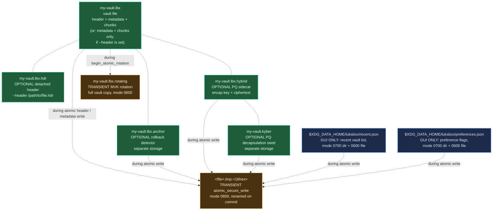

Concretely, on a vault that uses every optional artifact:

```
my-vault.lbx           <- the vault: header + metadata + chunks
my-vault.lbx.hdr       <- OPTIONAL: detached header (--header)
my-vault.lbx.anchor    <- OPTIONAL: rollback detector (separate storage)
my-vault.lbx.hybrid    <- OPTIONAL: PQ sidecar (encap key + ciphertext)
my-vault.kyber         <- OPTIONAL: PQ decapsulation seed (separate storage)
```

Subsections 3.4-3.9 below cover, in order: **detached headers**
(§3.4), the **`<file>.tmp.<16hex>` transient temp-file convention**
that every atomic update uses (§3.5), the **`<vault>.rotating`
MVK-rotation temp file** (§3.6), the GUI's **`$XDG_DATA_HOME/luksbox/`
state files** (§3.7), the **crash-orphan classification policy**
that tells the user what each leftover file means (§3.8), and the
**per-chunk encryption layering** (random nonce + binding AAD +
per-file derived key) that protects the chunk array (§3.9).

The `.lbx` itself is laid out as:

```
offset 0         : header (8192 bytes, includes 8 keyslots + HMAC)
offset 8192      : encrypted metadata blob (file tree, inode table)
offset data_off  : chunk array (each slot = nonce || ciphertext || tag)
```

Every chunk slot is exactly 4124 bytes:
- 12 bytes nonce
- 4096 bytes encrypted plaintext
- 16 bytes auth tag

A 1 MiB file occupies 256 chunk slots; size on disk is round numbers.

The header layout (first 8192 bytes) includes:

```
0..8     : magic "LUKSBOX1"
8..12    : version (major, minor)
12..16   : header_size (always 8192)
16..18   : cipher_suite (1=Aes256Gcm, 2=ChaCha20Poly1305, 3=Aes256GcmSiv)
18..20   : kdf_id (1=Argon2id)
20..24   : chunk_size (always 4096 in v1)
24..56   : header_salt (32 random bytes)
56..64   : metadata_offset
64..72   : metadata_size
72..80   : data_offset
80..84   : keyslot_count (always 8)
84..96   : flags + reserved
96..4192 : 8 keyslots x 512 bytes
4192..8160 : random padding (entropy obfuscation, not authenticated)
8160..8192 : HMAC-SHA256 over bytes 0..8160
```

Anyone with read access to the `.lbx` can see: the magic, version,
chunk size, that there are 8 keyslot regions (occupied or empty),
and the HMAC. Everything else is either random-looking ciphertext or
random padding.

### 3.1 On-disk file layout (ASCII)

```
+----------------------------------------------------------------+
| HEADER  (offset 0, size 8192 bytes)                            |
|   0..8     magic "LUKSBOX1"                                    |
|   8..12    version (major, minor)                              |
|   12..16   header_size = 8192                                  |
|   16..18   cipher_suite (1=GCM, 2=ChaCha20Poly1305, 3=GCM-SIV) |
|   18..20   kdf_id (1=Argon2id)                                 |
|   20..24   chunk_size = 4096                                   |
|   24..56   header_salt (32 random bytes)                       |
|   56..72   metadata_offset, metadata_size                      |
|   72..80   data_offset                                         |
|   80..96   keyslot_count = 8, flags, reserved                  |
|   96..608  Keyslot 0   (512 bytes)                             |
|   608..1120 Keyslot 1                                          |
|     ...                                                        |
|   3680..4192 Keyslot 7                                         |
|   4192..8160 random padding (entropy obfuscation)              |
|   8160..8192 HMAC-SHA256 over bytes 0..8160 (under MVK subkey) |
+----------------------------------------------------------------+
| METADATA BLOB  (offset 8192, size = metadata_size)             |
|   nonce(12) || AEAD(metadata_key, file_tree + inodes) || tag   |
+----------------------------------------------------------------+
| CHUNK 0  (offset data_offset, slot size 4124 bytes)            |
|   nonce(12) || AEAD(file_key, plaintext 4096) || tag(16)       |
+----------------------------------------------------------------+
| CHUNK 1, CHUNK 2, ... (same shape, sequential)                 |
+----------------------------------------------------------------+
```

### 3.2 Keyslot internal layout (512 bytes)

```
+----------+------------------------------------------------+
|   0      | kind (0=Empty, 1=Passphrase, 2=Fido2HmacSecret,|
|          |       3=Fido2DerivedMvk, 4-7=hybrid variants)  |
+----------+------------------------------------------------+
|   1      | aad_version (0=V1 legacy, 1=V2 legacy, 2=V3 current default) |
|   2..4   | reserved                                       |
|   4..20  | UUID (16 random bytes)                         |
|  20..24  | kdf_param_m_cost (Argon2id memory, KiB)        |
|  24..28  | kdf_param_t_cost (Argon2id iterations)         |
|  28..32  | kdf_param_p_cost (Argon2id lanes)              |
|  32..64  | kdf_salt (32 random bytes)                     |
|  64..76  | aead_nonce (12 random bytes)                   |
+----------+------------------------------------------------+
|  76..108 | wrapped_ct (32 bytes = encrypted MVK)          |
| 108..124 | wrapped_tag (16 bytes = AEAD auth tag)         |
+----------+------------------------------------------------+
| 124..126 | fido2_cred_id_len (u16, FIDO2 slots only)      |
| 126..128 | fido2_hmac_salt_len (u16)                      |
+----------+------------------------------------------------+
       (cred_id and hmac_salt offsets depend on aad_version)
+----------+------------------------------------------------+
| V1 / V2 layout (legacy, for vaults created pre-2026):     |
| 128..256 | fido2_cred_id (up to 128 bytes)                |
| 256..288 | fido2_hmac_salt (32 bytes)                     |
| 288..512 | random padding                                 |
+----------+------------------------------------------------+
| V3 layout (current default; supports stateless FIDO2):    |
| 128..480 | fido2_cred_id (up to 352 bytes)                |
| 480..512 | fido2_hmac_salt (32 bytes)                     |
+----------+------------------------------------------------+

AEAD AAD scope:
  V1 (legacy):       bytes [0..76] || header_salt
  V2 (legacy):       bytes [0..76] || bytes [124..288] || header_salt
                                       ^^^^^^^^^^^^^^^^
                                       cred_id + hmac_salt protected
  V3 (current):      bytes [0..76] || bytes [124..512] || header_salt
                                       ^^^^^^^^^^^^^^^^
                                       full extended cred_id (352 B max)
                                       + hmac_salt protected
```

**Why V3 exists**: some FIDO2 authenticators emit credential IDs
substantially larger than the typical YubiKey 64-byte case. Reported
sizes: Google Titan 288 B, SoloKey stateless mode 140 B, various
other vendors in the 100-300 B range. The exact format and reason
for the larger size vary per vendor (encoded wrapped private key,
embedded metadata, longer key handles for forward secrecy, etc.) and
aren't always publicly documented. The V1/V2 layout hard-capped at
128 bytes and silently rejected these devices with
`Fido2CredIdTooLong`. V3 reorganizes the slot to give cred_id 352
bytes of capacity (covers every authenticator we've seen reports of,
with margin) while keeping the slot size at 512 bytes, so on-disk
vault format isn't broken. New slots created by `Keyslot::new_*`
default to V3; V1/V2 vaults still on disk continue to read under
their original layout.

### 3.3 Key derivation tree

Everything in the vault traces back to the MVK by HKDF-SHA256 with a
unique `info` label per purpose. Different label = different key,
guaranteed by HKDF's design.

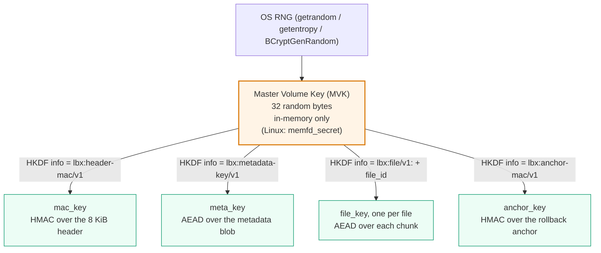

The MVK itself is wrapped under per-keyslot KEKs (one per unlock
factor), but those wraps are reversible only with the unlock factor
(passphrase, FIDO2 device, hybrid combo). The MVK is the root of
trust; the per-purpose subkeys are leaves.

### 3.4 Detached header mode

By default, the 8 KiB header lives at offset 0 of the `.lbx` and
`Container::open` reads it from there. Pass `--header /path/to/file.hdr`
to any subcommand (`create`, `open`, `mount`, `enroll`, `revoke`,
`rotate-mvk`, `info`) and the header moves to a separate file. The
`.lbx` then begins at the metadata region (offset 0 = encrypted
metadata blob, no plaintext bytes whatsoever).

What changes on disk:

```
DEFAULT (inline header):
  my-vault.lbx
    [0..8192]            header (magic, params, keyslots, HMAC)
    [8192..]             encrypted metadata blob, then chunk array

DETACHED HEADER (--header):
  my-vault.lbx.hdr
    [0..8192]            header
  my-vault.lbx
    [0..]                encrypted metadata blob, then chunk array
                         (NO magic, NO version, NO keyslots, opaque)
```

The detached-header file can sit on different storage from the
vault (USB stick, network share, separate cloud account). Without
it, the `.lbx` is indistinguishable from random data, there is no
on-disk way to tell it's a LUKSbox vault. With it, an attacker
needs to compromise both stores to mount any attack at all.

`Container::open` locks both files (`fs2::FileExt::try_lock_exclusive`
on each) before reading the header, so detached-header opens have
the same concurrency guarantees as inline opens (see §3 of
`docs/SECURITY_ARCHITECTURE.md` for the lock-then-read rule).

**Crash safety caveat for detached-header MVK rotation**: inline
rotation uses the `<vault>.rotating` two-file commit described in
§3.6. Detached-header rotation does **not** yet have a matching
two-file atomic commit across the vault and the header sidecar; a
crash mid-rotation can leave the pair inconsistent. **Back up the
detached header before rotating in that mode.** Tracked as a
known gap.

### 3.5 Transient temp files (`<file>.tmp.<16hex>`)

Every durable on-disk update LUKSbox makes goes through a single
helper, `atomic_secure_write`, defined at
`crates/luksbox-core/src/file_util.rs:202`. The helper takes a
target path and a byte payload and produces a crash-safe atomic
replacement using the standard temp-file + rename pattern:

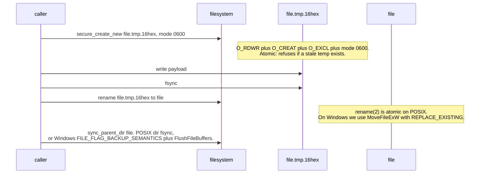

The 16-hex random suffix (8 bytes from `OsRng`) prevents two
parallel writers from racing on the same temp name, and the
`O_EXCL` open prevents resurrection of a stale temp from a previous
crash without explicit operator action.

**Every site that uses this primitive**:

| Production caller | Target path | Source location |
|---|---|---|
| Header rewrite during `enroll` / `revoke` / `rotate-mvk` | `<vault>.lbx` (or `<vault>.hdr` in detached mode) | `crates/luksbox-format/src/container.rs::persist_header` |
| Anchor sidecar update | `<vault>.lbx.anchor` | `crates/luksbox-format/src/anchor.rs:137` |
| Hybrid PQ sidecar (v3, with header binding) | `<vault>.lbx.hybrid` | `crates/luksbox-format/src/hybrid_sidecar.rs:157, 314` |
| Kyber seed file initial write | `<vault>.kyber` | `crates/luksbox-pq/src/seed_file.rs:136` |
| GUI recent-vaults list | `$XDG_DATA_HOME/luksbox/recent.json` | `crates/luksbox-gui/src/recent.rs:73` |
| GUI preferences | `$XDG_DATA_HOME/luksbox/preferences.json` | `crates/luksbox-gui/src/preferences.rs:52` |

In every case the temp file is mode 0600 from the moment it exists
(set via `O_EXCL | mode 0600`, not via post-create chmod, so even a
concurrent reader can't observe a wider-mode window). On a clean
exit from `atomic_secure_write` the temp is gone and only the final
target remains.

### 3.6 MVK rotation (`<vault>.rotating`)

`luksbox rotate-mvk` re-wraps every active keyslot under a new MVK
and re-encrypts every chunk's per-file key. For inline-mode vaults
this is wrapped in a two-file atomic commit so a crash leaves either
the old vault or the new vault on disk, never a half-rewritten one:

1. `Container::begin_atomic_rotation`, copy the original `.lbx`
   byte-for-byte to `<vault>.lbx.rotating` (a fixed-suffix sibling,
   NOT a `.tmp.<16hex>` random suffix). Mode 0600. Refuses if a
   stale `.rotating` exists; the operator must delete it manually
   so we don't silently overwrite recovery state.
2. The Container's open file handle swaps to point at the temp.
   All subsequent reads / writes (rekeying chunks, persisting the
   new header) land in the temp.
3. `Container::commit_atomic_rotation`, fsync the temp, then
   `rename(<vault>.lbx.rotating, <vault>.lbx)`, then fsync the
   parent dir (POSIX + Windows).

Source: `crates/luksbox-format/src/container.rs::begin_atomic_rotation`
(line 1484+) and `commit_atomic_rotation` (line 1543+).

The fixed-suffix naming is intentional: the temp file is large
(same size as the vault, potentially gigabytes) and the operator
needs to be able to find and recover it after a crash. The rotation
is the only LUKSbox operation that doesn't use the
`<file>.tmp.<16hex>` random-suffix convention.

### 3.7 GUI state files (`$XDG_DATA_HOME/luksbox/`)

The GUI maintains two persistent state files outside the vault
directory:

| File | Contents | Why it's security-relevant |
|---|---|---|
| `$XDG_DATA_HOME/luksbox/recent.json` | List of recently-opened vault paths, each with sidecar locations and capability flags (FIDO2 enrolled, hybrid-PQ present, TPM-bound, cipher choice) | Structural intelligence about the user's vault inventory, not the keys themselves, but enough for an attacker on the same multi-user host to enumerate "which files to steal and which authenticator to pursue" |
| `$XDG_DATA_HOME/luksbox/preferences.json` | GUI preference flags (panic-warning acknowledgement, last-used cipher choice, etc.) | Low sensitivity, but still 0600 by policy |

Both files use the same crash-safe write path described in §3.5
(temp + rename + parent-dir fsync) and the same 0600 file / 0700
parent-directory mode contract. The containing directory is created
with `secure_create_dir_all` so the mode is enforced regardless of
the user's umask. On Unix `dirs::data_dir()` resolves to
`$XDG_DATA_HOME` (typically `~/.local/share`).

The CLI does not write these files, they are GUI-only state.

### 3.8 Crash-orphan classification

A crash between `atomic_secure_write` opening the temp and renaming
it leaves a `<file>.tmp.<16hex>` orphan on disk. A crash during MVK
rotation leaves a `<vault>.lbx.rotating` orphan. The
`classify_tempfile_suffix` function at
`crates/luksbox-core/src/file_util.rs:282` is the source of truth
for what each suffix means and what the operator should do:

| Filename pattern | Origin | Recovery |
|---|---|---|
| `<base>.tmp.<exactly-16-lowercase-hex>` | `atomic_secure_write` orphan from a crashed sidecar / header rewrite. Contains a partial or fully-written but un-renamed payload. | Safe to delete after confirming the original target file is intact. The original target is unchanged because the rename never happened. |
| `<vault>.lbx.rotating` | `begin_atomic_rotation` orphan from a crashed MVK rotation. Contains a partial vault re-encryption under the new MVK. | If the rotation hadn't reached `commit_atomic_rotation`, the original vault is intact, delete the `.rotating` file and the rotation is undone. If the operator can determine the rotation completed ALL chunk rekeys before the crash, manual recovery is possible; the safer path is to start over from the original vault. **Never** delete a `.rotating` file without first confirming the original vault opens cleanly. |
| Any other `.tmp` / `.bak` / `~` etc. on a vault sibling path | Not produced by LUKSbox. Could be from the user's editor or a third-party sync tool. | Out of scope for the LUKSbox spec; treat per the producing tool's recovery contract. |

`luksbox info` surfaces a warning if it detects an orphan in the
vault's directory at open time. The CLI / GUI / wizard never
silently delete an orphan, operator action is required.

### 3.9 Per-chunk encryption layering

Every 4 KiB plaintext chunk that hits the chunk array (§3.1) is
protected by **three independent layers**: a fresh random nonce, a
binding AAD, and a per-file derived key. Each layer addresses a
different failure mode, and removing any one of them would weaken
a property the others can't recover:

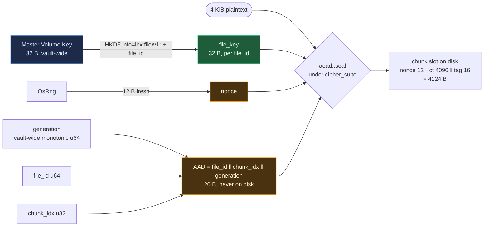

The three layers are:

| Layer | Width | Where it lives | Failure mode it defends against |
|---|---|---|---|
| **Random nonce** | 96 bits | Prepended to ciphertext on disk; fresh `OsRng` draw on every `write_chunk` (`crates/luksbox-vfs/src/chunk.rs:88-91`). | Two encryptions of the same chunk slot at different times use independent nonces. Without this, AES-GCM nonce reuse leaks the keystream and the GHASH key — a catastrophic break of confidentiality and integrity. |
| **Binding AAD** | 20 bytes (never on disk) | Reconstructed at read time from `file_id ‖ chunk_idx ‖ generation` (`crates/luksbox-vfs/src/chunk.rs:35-44`). The AAD itself isn't stored, only its effect on the AEAD tag is. | Cut-and-paste / chunk-shuffling: an attacker swapping chunk 7 of file A onto chunk 12 of file B fails the AEAD tag because `file_id` and `chunk_idx` no longer match. Replay of an older version of the *same* slot fails because the inode now records a higher `generation` than the saved AAD bytes. |
| **Per-file derived key** | 256 bits | `file_key = HKDF-Expand(MVK, info = "lbx:file/v1:" ‖ file_id_le, len = 32)` (`crates/luksbox-vfs/src/chunk.rs:125-130`). | The MVK never directly encrypts user data. Even a hypothetical nonce collision *within* one file leaves every other file untouched, and the same file_key is structurally never derivable for two distinct `file_id` values. |

**Why three layers and not two:**

- Removing the **per-file key** would let a within-vault nonce
  collision affect every file at once. With it, the birthday bound
  on random 96-bit nonces (≈ 2⁴⁸ writes for 2⁻³² collision
  probability under AES-GCM) is **per file**, not vault-wide. The
  default cipher suite, AES-256-GCM-SIV, makes this even safer:
  GCM-SIV is misuse-resistant — a nonce collision under GCM-SIV
  reveals only that two messages had the same plaintext, never the
  keystream or the GHASH key. Vaults created with the legacy
  `Aes256Gcm` suite still inherit the original NIST bound (2³² writes
  per file) and benefit from the per-file partition.

- Removing the **AAD** would let an attacker rearrange chunks
  without breaking the cipher: any chunk's ciphertext+nonce+tag
  would decrypt under the correct file_key regardless of where it
  was placed in the data area, and an attacker who saved the
  vault's bytes before a write could roll a single chunk back
  without rolling back the metadata. The `generation` field in the
  AAD is what closes the per-chunk replay window; the
  `file_id ‖ chunk_idx` fields close the cross-position swap window.

- Removing the **per-chunk random nonce** isn't an option for
  AES-GCM family ciphers at all: deterministic nonces under AES-GCM
  are catastrophic (the second use of a nonce reveals the keystream
  XOR of the two messages and lets the attacker forge arbitrary
  ciphertexts under that key).

**What this combination does and does not protect:**

- **Does protect:** confidentiality of every chunk's content,
  authenticity of every chunk's ciphertext, position-binding
  (`file_id ‖ chunk_idx`), per-chunk freshness (`generation`).

- **Does not protect against vault-wide rollback:** an attacker
  with read+write access to the `.lbx` who saves a snapshot at time
  T0 and restores it wholesale at time T1 sees every chunk, every
  AAD field, and every generation counter consistent with T0 — by
  design. The `.anchor` sidecar (§3 listing, §17) closes this gap
  by storing the current vault generation under a separate MAC and
  having `Container::open` cross-check it. Without the anchor, the
  per-chunk layering above is **strictly weaker** than rollback-
  detected mode by the difference between "T0 was a valid state"
  and "T0 is not the current state."

- **Does not hide chunk presence/count:** the chunk array's size
  reveals the on-disk byte count, so an observer can compute the
  number of allocated chunk slots. Logical file sizes are inside
  the encrypted metadata blob and not directly observable, but
  total occupancy of the data area is. The optional
  `--hide-size-header` flag obfuscates the boundary between
  metadata and chunk array but not the total file size.

**Cross-references:**
- §14 "Read a file" walks the operational read path (open the
  chunk slot, split nonce+ct+tag, compute the AAD, AEAD-open).
- §15 "Write a file" walks the write path (allocate or reuse
  slot, bump generation, fresh nonce, AEAD-seal, write back).
- §17 "Rollback" explains why anchor-based detection is the only
  defence the per-chunk layering can't provide on its own.

---

## 4. Scenario: create a passphrase vault

**You do:**

```bash
luksbox create my-vault.lbx
# -> Choose passphrase keyslot
# -> Type passphrase
```

**What happens:**

1. **Generate a Master Volume Key.** OS RNG gives us 32 random bytes.
   This is the MVK. It immediately moves into `memfd_secret` pages
   so it can't be read by other processes or end up in a coredump.
2. **Generate the header salt.** OS RNG gives us 32 more random bytes.
3. **Generate per-slot randoms.** For keyslot 0:
   - 16-byte UUID (so slots can be distinguished after rotation)
   - 32-byte KDF salt (so two vaults under the same passphrase get
     different KEKs)
   - 12-byte AEAD nonce (used to wrap the MVK below)
4. **Stretch the passphrase.**
   `KEK = Argon2id(passphrase, kdf_salt, m=256MiB, t=3, p=4)` ->
   32 bytes. Takes 500 ms on a modern laptop.
5. **Wrap the MVK.** Encrypt the 32-byte MVK under the KEK using the
   selected AEAD (default AES-256-GCM-SIV) with the per-slot nonce.
   The "associated data" includes: the slot kind byte, the AAD-version
   byte, the slot UUID, the KDF parameters, the KDF salt, the AEAD
   nonce, and the header salt. (For FIDO2 slots, also the credential
   ID and FIDO2 hmac salt - see section 5.)
6. **Compute the header HMAC.** Derive a header-MAC subkey from the
   MVK (`HKDF(MVK, header_salt, "lbx:header-mac/v1")`), then
   `HMAC-SHA256` over bytes 0..8160 of the header. Write the 32-byte
   tag at offset 8160.
7. **Write the vault file.** Header -> empty encrypted metadata blob ->
   empty chunk array. Wipe the KEK from RAM.

**What's stored:**

- **In the keyslot:** kind=Passphrase, UUID, KDF params, KDF salt,
  AEAD nonce, **wrapped MVK ciphertext + tag**, AAD-version byte. No
  passphrase, no derived KEK, no MVK. Just 32 random bytes that
  decrypt to the MVK only if you re-derive the same KEK.
- **In the header:** cipher suite, header salt, the keyslot, the HMAC.

**What an attacker would need to recover the MVK:**

- Either: brute-force the passphrase under Argon2id with m=256MiB,
  t=3, p=4. At 500 ms per guess on a laptop, a 6-character lowercase
  passphrase takes weeks; a 4-word diceware passphrase takes
  centuries.
- Or: directly recover the 32-byte MVK from the AEAD ciphertext,
  which means breaking AES-256-GCM-SIV (out of reach for anyone).

**Schema:**

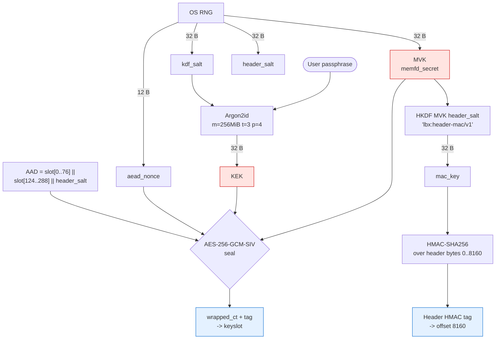

Pink boxes = secrets that exist only in RAM and never touch disk.
Blue boxes = the persisted ciphertext + tags an attacker would see
on disk.

---

## 5. Scenario: create a FIDO2-only vault

**You do:**

```bash
luksbox create my-vault.lbx --fido2-only
# -> Touch your security key
```

**What happens:**

There are two flavours of FIDO2 keyslot: **`Fido2HmacSecret`** (wraps a
random MVK; supports backup) and **`Fido2DerivedMvk`** (no wrap; the
MVK *is* the FIDO2 derivation; lose the key, lose the vault).
`--fido2-only` builds the second.

1. **Talk to the authenticator (CTAP2 makeCredential).** Send the
   security key a request to create a credential for the relying
   party `luksbox.local`, with the `hmac-secret` extension enabled.
   The user touches their key.
2. **Receive the credential ID.** This is a 16-256 byte opaque blob
   the device produced. We'll store it; the device uses it to find
   the right private key for assertions later.
3. **Pick a FIDO2 hmac salt.** OS RNG gives us 32 random bytes. This
   is the `salt` we feed to the device's hmac-secret extension.
4. **Ask the device for the hmac-secret value (CTAP2 getAssertion).**
   The user touches the key again. The device computes
   `HMAC(its_internal_secret, fido2_hmac_salt)` and returns 32 bytes.
   Note: this 32 bytes never travels in the clear, the CTAP2 protocol
   uses pinUvAuthProtocol v1 to encrypt it on the USB wire.
5. **Derive the MVK directly.**
   `MVK = HKDF(salt=fido2_hmac_salt, ikm=hmac_secret, info="lbx:mvk-fido/v1")`.
   No wrap, no KEK. The MVK exists only when the device is plugged in
   and produces the hmac-secret value. Without the device, no MVK.
6. **Write the header.** Same as the passphrase scenario, but with a
   `Fido2DerivedMvk` keyslot containing the credential ID and the
   FIDO2 hmac salt instead of a wrapped-MVK ciphertext.

**What's stored:**

- **In the keyslot:** kind=Fido2DerivedMvk, UUID, the credential ID,
  the FIDO2 hmac salt, AAD-version byte. Wrapped-MVK ciphertext field
  is all zeros (there's nothing to wrap).
- **On the device:** an entry in its credential database tied to
  `luksbox.local`, holding the device-internal HMAC key. Unreadable
  even with physical disassembly of the device's secure element.

**What an attacker would need:**

- Physical possession of the security key, AND knowledge of the
  PIN (CTAP2 requires user verification for hmac-secret).
- Without the key, the only material on disk is the credential ID and
  the FIDO2 hmac salt. Neither reveals the device-internal HMAC key.

**Trade-off:** lose the key, lose the vault. There is no backup MVK to
recover. For redundancy, use `Fido2HmacSecret` (the wrap version) and
enroll multiple security keys, each with their own slot.

**Schema (CTAP2 protocol exchange):**

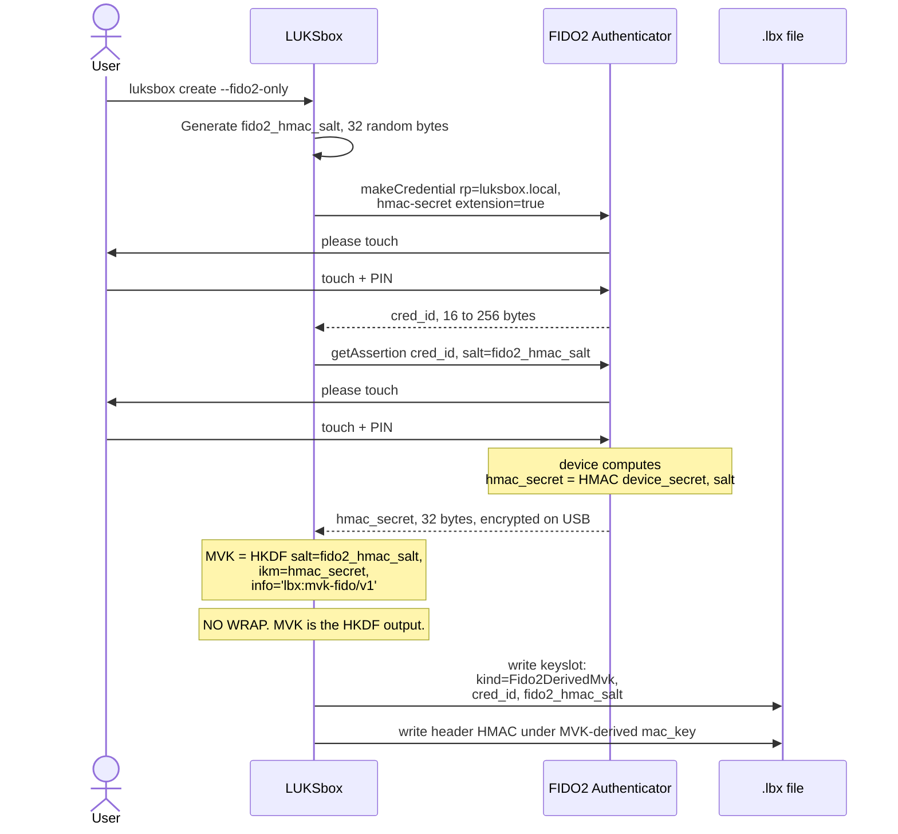

The hmac_secret value is the only thing tying the device to the
MVK. The device never reveals its internal HMAC key. Two different
devices producing the same `cred_id` (impossible by spec) would
still produce different hmac_secret outputs.

---

## 6. Scenario: create a FIDO2 + passphrase vault

**You do:**

```bash
luksbox create my-vault.lbx --fido2
# -> Touch your security key
# -> Type a passphrase (optional)
```

**What happens:**

This is the **`Fido2HmacSecret`** kind. The MVK is random and gets
wrapped under a KEK that combines BOTH a passphrase and a FIDO2
hmac-secret value. Both are required to unlock.

1. **Generate a fresh MVK.** Same as the passphrase scenario.
2. **Talk to the device, get cred ID + hmac_secret.** Same as section 5.
3. **Build the KEK input** with domain separation:
   `kdf_input = "lbx:fido" || passphrase || 0xff || hmac_secret`.
   The 0xff byte is a delimiter; it's not a valid UTF-8 byte, so it
   can't appear inside a passphrase. (The code rejects passphrases
   containing 0xff at the API boundary as a defence-in-depth check.)
4. **Stretch the combined input via Argon2id.**
   `KEK = Argon2id(kdf_input, kdf_salt, m=256MiB, t=3, p=4)`.
5. **Wrap the MVK** with the KEK + per-slot AEAD nonce. AAD includes
   slot fields + cred ID + FIDO2 hmac salt + header salt.
6. **Write the header.** Same as the passphrase scenario.

**What an attacker would need:**

- The security key (with PIN), AND the passphrase, AND access to the
  vault file. All three. Missing any one breaks the unlock.

If you set `passphrase = ""`, the construction degrades to "FIDO2 +
empty passphrase" - still requires the device, but anyone with the
device can unlock. Same security as `Fido2DerivedMvk` (section 5) but with
the trade-off that backup is now possible: the same MVK can be wrapped
in a second `Passphrase` slot for emergency recovery.

**Schema:**

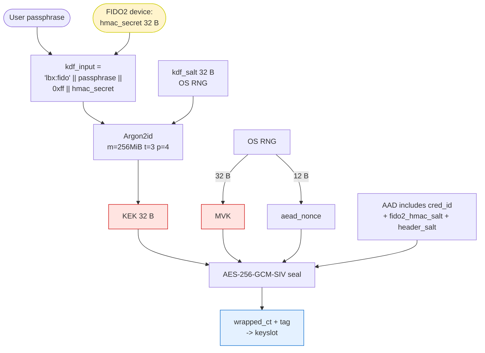

Yellow box = ephemeral input that exists only while the device is
plugged in and the user touches it.

---

## 7. Scenario: create a Windows Hello vault

**You do:**

```bash
luksbox create my-vault.lbx --fido2 --fido2-device webauthn://platform
# -> Face / fingerprint / PIN prompt
```

**What happens:**

Identical to section 6 (`Fido2HmacSecret` slot), with one twist: instead of
talking to a USB security key, we route the FIDO2 calls through
Microsoft's `webauthn.dll`. The OS prompts the user with Windows
Hello (face / fingerprint / PIN); the platform authenticator computes
the hmac-secret value internally; the rest of the flow is unchanged.

**Why this matters at all:** since Windows 10 1903, Microsoft reserved
the FIDO HID device class for the `webauthn.dll` system service. A
non-elevated process *cannot* directly talk to a USB security key;
trying it returns `ERROR_ACCESS_DENIED`. So on Windows the only path
that works without admin is `webauthn.dll`. As a bonus, it also
handles Windows Hello transparently - same API call, the user picks.

**Requirements:** Windows 11 22H2 or later. Earlier Windows Hello
versions don't expose the hmac-secret extension to webauthn.dll.

**What's different vs. section 6:**
- Nothing on disk. Same `Fido2HmacSecret` slot layout.
- The credential is anchored to your Windows user profile, not to a
  removable device. Replacing your laptop = need a backup keyslot
  (passphrase or second FIDO2 device).

---

## 8. Scenario: create a hybrid post-quantum vault

**You do:**

```bash
luksbox create my-vault.lbx --kind hybrid-pq
# -> Type passphrase
# -> Saves my-vault.kyber to a path you choose
```

**What happens:**

This is the **`HybridPqKemPassphrase`** kind (kind byte = 4). The KEK
combines a passphrase-stretched value AND a post-quantum shared
secret. Breaking the classical part alone is not enough; an attacker
also needs the `.kyber` seed file.

1. **Generate a fresh MVK.** Same as before.
2. **Generate an ML-KEM-768 keypair.** OS RNG seed -> 64-byte seed -> from
   the seed, derive the encapsulation key (1184 bytes) and the
   decapsulation key (which we never store; we always re-derive it
   from the seed when needed).
3. **Encapsulate against our own public key.**
   `(pq_ciphertext, pq_shared) = MlKem768::encapsulate(encap_key)`.
   `pq_shared` is 32 bytes, a one-shot symmetric secret.
4. **Build the hybrid KEK.**
   - First: `classical = Argon2id(passphrase, kdf_salt, params)`.
   - Mix: `ikm = classical || pq_shared` (64 bytes).
   - Final: `KEK = HKDF(salt=kdf_salt, ikm=ikm, info="lbx:hybrid-kek/v1")`.
   Both halves contribute through HKDF - breaking either alone
   doesn't recover the KEK.
5. **Wrap the MVK** under this KEK. Same AEAD as before.
6. **Write three files:**
   - `my-vault.lbx`: header + slot kind=4. Slot bytes look identical
     to a regular passphrase slot; only the kind byte differs.
   - `my-vault.lbx.hybrid`: the encapsulation key + ciphertext (the
     `pq_ciphertext` from step 3). Re-read at unlock time so we don't
     have to keep regenerating.
   - `my-vault.kyber`: the **seed** (64 bytes) needed to re-derive the
     decapsulation key. The user is told to store this on different
     storage (USB stick, password manager, etc.).

**Why the seed lives in a separate file:** the threat model assumes a
"harvest now, decrypt later" attacker who records the vault file
today and waits 10-20 years for a quantum computer that can break
classical primitives. If the seed were in the vault file, the
attacker would already have everything they need. By storing the
seed separately, the attacker has to also exfiltrate the seed file,
which the user keeps on different media.

**What's the difference between `--kind hybrid-pq` and `--kind hybrid-pq-1024`?**
The 768 variant uses ML-KEM-768 (NIST security category 3, ~AES-192).
The 1024 variant uses ML-KEM-1024 (NIST security category 5, ~AES-256).
Same flow, bigger blobs, slightly slower.

**What an attacker would need:**

- The passphrase (Argon2id-stretched), AND the `.kyber` seed file, AND
  the vault file.
- A quantum computer (CRQC) is the threat model where this matters: a
  CRQC can in principle break the classical Argon2id by inverting it
  - well, no, Argon2id resists quantum well too, but combined with
  classical brute force on a weak passphrase, the CRQC story is
  about reducing the search space. ML-KEM is designed to remain
  intact even against a CRQC, so the PQ half of the KEK acts as a
  hard floor: no matter what's broken classically, the attacker
  still needs the seed.

**Schema:**

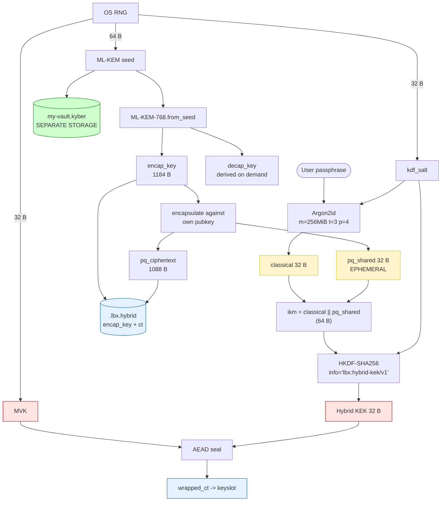

Green box = the file that MUST live on different storage from the
`.lbx` for the post-quantum guarantee to hold. Yellow boxes =
ephemeral intermediaries that are zeroized after the HKDF step.

---

## 9. Scenario: open a vault (any passphrase slot)

**You do:**

```bash
luksbox open my-vault.lbx -m /mnt/v
# -> Type passphrase
```

**What happens:**

1. **Read the header** (first 8192 bytes). Parse it; check the magic;
   read the cipher suite, header salt, and all 8 keyslots.
2. **For each non-empty keyslot of kind=Passphrase:** try to unwrap
   the MVK.
   - Stretch the passphrase: `KEK = Argon2id(passphrase, slot.kdf_salt, slot.kdf_params)`.
   - Build the AEAD AAD: slot AAD region (76 bytes) + slot extended
     fields (164 bytes for V2, zero for V1) + header_salt.
   - Try to decrypt: `aead::open(slot.cipher_suite, KEK, slot.aead_nonce, AAD, slot.wrapped_ct + slot.wrapped_tag)`.
   - On success, you have the MVK candidate.
   - On AEAD tag failure, this slot's KEK was wrong; try the next slot.
3. **Verify the header HMAC** against the candidate MVK.
   - Derive `mac_key = HKDF(MVK, header_salt, "lbx:header-mac/v1")`.
   - Recompute `HMAC-SHA256(mac_key, header[0..8160])`.
   - Constant-time-compare against the on-disk HMAC at `header[8160..8192]`.
   - If it matches, this MVK is correct AND the header hasn't been
     tampered with. If it doesn't, refuse to open.
4. **Decrypt the metadata blob** (file tree, inode table) using a
   metadata key derived from the MVK:
   `metadata_key = HKDF(MVK, header_salt, "lbx:metadata-key/v1")`.
5. **Move the MVK into `memfd_secret` pages** so it can't be paged
   out, can't end up in a coredump or hibernate snapshot, and can't
   be read by other processes.
6. **Vault is open.** All subsequent file I/O uses keys derived from
   the MVK as needed.

**Constant-time considerations:**

- The HMAC compare uses `subtle::ConstantTimeEq` - wrong MVKs all
  fail in the same elapsed time, no MAC-tag timing leak.
- Keyslot iteration is in fixed order; failures don't short-circuit
  with observable timing differences beyond the Argon2id cost itself
  (which dominates by 6 orders of magnitude).

**Wrong passphrase:** every slot's AEAD tag fails, no candidate MVK is
found, the open returns `Error::UnlockFailed`. No information about
which slot kind was tried, no information about how close the
passphrase was.

**Schema:**

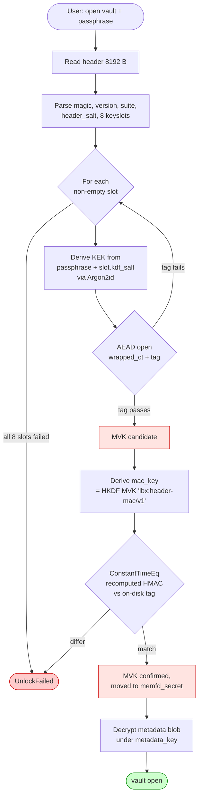

Note: HMAC verification only runs *after* a candidate MVK is found.
Order matters: trying the HMAC first would leak (via timing) which
slot the AEAD recovered, since the HMAC step is much faster than
Argon2id. The current order makes every wrong-passphrase attempt
take exactly the same time (8 x Argon2id, regardless of MVK).

---

## 10. Scenario: open a vault (any FIDO2 slot)

**You do:**

```bash
luksbox open my-vault.lbx -m /mnt/v --fido2
# -> Touch your security key
```

**What happens:**

Same shape as section 9, but the per-slot KEK derivation talks to the
authenticator instead of running Argon2id over a passphrase.

For each non-empty FIDO2 keyslot:

1. **Talk to the authenticator (CTAP2 getAssertion).** Send the slot's
   credential ID and FIDO2 hmac salt. The user touches the key. The
   device returns the 32-byte hmac-secret value over the (PIN/UV-
   protected) CTAP2 channel.
2. **For `Fido2DerivedMvk` slots:**
   `MVK = HKDF(salt=slot.fido2_hmac_salt, ikm=hmac_secret, info="lbx:mvk-fido/v1")`.
   No wrap to verify yet - verification happens at the header HMAC step.
3. **For `Fido2HmacSecret` slots (with optional passphrase):**
   - Build the KEK input: `"lbx:fido" || passphrase || 0xff || hmac_secret`
     (passphrase = `b""` if FIDO2-only).
   - `KEK = Argon2id(kdf_input, slot.kdf_salt, slot.kdf_params)`.
   - Try to unwrap the MVK with this KEK.
4. **Verify the header HMAC** against the recovered MVK. Same as section 9.

**Wrong device:** the device returns *some* hmac-secret value (a
different device under the same `salt` produces a different output),
which derives a different KEK, which fails the AEAD tag. Same error
path as wrong passphrase.

**Device removed mid-unlock:** the CTAP2 call returns an OS-level
error before any cryptographic step runs. User-visible message;
nothing to recover.

---

## 11. Scenario: open a hybrid post-quantum vault

**You do:**

```bash
luksbox open my-vault.lbx --kyber my-vault.kyber -m /mnt/v
# -> Type passphrase (or touch device, for hybrid-fido)
```

**What happens:**

For each `HybridPqKem*` keyslot:

1. **Read the sidecar.** Open `my-vault.lbx.hybrid` and read this
   slot's encap key + ciphertext.
2. **Read the seed file.** Open `my-vault.kyber`, read 64 bytes.
3. **Decapsulate.**
   `pq_shared = MlKem768::decapsulate(seed, ciphertext)`.
   ML-KEM has implicit rejection: a wrong seed yields a deterministic
   PRF-derived garbage value, never an error. We rely on the
   downstream AEAD tag check to catch this.
4. **Build the hybrid KEK.** Same as the create flow:
   - `classical = Argon2id(passphrase, slot.kdf_salt, slot.kdf_params)`
     (or for hybrid-fido: `classical = Argon2id("lbx:fido" || passphrase || 0xff || hmac_secret, ...)`).
   - `ikm = classical || pq_shared`.
   - `KEK = HKDF(salt=slot.kdf_salt, ikm=ikm, info="lbx:hybrid-kek/v1")`
     (or `"lbx:hybrid-fido-kek/v1"`).
5. **Unwrap the MVK** with this KEK. AEAD tag fails if either:
   - The passphrase was wrong, OR
   - The seed file was wrong (decapsulation produced garbage), OR
   - The vault file was tampered with.
6. **Verify the header HMAC.** Same as section 9.

**What's defended:** an attacker with the `.lbx` and the passphrase but
**not** the `.kyber` seed cannot recover the KEK. Even with a CRQC
that breaks classical crypto, they still need the seed.

**What's not defended:** an attacker who steals all three files
(`.lbx`, `.lbx.hybrid`, `.kyber`) and has the passphrase wins. The
hybrid wraps an extra factor; it doesn't multiply the overall
security past "all factors required".

---

## 12. Scenario: add a second keyslot (enroll)

**You do:**

```bash
luksbox enroll my-vault.lbx
# -> Provide existing passphrase (to recover the MVK)
# -> Provide new passphrase / FIDO2 / etc. (the new factor to enroll)
```

**What happens:**

1. **Open the vault** with the existing factor (section 9, section 10, or section 11). You
   now have the MVK in RAM.
2. **Find the lowest-numbered empty keyslot.** Vaults have 8 slots,
   indices 0-7. Empty slots have kind byte = 0.
3. **Build a new keyslot** of the requested kind, using the new factor:
   - For passphrase: pick a fresh random KDF salt + AEAD nonce, derive
     a fresh KEK from the new passphrase, wrap the (existing!) MVK.
   - For FIDO2: do the makeCredential dance, get a new cred ID, pick a
     fresh FIDO2 hmac salt, derive the new KEK, wrap the MVK.
   - For hybrid: generate a fresh ML-KEM keypair, encapsulate, write a
     new sidecar entry, derive the hybrid KEK, wrap the MVK.
4. **Recompute the header HMAC** (the slot region changed -> HMAC
   changes).
5. **Write the updated header** atomically (temp file + rename).

**What's preserved:** the MVK is unchanged. Existing slots still work.
File chunks don't need re-encryption. The new slot just provides a
new way to unwrap the same MVK.

---

## 13. Scenario: revoke a keyslot

**You do:**

```bash
luksbox revoke my-vault.lbx --slot 1
# -> Provide existing passphrase (to recover the MVK)
```

**What happens:**

1. **Open the vault** with the existing factor.
2. **Zero out the target slot.** Set kind byte = 0, fill the rest with
   fresh random bytes (the entropy padding obscures whether the slot
   was ever populated).
3. **Recompute the header HMAC.**
4. **Write the updated header.**

**Important caveat:** revoking a slot does NOT rotate the MVK. An
attacker who already extracted the MVK (e.g. via a memory snapshot
while the vault was open) keeps access to all files. To get true
revocation against an MVK-leak adversary, run `luksbox rotate-mvk`
which generates a new MVK, re-wraps it under all surviving slots, and
re-encrypts every file chunk under the new MVK-derived per-file key.
That operation is O(vault size).

---

## 14. Scenario: read a file

**You do:**

The vault is open (you ran section 9, section 10, or section 11). You issue:

```bash
luksbox cat my-vault.lbx /docs/notes.txt
# OR (mounted)
cat /mnt/v/docs/notes.txt
```

**What happens:**

1. **Look up the inode** for `/docs/notes.txt` in the decrypted
   metadata blob (already in memory). Get its `file_id` (a u64) and
   the list of chunk references.
2. **Derive the file key.**
   `file_key = HKDF(MVK, header_salt, "lbx:file/v1:" || file_id_LE)`.
   Each file gets its own AEAD key, derived once and cached for the
   lifetime of the open.
3. **For each chunk to read:**
   - Look up where it lives on disk: `chunk_offset = data_offset + chunk.id * 4124`.
   - Read 4124 bytes from that offset: `nonce (12) || ciphertext (4096) || tag (16)`.
   - Build the AAD: `file_id (8) || chunk_idx (4) || chunk.generation (8)` = 20 bytes.
   - Decrypt: `plaintext = aead::open(suite, file_key, nonce, AAD, ciphertext+tag)`.
   - On success, you get 4096 bytes of plaintext (zero-padded if it's
     the last chunk of a smaller-than-4-KiB file).
   - On failure (AEAD tag mismatch), reject the read - the chunk has
     been tampered with, moved between files, moved between
     positions, or rolled back to an older version.
4. **Concatenate chunks**, trim to the file's logical size, return.

**Constant-time considerations:** the AEAD `open()` is constant-time
in the sense Galois/Counter-Mode and Poly1305 are constant-time;
there's no early-out on a failed tag check that leaks bytes of the
plaintext.

**Schema:**

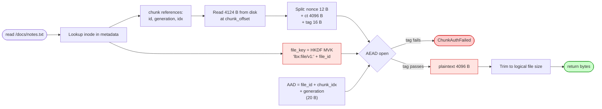

The `generation` field in the AAD is what makes per-chunk replay
detection work. If an attacker swaps in an older version of this
chunk (same position, same file), the older chunk's saved AAD has a
lower generation than the metadata-recorded one for this slot, so
the AEAD tag mismatches.

For the consolidated breakdown of the three-layer property
(per-chunk random nonce, binding AAD, per-file derived key) and
what each layer does and does not defend against, see **§3.9
Per-chunk encryption layering**.

---

## 15. Scenario: write a file

**You do:**

```bash
luksbox put my-vault.lbx /docs/notes.txt local-file.txt
# OR (mounted)
echo "hello" > /mnt/v/docs/notes.txt
```

**What happens:**

1. **Look up or create the inode.** Update the metadata blob.
2. **Derive the file key** (same as the read path; cached for the
   open).
3. **For each 4 KiB chunk of plaintext:**
   - **Pick a chunk slot.** Either reuse the existing one (overwrite)
     or allocate a new one (extend).
   - **Bump the chunk generation counter.** Vault-wide monotonic u64.
     This is what makes the chunk's AAD unique per write - if an
     attacker swaps in an older version of this same chunk (same
     position, same file), the generation in their saved bytes is
     lower than what's now recorded in the metadata, so the AAD
     mismatch breaks the AEAD tag.
   - **Generate a fresh nonce.** 12 random bytes from OS RNG.
   - **Build the AAD.** `file_id || chunk_idx || generation` (20 bytes).
   - **Encrypt.** `ciphertext+tag = aead::seal(suite, file_key, nonce, AAD, plaintext)`.
   - **Write to disk.** `nonce || ciphertext || tag` at the chunk slot
     offset.
4. **Update the metadata blob** with the new chunk references and
   logical file size. Re-encrypt the metadata blob (single AEAD over
   the whole blob), write to disk.
5. **Update the header HMAC** (only if header itself changed, e.g.
   `metadata_size` field; otherwise the HMAC is unchanged).
6. **If using an anchor file, update it.** Write the new generation
   counter into `my-vault.lbx.anchor`, MAC'd under the anchor key
   `HKDF(MVK, header_salt, "lbx:anchor-mac/v1")`.

**On the nonce-uniqueness question:** AEAD with random 96-bit nonces
has a birthday bound of 2^32 messages per key for negligible (2^-32)
collision probability. Using **AES-GCM-SIV** (the default since the
audit) makes this safe even on collision: a nonce reuse under
GCM-SIV reveals only that two messages had the same plaintext, never
the keystream or the GHASH key. Vaults created with the legacy
`Aes256Gcm` suite still inherit the original NIST bound (2^32 writes
per file).

For the consolidated breakdown of why the chunk layer combines a
random nonce, a binding AAD, **and** a per-file derived key, see
**§3.9 Per-chunk encryption layering** — that's the canonical
reference for the three-layer property and what each layer does
and does not defend against.

**Schema:**

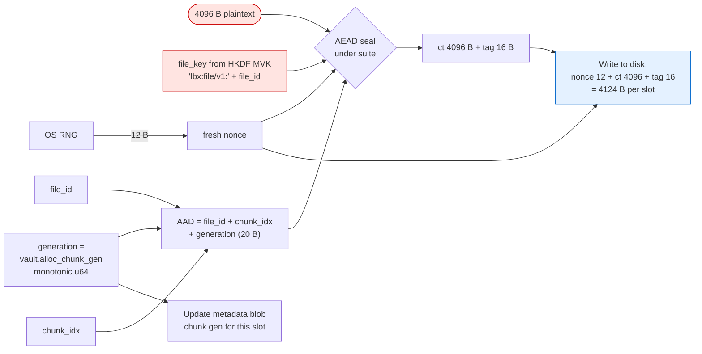

The fresh nonce + fresh generation per write is what makes per-chunk
replay detection work on the read path: an attacker who restores an
older copy of a chunk has a saved AAD with a stale generation, and
the AEAD tag check at read time catches the mismatch.

---

## 16. Scenario: someone tampers with the vault

**You do:**

Nothing. An attacker has flipped some bytes in your `.lbx` file.

**What happens at the next open:**

The defence depends on which bytes were flipped:

| Bytes flipped | What catches it |
|---|---|
| Magic, version, cipher suite ID, KDF ID, header salt, metadata offsets, any keyslot byte | Header HMAC check (after MVK is recovered) |
| Wrapped MVK ciphertext or tag | Per-slot AEAD tag check during unwrap (open returns UnlockFailed) |
| Slot KDF params, KDF salt, AEAD nonce, cred ID, FIDO2 hmac salt | Per-slot AEAD AAD covers all of these (V2 AAD covers up to 128-byte cred ID; V3 AAD covers up to 352-byte cred ID); AEAD tag fails |
| Slot kind byte, AAD-version byte | Per-slot AEAD AAD includes them; AEAD tag fails |
| Encrypted metadata blob | Metadata-blob AEAD tag fails on read |
| A chunk's nonce, ciphertext, or tag | Chunk AEAD tag fails on read of that chunk |
| Header HMAC tag itself | Header HMAC check (recomputed expected != on-disk) |
| Header padding region (offsets 4192..8160) | Header HMAC scope covers this region too |

In every case the open or read fails loudly. There is no "try the
attacker's data anyway" code path.

**What's NOT defended:**

- An attacker who *deletes* the entire file. Authentication only works
  on data that exists.
- An attacker who knows the MVK can forge anything (header, chunks,
  metadata). The whole construction trusts the MVK-holder.

**Schema (which defence catches what):**

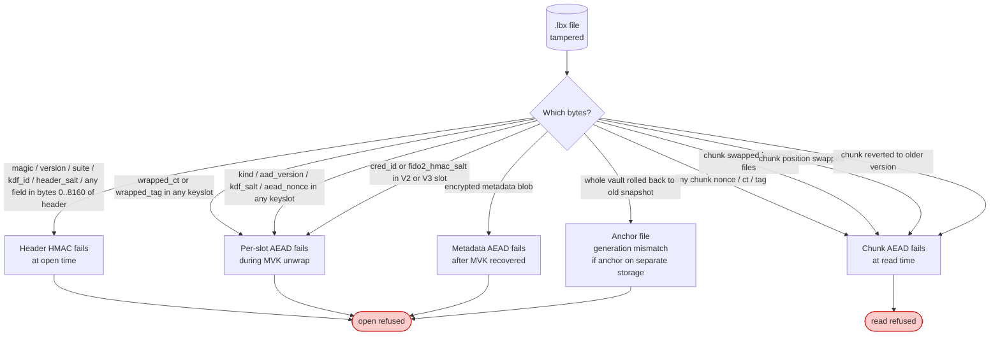

---

## 17. Scenario: someone rolls the vault back to an old snapshot

**You do:**

You wrote some data yesterday. Today you open the vault and read; an
attacker who had the disk overnight has restored the vault to its
state from a week ago.

**What catches it (when an anchor file is configured on separate storage):**

1. The vault file's metadata blob contains the **vault-wide
   generation counter**: a monotonic u64 bumped on every write. This
   week's vault has, say, generation 412; last week's had 380.
2. The anchor file contains the same counter, MAC'd under the anchor
   key. If the user's been writing all week, the anchor file (on
   separate storage that the attacker couldn't roll back) reads
   generation 412.
3. At open time, after recovering the MVK and decrypting the
   metadata, we read the anchor and compare:
   - anchor.gen == metadata.gen -> all good
   - **anchor.gen > metadata.gen -> ROLLBACK DETECTED. Refuse to open.**
   - anchor.gen < metadata.gen -> warn ("you wrote without the anchor
     present"; not necessarily an attack)

**What's NOT defended (without an anchor file or with anchor on same medium):**

- Per-chunk replay (one chunk swapped to its previous version):
  caught by the per-chunk generation counter inside the AEAD AAD,
  always - anchor file isn't needed for this.
- Whole-vault rollback (entire `.lbx` restored to a consistent older
  snapshot): only caught if the anchor file is on storage the
  attacker can't roll back along with the vault.

**Where to put the anchor file:**

- A USB stick the user carries.
- A YubiKey's PIV applet.
- A trusted network service (cloud KMS).
- A TPM2 NV counter (planned, not yet implemented).

If the anchor lives on the same disk as the vault, the attacker has
both and can roll them back together. The anchor-file feature is
documented honestly as integrity-checking your own write history when
co-located.

**Schema:**

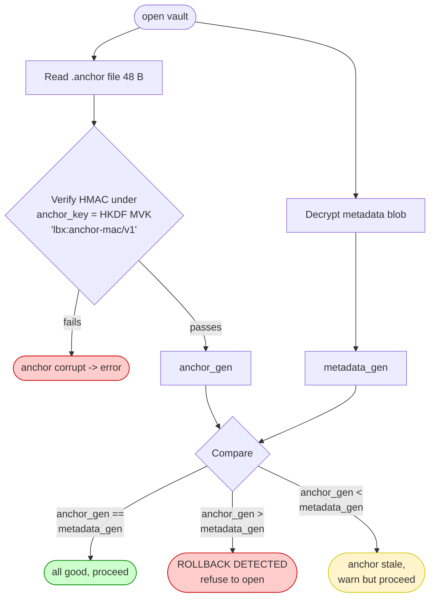

`anchor_gen > metadata_gen` is the smoking gun: the anchor (which
the attacker couldn't roll back) records that we wrote up to
generation N, but the vault file claims it's only at generation M < N.

---

## 18. Scenario: mount the vault as a drive

**You do:**

```bash
luksbox mount my-vault.lbx /mnt/v
# OR (Windows)
luksbox mount my-vault.lbx Z:
# OR (GUI)
[click Mount in the LUKSbox GUI]
```

**What happens cryptographically:**

Nothing extra - mounting just reuses the open vault from section 9/section 10/section 11
and exposes its file tree through a userspace filesystem. Every
read on the mountpoint translates to section 14, every write to section 15. The
MVK stays in `memfd_secret` for the lifetime of the mount.

**What happens operationally:**

- Linux/macOS: a FUSE session is opened. The MVK lives in the
  `luksbox` process's `memfd_secret` page. The FUSE kernel module
  shuttles read/write requests between the OS and our user-mode
  process. Unmount via `fusermount3 -u /mnt/v` triggers a clean
  shutdown.
- Windows: the WinFsp kernel driver dispatches IRPs to our user-mode
  process. Mount lifetime is tied to the process; killing the process
  unmounts. The MVK lives in regular heap (memfd_secret is Linux-only),
  zeroed on drop.

**What the kernel module sees:**

- File names and paths (because the OS needs them to dispatch I/O).
- Logical file sizes (for `ls -l`).
- Per-file plaintext bytes during read/write (the kernel module is by
  necessity downstream of decryption).

**What the kernel module never sees:**

- The MVK or any KEK.
- Encrypted chunks (they're decrypted before being handed up).
- Keyslot contents.

**An attacker who compromises the kernel** while the vault is
mounted can read everything. If that's in your threat model, don't
mount; use `luksbox cat`/`get` for one-shot reads instead, which keeps
the plaintext window measured in milliseconds.

---

## 19. FIDO2 / CTAP2 deep dive: how it works and why it's secure

This section is the standalone reference for everything FIDO2 in
LUKSbox. Sections 5-12 walk through specific scenarios; this section
explains the protocol fundamentals, the security properties LUKSbox
relies on, the threat model, and the empirical hardware behaviour
verified against real devices (Google Titan, YubiKey 4/5).

### 19.1 What FIDO2 actually is

FIDO2 is the umbrella for two specifications:

- **WebAuthn** (W3C): the browser API and server-side protocol
- **CTAP2** (FIDO Alliance Client to Authenticator Protocol v2): the
  USB-HID / NFC / BLE wire protocol the host uses to talk to the
  authenticator (the security key)

LUKSbox doesn't use a browser, so we talk CTAP2 directly via Yubico's
`libfido2` library (or, on Windows, via `webauthn.dll` so the OS
mediates and we don't need driver-level USB access). The two CTAP2
operations LUKSbox cares about:

| Operation | What it does | Touch required? |
|---|---|---|
| `authenticatorMakeCredential` | Create a new credential bound to a relying party (RP). Device returns a `credential ID` (an opaque blob the device uses later to find the right private key). | Yes |
| `authenticatorGetAssertion` | Sign a challenge with a previously-created credential. With the `hmac-secret` extension enabled, also computes `HMAC(per-credential-secret, salt)` and returns the 32-byte result. | Yes |

LUKSbox uses the **`hmac-secret` extension** specifically. This
extension was designed for password-manager-style use cases where the
authenticator returns a deterministic per-credential / per-salt value
that the host uses as keying material. Critically:

- The hmac-secret value is **deterministic**: same credential + same
  salt always returns the same 32 bytes (verified empirically; see
  Sec.19.6).
- It is **per-credential**: two different credentials on the same
  device, with the same salt, produce different outputs.
- It is **per-salt**: same credential, different salts, produce
  different outputs.
- It is **device-bound**: the per-credential master never leaves the
  authenticator's secure element. Without the physical device, the
  output cannot be computed.

Those four properties are what make FIDO2 a viable building block for
a vault KEK.

### 19.2 Two flavours of FIDO2 keyslot in LUKSbox

| Property | `Fido2HmacSecret` (default) | `Fido2DerivedMvk` |
|---|---|---|
| Wraps a random MVK on disk? | Yes (AES-256-GCM-SIV ciphertext + tag) | No (no wrapped MVK exists anywhere) |
| MVK exists where? | In a wrapped form on disk; in cleartext only in `memfd_secret` while vault is open | Only in `memfd_secret` while the device is connected, derived afresh each unlock |
| Multi-slot capable (multiple devices)? | Yes - each device wraps the same MVK under its own KEK | No - only valid as the SOLE keyslot in a vault |
| Backup recovery possible? | Yes (enroll a passphrase backup slot or a second device) | No - lose the device, lose the vault |
| KEK derivation | `KEK = Argon2id("lbx:fido" \|\| passphrase \|\| 0xff \|\| hmac_secret, salt)` | None - `MVK = HKDF(salt, hmac_secret, "lbx:mvk-fido/v1")` |

**Why two modes?** Trade-off between recoverability and "no wrapped
MVK on disk to attack."

`Fido2HmacSecret` is the default for almost every user because it
supports multiple devices + emergency-passphrase backup. The
wrapped-MVK ciphertext on disk is a brute-force surface - a quantum
adversary who recorded USB-HID traffic at enrollment + recovers the
hmac-secret via Grover, or breaks AES-256-GCM-SIV under Grover-128,
gets the MVK. Defended by hybrid-PQ if you care about that.

`Fido2DerivedMvk` is for users who want **no wrapped material on
disk** at the cost of zero recoverability. The MVK is `HKDF(salt,
hmac_secret)`, computed at every unlock from the live device output.
Without the device, no MVK exists in any form. The trade-off is
single-device, single-point-of-failure.

### 19.3 Enrollment ceremony (how the keyslot gets created)

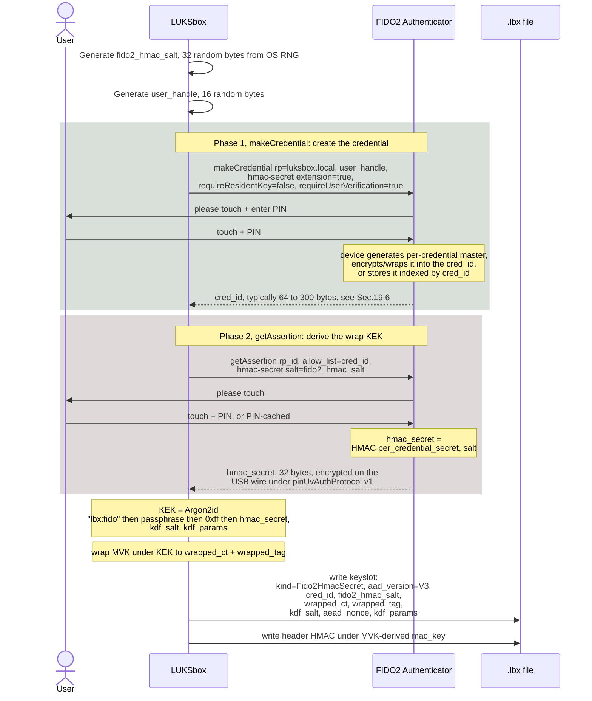

The `cred_id` and `fido2_hmac_salt` get persisted in the on-disk
keyslot. The hmac_secret value is **not** stored - it's recomputed at
every unlock by re-querying the device.

### 19.4 Unlock ceremony (recovers the MVK)

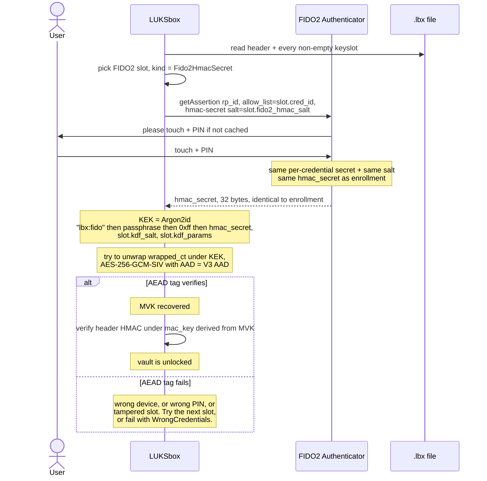

### 19.5 Security properties

#### What we DO defend against

1. **Offline brute-force of the wrapped MVK without the device**.
   The wrapped MVK on disk is `Enc_KEK(MVK)` where `KEK = Argon2id(... \|\| hmac_secret, ...)`. An attacker with the disk and no device must guess the 32-byte hmac_secret value, which has 256 bits of entropy (provided the device's per-credential master has full entropy - see Sec.19.7). That's intractable with current or foreseeable computing. Hybrid-PQ slots add ML-KEM on top to also defeat a CRQC adversary.

2. **Phishing / credential reuse across services**. CTAP2 binds the
   credential to a specific Relying Party ID (`rp_id`). LUKSbox uses
   `rp_id = "luksbox.local"`. A credential created for `google.com`
   can't be exercised by LUKSbox, and vice versa. The device enforces
   this; the host can't forge a different `rp_id` because the device
   includes it in every signature input.

3. **Replay attacks on the USB wire**. CTAP2's pinUvAuthProtocol v1
   wraps the hmac-secret response in an encrypted, authenticated
   envelope keyed off an ECDH session that's freshly negotiated per
   request. An attacker who recorded a previous USB exchange cannot
   replay it; the session keys differ each time.

4. **Rogue / MITM authenticator returning attacker-controlled values**.
   Tested in `crates/luksbox-fido2/tests/rogue_authenticator.rs`. A
   malicious device that returns a chosen `hmac_secret` derives a
   wrong KEK, which fails the AEAD tag check on the wrapped MVK.
   Defence in depth: the header HMAC layer would also reject any MVK
   the wrong-KEK unwrap could yield.

5. **Tampered cred_id or hmac_salt on disk**. The slot's V3 AAD
   includes `slot[124..512]`, so any single-bit flip in the cred_id
   (offsets 128..480) or hmac_salt (480..512) breaks the AEAD tag at
   unlock. Verified by the `v3_slot_aead_aad_covers_*` tests and by
   live hardware in Sec.19.6.

6. **Stolen device without the PIN**. CTAP2 user-verification is
   required (LUKSbox always requests `requireUserVerification=true`).
   The device enforces a PIN-attempt counter in tamper-resistant
   silicon. After 8 wrong PINs the device wipes its credentials.

7. **Lost device with backup enrolled**. If the user enrolled either
   (a) a backup passphrase slot or (b) a second device's keyslot, the
   vault is recoverable from the backup material alone.

#### What we explicitly do NOT defend against

1. **Compromise of the device's secure element**. If an attacker
   physically extracts the per-credential master from the
   authenticator's secure element (side-channel, fault injection,
   exploiting an undisclosed firmware bug), they can compute the
   hmac_secret offline. Device-vendor problem, outside our control.

2. **Attestation forgery**. LUKSbox does **not** verify the
   authenticator's attestation certificate. We accept any device that
   speaks CTAP2 + hmac-secret. Rationale: most users don't have a
   verified-firmware-only requirement, and pinning to specific vendor
   certificates would brick their vault if they upgrade their key.
   For a high-assurance deployment, attestation pinning is on the
   roadmap (would be a `--require-attestation <pem>` flag).

3. **Coerced user / rubber-hose decryption**. If the attacker has
   the device, the PIN, and a finger to apply, the vault opens.
   Hidden-volume / duress-passphrase functionality is not in v1.

4. **Compromised host while vault is open**. If the host is
   already running attacker code, FIDO2 can't help - the MVK is in
   `memfd_secret` but the kernel can read it, and a malicious userspace
   process running as the same user can read mounted plaintext via
   the FUSE / WinFsp interface. FIDO2 protects authentication, not
   ongoing confidentiality.

#### What we delegate to the device vendor

| Property | LUKSbox role | Vendor role |
|---|---|---|
| Per-credential master entropy | Trust the device's RNG | Vendor must use a CSPRNG |
| Side-channel resistance during HMAC | Nothing we can do | Vendor's secure-element design |
| PIN counter integrity | Nothing | Vendor's tamper-resistant counter |
| `hmac-secret` extension correctness | Verify deterministic + variable-with-salt at first unlock (any failure is a no-go) | Spec compliance |
| Supply-chain integrity | Nothing | Vendor's manufacturing |

The practical corollary: a YubiKey 5 (Infineon SLE secure element,
FIPS 140-2 L3 / CC EAL5+ certified) is a meaningfully different
trust anchor than a generic open-hardware key based on a non-certified
MCU. LUKSbox treats both identically at the protocol layer; the user
chooses how much to trust the underlying device.

### 19.6 Empirical hardware verification

Verified on real devices (sandboxed Linux, libfido2 1.x, two
authenticators plugged in concurrently):

| Device | Model | USB ID | cred_id length |
|---|---|---|---|
| Google Titan Security Key v2 | USB-C | `18d1:9470` | **288 bytes** |
| YubiKey 4/5 OTP+FIDO+CCID | USB-A | `1050:0407` | **64 bytes** |

The 4.5x size difference is what motivated the V3 keyslot layout
(see Sec.3.2): pre-V3 slots reserved 128 bytes for the cred_id and
silently rejected the Titan with `Fido2CredIdTooLong(288)`. V3
gives cred_id 352 bytes of capacity, accommodating both with margin.

**Determinism + variability** verified empirically against both
devices using `crates/luksbox-fido2/examples/probe.rs`:

| Test | Same `(cred_id, salt)` twice | Different salts |
|---|---|---|
| Titan | identical 32-byte output | different 32-byte outputs |
| YubiKey | identical 32-byte output | different 32-byte outputs |

Both devices satisfy the determinism + variability properties LUKSbox
depends on. Without determinism, the vault could never be reopened.
Without variability, every slot would derive the same KEK, defeating
multi-slot independence.

**End-to-end multi-device V3 roundtrip** verified using
`crates/luksbox-fido2/examples/multidev_probe.rs`:

1. Enroll Titan -> slot 0 wraps a random MVK (V3 layout, 288-byte cred_id at offsets 128..416)
2. Enroll YubiKey -> slot 1 wraps the SAME MVK (V3 layout, 64-byte cred_id at offsets 128..192)
3. Both slots serialize to 512-byte on-disk form, parse back byte-identical
4. Unlock via Titan -> recovers the same 32-byte MVK
5. Unlock via YubiKey -> recovers the same 32-byte MVK
6. Cross-device MVK equality check: PASS

This confirms multi-device redundancy + V3 layout work end-to-end on
real hardware, not just in synthetic unit tests.

### 19.7 Why "deterministic" doesn't mean "predictable"

The hmac-secret being deterministic across invocations might sound
worrying - same input always gives the same output, doesn't that mean
an attacker can replay it? No, because:

- The "input" includes the device's **per-credential master secret**,
  which is 256 bits of entropy generated by the device's RNG at
  enrollment and never leaves the secure element.
- Without that secret, an attacker on the network or with the disk
  can't compute the HMAC. They'd need either (a) the device or (b)
  to break HMAC-SHA256 / extract the device secret.
- The CTAP2 wire transport encrypts the hmac_secret response under a
  freshly-derived per-request session key (ECDH-P256 + AES-CBC +
  HMAC-SHA256), so an eavesdropper with USB-HID capture sees only
  ciphertext.

Determinism is a feature, not a bug: it's what lets the vault be
opened the same way every time without any persistent state on the
device beyond the credential itself. The randomness comes from
**enrollment**, not from each individual unlock.

### 19.8 ECDH-P256 in CTAP2 and the post-quantum gap

The encryption of the hmac_secret on the USB wire uses ECDH-P256 to
derive per-session keys between host and device. ECDH-P256 is
classical-secure but **NOT post-quantum secure** - a CRQC adversary
could break the ECDH shared secret offline from a recorded USB-HID
capture, then decrypt the hmac_secret value, then derive the wrap KEK
and recover the MVK.

This is the threat that hybrid-PQ keyslots
(`HybridPqKemFido2` / `HybridPqKem1024Fido2`) close: they extend the
KEK derivation to include an ML-KEM-768 / ML-KEM-1024 shared secret
from a separate `.kyber` seed file, so even with the recovered
hmac_secret the attacker still needs the seed file. See Sec.8 + Sec.11.

For non-hybrid FIDO2 vaults, the practical threat from this gap
requires (a) USB-HID capture during enrollment AND every unlock the
attacker wants to forge, (b) a CRQC, AND (c) the disk. Realistic
within the 10+ year horizon, hence the hybrid-PQ option for users
who want to defend against it.

### 19.9 Implementation pointers

| Concern | Source |
|---|---|
| CTAP2 request / response handling on Linux+macOS | `crates/luksbox-fido2/src/hid.rs` (libfido2 wrapper) |
| CTAP2 request / response handling on Windows | `crates/luksbox-fido2/src/webauthn.rs` (webauthn.dll, no admin) |
| Pure-software ECDH-P256 + AES-CBC + HMAC for `pinUvAuthProtocol v1` | `crates/luksbox-fido2/src/protocol.rs` (used in tests; on real hardware, libfido2 / webauthn.dll handle this) |
| Keyslot wrap / unwrap | `crates/luksbox-core/src/keyslot.rs` (`new_fido2`, `unlock_fido2`, V3 layout) |
| Rogue-authenticator regression tests | `crates/luksbox-fido2/tests/rogue_authenticator.rs` |
| Hardware probe (single device) | `crates/luksbox-fido2/examples/probe.rs` (run with `--features hardware --example probe`) |
| Hardware probe (multi-device V3 roundtrip) | `crates/luksbox-fido2/examples/multidev_probe.rs` |

---

## 20. Quick reference: what an attacker would need

| Vault kind | Things attacker needs to recover MVK |
|---|---|
| Passphrase | Vault file + passphrase (Argon2id-stretched, 500 ms / guess at default params) |
| FIDO2-derived MVK (`Fido2DerivedMvk`) | Physical security key + PIN (no offline brute force possible) |
| FIDO2-wrapped MVK (`Fido2HmacSecret`) | Vault file + physical security key + PIN [+ passphrase if combined] |
| Windows Hello (platform `Fido2HmacSecret`) | Vault file + Windows user session [+ passphrase if combined] |
| Hybrid passphrase + ML-KEM-768 | Vault file + sidecar + `.kyber` seed file + passphrase |
| Hybrid FIDO2 + ML-KEM-768 | Vault file + sidecar + `.kyber` seed file + security key + PIN [+ passphrase if combined] |

| Defence | What it stops |
|---|---|
| Argon2id (m=256MiB, t=3, p=4 default) | GPU/ASIC dictionary attacks on weak passphrases |
| Per-slot random KDF salt | Two vaults under same passphrase get different KEKs; rainbow tables useless |
| AEAD AAD covers all slot fields | Tampering any slot field breaks the unwrap |
| Header HMAC over the whole header | Tampering anything in the header (including kind / cipher / params) is detected |
| Per-chunk AAD = (file_id, chunk_idx, generation) | Cross-file substitution, position swap, single-chunk rollback |
| Vault-wide monotonic generation counter | Per-chunk rollback (single chunks restored to older version) |
| Anchor file (on separate storage) | Whole-vault rollback (entire `.lbx` restored to old snapshot) |
| `memfd_secret(2)` for MVK | Other processes reading our memory, coredumps, hibernate snapshots |
| Constant-time tag/MAC compares | Timing side-channels on the secret-comparing operations |
| ML-KEM-768/1024 hybrid layer | Quantum-capable adversary ("harvest now, decrypt later") |

| What we don't defend against | Why |
|---|---|
| Compromise of the MVK while vault is open | The whole construction trusts MVK-holders |
| Kernel-level malware while mounted | Kernel sees plaintext on read/write paths |
| Disk full / physical destruction | Authentication doesn't restore deleted bytes |
| User using a weak passphrase | Argon2id raises the bar, doesn't make it infinite |
| Anchor and vault on the same medium | Attacker rolls both back together |
| Side-channels on the OS RNG, on Argon2id, on AES-NI | We trust the underlying primitives + hardware |

---

## End-of-document references

- **Source crates that implement this spec:**
  `crates/luksbox-core/src/{aead,kdf,key,header,keyslot,secret_box}.rs`
  for the cryptographic primitives + framing;
  `crates/luksbox-format/src/{container,metadata,anchor,hybrid_sidecar}.rs`
  for the on-disk format;
  `crates/luksbox-vfs/src/{chunk,vfs,tree}.rs` for the file/chunk path;
  `crates/luksbox-pq/src/{lib,seed_file}.rs` for the post-quantum layer;
  `crates/luksbox-fido2/src/{authenticator,hid,webauthn,protocol}.rs`
  for the FIDO2 path.
- **Tests that pin the spec:** `crates/luksbox-core/src/aead.rs`
  (AEAD primitives + RFC 8452 KAT);
  `crates/luksbox-format/tests/cipher_suite_correctness.rs`
  (end-to-end roundtrips per suite, cross-suite isolation, backward
  compat);
  `crates/luksbox-vfs/tests/{chunk_suite_correctness,security_invariants}.rs`
  (chunk path roundtrips, replay protection);
  `crates/luksbox-pq/tests/` (ML-KEM round-trip, seed-file DoS guards).
- **Threat model + policy:** `SECURITY.md`.
- **Audit trail:** internal audit log (rounds summarised at https://luksbox.penthertz.com/docs/security/audit/).
