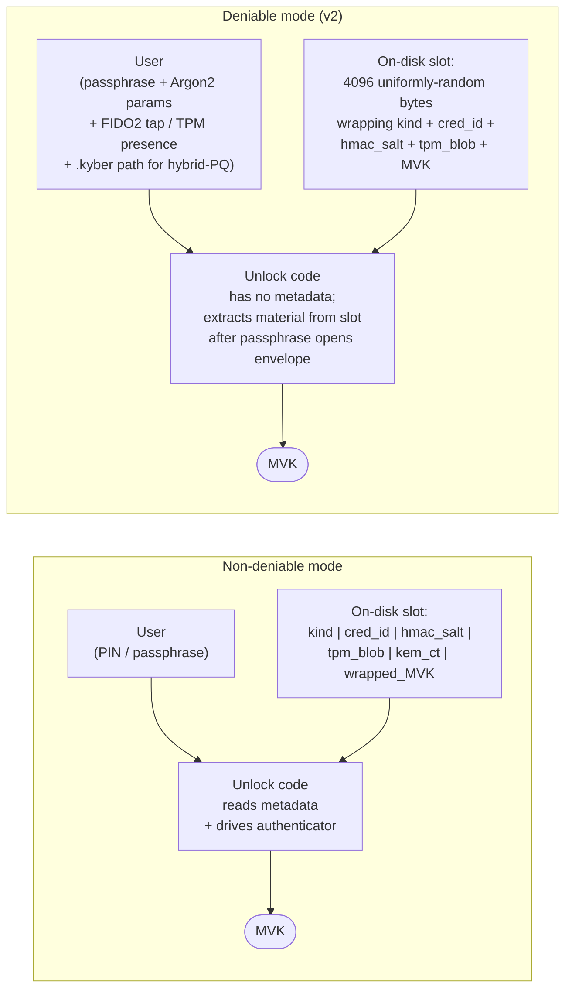

# Deniable header format ("LUKSbox v2-deniable")

**Status**: v2 design; under implementation. v1 (8 KiB header, 512 B
slots, external `cred_id` / `hmac_salt` / `.tpm-blob` sidecars) was
paused mid-implementation and is superseded; no public release ever
shipped v1.

LUKSbox's standard header (`docs/CRYPTO_SPEC.md`) stores plaintext
markers - magic bytes, cipher suite ID, KDF ID, slot table - that
make the file trivially identifiable as a LUKSbox vault. The
**deniable header** mode replaces all of that on-disk plaintext with
uniformly random bytes so that the entire file is computationally
indistinguishable from random output to anyone without the right
credential.

This is opt-in at vault-creation time (`luksbox init --deniable`).
Existing standard vaults are unaffected.

## v2 design rationale (why we replaced v1)

v1 wrapped only the 32-byte MVK inside each 512 B slot and required
the user to supply every other piece of credential material at unlock
time: `cred_id` and `hmac_salt` for FIDO2, the TPM-sealed blob (via
a `.lbx.tpm` sidecar) for TPM, and the ML-KEM ciphertext (via a
`.lbx.mlkem` sidecar) for hybrid-PQ. Two operational problems made
this untenable:

1. **Sidecars are a tell.** A `.lbx.tpm` next to a `vault.lbx` told a
   forensic examiner the vault uses TPM, breaking deniability of the
   credential type even though the vault file itself looked random.
2. **External cred material is a UX trap.** Carrying around hex
   `cred_id` blobs that "look random but aren't" defeats the entire
   point - users either write them down where they leak, or lose
   them and brick the vault.

v2 solves both by **bumping the slot to 4 KiB** so it can carry the
authenticator-bound material itself (`cred_id`, `hmac_salt`, TPM
sealed blob) **inside the slot envelope**, wrapped under a
passphrase-derived `KEK_envelope` so the slot still looks like uniform
random on disk.

Consequences:

- **Passphrase is mandatory for every v2 deniable credential.** A
  passphrase is the only discovery factor that can decrypt the slot
  envelope without itself being inside the slot (chicken-and-egg). v1
  "pure FIDO2" and "pure TPM" deniable modes are removed - they were
  the modes that required external material in the first place.
- **TPM sidecar (`.lbx.tpm`) is eliminated.** The sealed blob now
  lives inside the v2 slot, wrapped by the passphrase envelope.
- **FIDO2 `cred_id` and `hmac_salt` are no longer printed on a
  recovery card.** The user only needs to remember their passphrase
  + Argon2id parameters.
- **ML-KEM sidecar (`.lbx.kyber`) is retained.** ML-KEM ciphertexts
  (1568 B for ML-KEM-1024) and seed files have their own management
  story already (sidecars served by the standard flow); folding them
  into the slot envelope would force the same `m_cost` Argon2id
  derivation to run over 2-3 KiB of payload per trial-decrypt and
  gain no deniability benefit (the sidecar shape is itself wrapped
  by a separate passphrase). v2 keeps the sidecar; the slot embeds
  the per-vault ML-KEM share rather than the public-key blob.

**Important: v2 changes ONLY affect deniable mode.** Standard
(non-deniable) LUKSbox vaults are completely untouched. Pure-FIDO2,
pure-TPM, pure-Hybrid-PQ keyslots remain fully supported there - the
standard slot table is plaintext-keyed, the per-slot metadata
declares its kind and carries `cred_id` / `hmac_salt` / TPM blob /
ML-KEM ciphertext directly, and the unlock code reads them and drives
the relevant authenticator without needing a passphrase as a
discovery factor. The mandatory-passphrase rule exists solely to
solve the deniable-mode chicken-and-egg problem.

## Threat model

The format defends against a **forensic analyst who knows LUKSbox
exists** and wants to either prove a file is a LUKSbox vault or
brute-force a known credential. It does not (and cannot, by itself)
defend against an adversary who runs malicious code on the unlock
host, who has the credential, or who can compel the user to reveal
the credential.

| Goal | Defended? |
|---|---|
| File-type tools (file(1), libmagic, yara) cannot identify the vault | yes |
| Forensic analyst with LUKSbox knowledge cannot prove the file is a vault | yes |
| Adversary cannot enumerate users / count slots | yes |
| Adversary cannot identify which credential types are in use | yes (passphrase, FIDO2, TPM all in-slot); partial (PQ-hybrid via sidecar) |
| Adversary cannot distinguish wrong-passphrase from wrong-cipher from wrong-KDF-params | yes (single AEAD failure mode) |
| File-size pattern (~36 KiB header + N x 4 KiB) does not reveal LUKSbox | mitigated by optional `--pad-to <N>` quantization |
| Per-chunk 4 KiB stride does not reveal LUKSbox | not addressed (same as standard mode; out of scope) |
| Steganographic carrier (vault hidden inside PNG/JPEG/PDF) | not addressed (separate feature) |
| Two vaults with same passphrase yield same wrapped MVK in slots | mild leak: forensic analyst who guesses the passphrase sees 2 slots match, learns ">=2 users share that passphrase" |

## On-disk layout

```
Offset (bytes)   Size         Content                          Looks like
--------------   ----         -------                          ----------
0                32           Per-vault salt                   uniform random
32               8 x 4096     8 slots (any may be occupied)    uniform random
32800            4064         Encrypted inner header           uniform random
36864            ...          Chunked data area                uniform random
```

**Total header size: 36864 bytes (~36 KiB)** - larger than v1's
8 KiB and larger than the standard format's 8 KiB, but still
trivial on absolute terms and well below filesystem block-aligned
overhead for any non-trivial vault. The size difference from the
standard format is deliberately not aligned to any well-known
multiple, so size alone is not a reliable LUKSbox fingerprint.
`init --pad-to <N>` quantization remains available for users who
want the file size to match a target distribution.

The per-vault salt is the only "fixed structure" anywhere in the
file. Since 32 bytes of uniform random is the unavoidable minimum
prefix of any AEAD scheme, this leaks nothing on its own.

## Per-slot structure (v2)

Each slot is 4096 bytes of indistinguishable ciphertext:

```
Slot layout (4096 bytes, after AEAD-decrypt with KEK_envelope):
  [u8  kind]             credential variant tag (1 of 8)
  [u16 cred_id_len]      FIDO2 credential id length, 0..=1024
  [u8  hmac_salt_len]    32 if FIDO2 enabled, else 0
  [u16 tpm_blob_len]     TPM2 sealed-blob length, 0 or 128..=3500
  [u32 reserved]         set to 0; future-extension byte
  [u8  cred_id[cred_id_len]]
  [u8  hmac_salt[hmac_salt_len]]
  [u8  tpm_blob[tpm_blob_len]]
  [u8  wrapped_mvk_nonce[12]]
  [u8  wrapped_mvk_ct_and_tag[48]]       AEAD(KEK_factors, MVK)
  [random padding to fill 4068 bytes]    OsRng-filled at enroll time

Encrypted as:
  [u8  envelope_nonce[12]]
  [u8  envelope_ct[4036 + 16]]           AEAD(KEK_envelope, payload, AAD)
```

Two-layer encryption:

- **Outer envelope** is sealed by `KEK_envelope = Argon2id(passphrase,
  per_vault_salt, params)`. Trial-decrypt across all 8 slots at unlock
  time recovers (cred_id, hmac_salt, tpm_blob, wrapped_mvk) if and
  only if the user supplies the right passphrase + params.
- **Inner `wrapped_mvk`** is sealed by `KEK_factors`, which combines
  every secondary factor the slot's `kind` declares:

  | kind | KEK_factors derivation |
  |---|---|
  | `Passphrase` | `KEK_envelope` itself (no inner factors; `wrapped_mvk` collapses to `AEAD(KEK_envelope, MVK)`) |
  | `Fido2Passphrase` | `HKDF(per_vault_salt, KEK_envelope \|\| hmac_secret_output, "kek/fido2+passphrase")` |
  | `TpmPassphrase` | `HKDF(per_vault_salt, KEK_envelope \|\| tpm_unsealed, "kek/tpm+passphrase")` |
  | `TpmFido2Passphrase` | `HKDF(per_vault_salt, KEK_envelope \|\| tpm_unsealed \|\| hmac_secret_output, "kek/tpm+fido2+passphrase")` |
  | `HybridPqPassphrase` | `HKDF(per_vault_salt, KEK_envelope \|\| mlkem_shared, "kek/pq+passphrase")` |
  | `HybridPqFido2Passphrase` | adds `hmac_secret_output` |
  | `HybridPqTpmPassphrase` | adds `tpm_unsealed` |
  | `HybridPqTpmFido2Passphrase` | adds both |

A slot is "occupied" iff AEAD-decrypting the outer envelope with the
candidate `KEK_envelope` produces a valid tag. An "empty" slot is
4096 fresh `OsRng` bytes - under any secure AEAD's properties,
occupied-slot ciphertext and empty-slot random are computationally
indistinguishable.

Padding inside an occupied slot is random bytes written at enrollment
time and not subsequently verified. It exists so every slot is the
same wire length regardless of which credential variant occupies it -
otherwise the envelope length itself would leak the slot kind.

## AEAD inputs (the binding details)

For slot index `i`, the **outer envelope**:

```
plaintext  = payload (4036 bytes: kind || lens || cred_id || hmac_salt
                     || tpm_blob || wrapped_mvk || random padding)
key        = KEK_envelope (32 bytes, Argon2id-derived from passphrase)
nonce      = random 12 bytes (fresh per slot enrollment)
AAD        = b"luksbox-deniable-v2" || per_vault_salt || (i as u8)
```

For the **inner wrapped_mvk** at offset `payload_offset_of_wrapped_mvk`
inside the decrypted payload:

```
plaintext  = MVK (exactly 32 bytes)
key        = KEK_factors (32 bytes, HKDF-derived per the table above)
nonce      = random 12 bytes (fresh per slot enrollment)
AAD        = b"luksbox-deniable-v2/inner" || per_vault_salt || (i as u8)
```

The AAD binds each AEAD computation to (a) the format version, (b)
the specific vault, and (c) the slot position, preventing
slot-shuffling attacks across vaults or across slots within a vault.
Outer and inner AADs are distinct (different prefix suffix) so a
forged outer envelope cannot reuse an inner ciphertext from another
slot.

## Inner header (offset 4128, length 4064)

The "inner header" is AEAD-encrypted using the MVK and replaces
everything the standard header carries in plaintext:

```
inner_plaintext layout:
  [u16 format_version_minor]
  [u16 cipher_suite]
  [u16 kdf_id]
  [u32 flags]
  [u64 metadata_offset]
  [u64 metadata_size]
  [u64 data_offset]
  [u32 chunk_size]
  [rest: padding to 4032 bytes]

AEAD:
  key = HKDF(MVK, info=b"luksbox-deniable-v1/inner-header", salt=per_vault_salt)
  nonce = 12 random bytes (stored as first 12 bytes of the 4064-byte region)
  AAD = b"luksbox-deniable-v1/inner-header" || per_vault_salt
  tag = 16 bytes (stored as last 16 bytes of the 4064-byte region)
```

This means the cipher / KDF / flags that the standard header keeps
in plaintext are visible only after a valid MVK has decrypted the
inner header. A forensic analyst without the MVK sees uniform random
bytes.

## Per-credential KEK derivation

All KEKs are 32 bytes. All derivations use explicit domain-separation
labels in HKDF `info` strings (security invariant #5). All take the
per-vault salt as input so two different vaults with the same
credential produce different KEKs.

`KEK_envelope` is always derived first, identically across every
credential variant. The slot envelope cannot be opened without it -
that is what makes the passphrase mandatory.

```
KEK_envelope = Argon2id(
    password    = user_passphrase,
    salt        = per_vault_salt,
    m_cost_kib  = user_supplied_or_default,
    t_cost      = user_supplied_or_default,
    p_cost      = user_supplied_or_default,
    output_len  = 32,
)
```

Wrong parameters fail identically to a wrong passphrase.

### Passphrase (no secondary factors)

```
KEK_factors = KEK_envelope
wrapped_mvk = AEAD(KEK_factors, MVK, AAD = inner_aad(slot_idx))
```

`cred_id`, `hmac_salt`, `tpm_blob` are all empty (lengths = 0).

### Fido2Passphrase

User supplies a passphrase (envelope) AND taps their FIDO2 device
(inner). At enroll time the host generates a fresh 32-byte random
`hmac_salt` and a `cred_id` from `MakeCredential`; both are embedded
in the slot envelope. At open time the host trial-decrypts the
envelope, reads `cred_id` + `hmac_salt` out, then drives the
authenticator:

```
hmac_secret_output = device.get_assertion(
    rp_id = "luksbox",
    cred_id,
    hmac_secret_salt = hmac_salt,
)
KEK_factors = HKDF(
    salt = per_vault_salt,
    ikm  = KEK_envelope || hmac_secret_output,
    info = b"luksbox-deniable-v2/kek/fido2+passphrase",
)
MVK = AEAD_open(KEK_factors, wrapped_mvk, AAD = inner_aad(slot_idx))
```

No external credential material to remember.

### TpmPassphrase

User supplies a passphrase (envelope) AND has the TPM chip the vault
was sealed against (inner). At enroll time the host seals a 32-byte
random `tpm_secret` via TPM2_Create / TPM2_Load + TPM2_PolicyAuthorize
and embeds the sealed blob (~1.5-3 KB) in the slot envelope. At open
time the host trial-decrypts the envelope, reads `tpm_blob` out, and
unseals:

```
tpm_unsealed = TPM2_Unseal(tpm_blob)
KEK_factors = HKDF(
    salt = per_vault_salt,
    ikm  = KEK_envelope || tpm_unsealed,
    info = b"luksbox-deniable-v2/kek/tpm+passphrase",
)
```

No external sidecar.

### TpmFido2Passphrase

Union of `TpmPassphrase` and `Fido2Passphrase`. Slot embeds both
`tpm_blob` and `(cred_id, hmac_salt)`. Inner KEK combines all three
factors:

```
KEK_factors = HKDF(
    salt = per_vault_salt,
    ikm  = KEK_envelope || tpm_unsealed || hmac_secret_output,
    info = b"luksbox-deniable-v2/kek/tpm+fido2+passphrase",
)
```

### HybridPq* (ML-KEM sidecar retained)

ML-KEM-768 ciphertexts (1088 B) and seed files have their own
passphrase-protected sidecar format (`.lbx.kyber`). v2 keeps the
sidecar for ML-KEM material - folding it into the slot envelope
gains no deniability (the sidecar is shaped by its own passphrase
wrapper already) and forces a 1-2 KiB Argon2id input per
trial-decrypt across the 8 slots.

The slot envelope still embeds anything else the variant requires
(`cred_id` + `hmac_salt` for hybrid+FIDO2 variants, `tpm_blob` for
hybrid+TPM variants). The ML-KEM shared secret is computed at open
time via `decap(ML-KEM secret key from sidecar, ciphertext from
sidecar)` and contributes to `KEK_factors`.

#### Optional separate seed-file passphrase

The `.lbx.kyber` sidecar is wrapped by its own passphrase (Argon2id
over the seed-file passphrase). At create time the user can either:

- **Reuse the envelope passphrase** for the seed file (default; one
  passphrase opens both). The GUI and TUI present the seed-file
  passphrase field as optional with the hint "leave blank to reuse
  the envelope passphrase above for both roles".
- **Set a distinct seed-file passphrase** for a defense-in-depth
  split: the envelope passphrase opens the slot envelope but the
  seed file refuses to decrypt without the second passphrase. Both
  must then be supplied at every unlock.

At open time the unlock form shows the envelope passphrase field
(required) plus the seed-file passphrase field (blank means "reuse
envelope"). The decap helper prefers the explicit seed-file
passphrase when non-empty and falls back to the envelope passphrase
otherwise.

| Choice | Create-time fields | Open-time fields |
|---|---|---|
| One passphrase (default) | Envelope passphrase (filled), seed-file passphrase (blank) | Envelope passphrase (filled), seed-file passphrase (blank) |
| Distinct passphrases | Envelope passphrase + seed-file passphrase, both filled | Envelope passphrase + seed-file passphrase, both filled |

The same passphrase-strength meter, "Generate strong passphrase"
button, and empty-passphrase-confirm modal that protect the
envelope passphrase also apply to the optional seed-file passphrase
in both UIs.

## Open ceremony (v2)

```
1. Read first 32 bytes of vault file -> per_vault_salt.
2. Read next 32768 bytes (8 slots x 4096 B) -> slot table.
3. Derive KEK_envelope = Argon2id(passphrase, per_vault_salt, params).
4. For slot_idx in 0..8:
     try AEAD-decrypt slot[slot_idx] with KEK_envelope, AAD =
       b"luksbox-deniable-v2" || per_vault_salt || (slot_idx as u8)
     record (success, candidate_payload) - constant-time (no early
     exit). Step 4 MUST iterate all 8 slots even after a match is
     found - security invariant #2.
5. If no slot's envelope decrypted, return ERROR_OPAQUE_UNLOCK_FAILED.
   If multiple slots decrypted (the user reused the same passphrase
   across slots, e.g. a passphrase slot + an enrolled FIDO2-passphrase
   slot), select the slot whose `kind` matches the credential
   variant the caller is asking to unlock with. Otherwise pick the
   first match. (This kind-matching is what lets the same envelope
   passphrase coexist across multiple credential combos in the same
   vault; the constant-time iteration in step 4 is preserved.)
6. Parse payload: read kind, cred_id_len, hmac_salt_len, tpm_blob_len,
   then cred_id, hmac_salt, tpm_blob, wrapped_mvk_nonce,
   wrapped_mvk_ct_and_tag.
7. Drive secondary factors based on kind:
   - Fido2*: device.get_assertion(rp_id="luksbox", cred_id, hmac_salt)
     -> hmac_secret_output (requires user touch + UV/PIN).
   - Tpm*: TPM2_Unseal(tpm_blob) -> tpm_unsealed (requires the right
     TPM chip; for Tpm2Pin variants the user also supplies the PIN).
   - HybridPq*: ML-KEM decap(.lbx.kyber ciphertext, .lbx.kyber secret
     key) -> mlkem_shared.
8. KEK_factors = HKDF(per_vault_salt, KEK_envelope || <secondary
   secrets in canonical order>, info per kind).
9. MVK = AEAD_open(KEK_factors, wrapped_mvk, AAD =
   b"luksbox-deniable-v2/inner" || per_vault_salt || (slot_idx as u8)).
10. Read 4064-byte encrypted inner header from offset 32800.
11. AEAD-decrypt with MVK and the inner-header HKDF / AAD.
12. Parse inner header -> cipher_suite, kdf_id, flags, offsets.
13. Hand off to the existing VFS open path.
```

Steps 7-9 only run for the matching slot (no constant-time
discipline across slots beyond step 4), because they may need user
interaction (FIDO2 touch / TPM PIN entry / sidecar passphrase) and
running them 8x for an attacker-controlled non-match would generate
spurious prompts. The constant-time invariant only applies to step 4
(envelope discovery); once an envelope matches, the variant identity
is revealed to the user and further work proceeds normally.

## Init ceremony (v2)

```
1. Generate per_vault_salt (32 fresh OsRng bytes).
2. Generate MVK (32 fresh OsRng bytes).
3. Choose target slot (default: slot 0).
4. Derive KEK_envelope = Argon2id(passphrase, per_vault_salt, params).
5. Per credential variant:
   - Fido2*: enroll a fresh discoverable credential via
     MakeCredential, capture cred_id. Generate 32-byte random
     hmac_salt. Call GetAssertion(cred_id, hmac_salt) to get
     hmac_secret_output (also confirms enrollment worked end-to-end).
   - Tpm*: seal a 32-byte random tpm_secret via TPM2_Create / Load /
     PolicyAuthorize, capture tpm_blob (the sealed blob).
   - HybridPq*: generate ML-KEM keypair, write .lbx.kyber sidecar
     (encrypted with sidecar passphrase), capture mlkem_shared from
     a fresh encap.
6. Derive KEK_factors per the per-kind formula above.
7. wrapped_mvk = AEAD_seal(KEK_factors, MVK, AAD = inner_aad).
8. Build payload: kind || lens || cred_id || hmac_salt || tpm_blob
   || wrapped_mvk_nonce || wrapped_mvk_ct_and_tag || OsRng padding
   to fill 4036 bytes.
9. envelope_ct = AEAD_seal(KEK_envelope, payload, AAD = outer_aad).
10. Slot[slot_idx] = envelope_nonce || envelope_ct.
11. Fill all other slots with 4096 fresh OsRng bytes each (invariant
    #3).
12. Build inner_header_plaintext with user-chosen cipher_suite,
    kdf_id, flags, metadata_offset = 36864, data_offset = 36864, etc.
13. AEAD-encrypt inner_header_plaintext with MVK-derived key.
14. Write 36864 bytes to disk.
```

## Slot lifecycle

### Adding a user

```
1. MVK-holder opens the vault (gets MVK).
2. For each slot 0..8: attempt to AEAD-decrypt with every known KEK
   the admin has access to (typically only their own). If decrypt
   fails for ALL admin KEKs, the slot is "candidate empty" from the
   admin's POV.
3. Pick the first such slot.
4. Derive new user's KEK (passphrase + Argon2 params; or FIDO2 +
   credential_id; etc.).
5. AEAD-encrypt MVK into that slot, write.
```

An admin with only their own KEK cannot distinguish "empty slot"
from "another user's slot." This is by design: admins cannot
enumerate co-users without all KEKs.

### Removing a user

```
1. MVK-holder identifies the target slot (typically: trial-decrypt
   with the to-be-removed credential's KEK and find which slot
   matches; this requires knowing the credential).
2. Overwrite the slot with 512 fresh OsRng bytes.
3. Write back.
```

After removal, the slot is byte-distinguishable from its old self
to anyone with old + new snapshots. To prevent this, see "MVK
rotation" below.

### MVK rotation (recommended after removing any user)

Shipped via `deniable_header::rotate_mvk_v2` and the
container-level wrapper `Container::rotate_mvk_v2_deniable`. The
caller hands in `keep_slots = [(slot_idx, credential, material)]`
naming the slots to preserve. The function:

```
1. Validate slot_idx range + reject duplicate slot_idx entries.
2. Generate new MVK + new per_vault_salt.
3. For each slot 0..8 (in a temp buffer): fill with fresh OsRng.
4. For each (slot_idx, credential, material) in keep_slots:
     a. Derive KEK_envelope_new = Argon2id(credential.passphrase,
                                            new_per_vault_salt, params).
     b. Derive KEK_factors_new = HKDF(new_per_vault_salt,
                                       envelope_kek_new || <secondaries>,
                                       info-per-kind).
     c. Seal new MVK with KEK_factors_new (fresh inner nonce + AAD).
     d. Build SlotPayload(kind, cred_id, hmac_salt, tpm_blob,
                           wrapped_mvk_new) and seal the envelope
                           with KEK_envelope_new (fresh outer nonce + AAD).
     e. Overwrite slot_idx in the temp buffer.
5. Re-encrypt inner header with new MVK (fresh inner-header nonce).
6. Assemble new 36864-byte header in a temp buffer.
7. Atomic commit: memcpy temp -> caller's buffer ONLY on full success.
   On any earlier error the original header bytes are untouched.
```

Step 3's universal-OsRng pre-fill is critical: empty slots MUST also
be re-randomized so that an adversary with before/after snapshots
cannot see "these N slots changed; those M did not" and infer
occupancy. See security invariant #4. The atomic commit pattern in
step 7 ensures partial failures (TPM unseal mid-rotation, OS RNG
failure, etc.) cannot leave the vault unbootable.

Caller is responsible for re-supplying each kept credential's
secondary outputs (`hmac_secret_output`, `tpm_unsealed`,
`mlkem_shared`) - rotation re-keys the envelope + factors KEKs
against the new salt, but the underlying authenticator material
(cred_id, hmac_salt, tpm_blob) carries over byte-for-byte.

## Security invariants (acceptance criteria)

These are normative. The implementation MUST satisfy them; tests
MUST assert each.

### Invariant 1: AAD binding

Every slot AEAD computation MUST include
`AAD = b"luksbox-deniable-v1" || per_vault_salt || (slot_idx as u8)`.

**Why**: prevents slot-shuffling attacks across vaults or across
slots within a vault.

**Test**: tampering with any single byte of AAD (e.g., wrong vault
salt, wrong slot index) MUST cause AEAD verification to fail.

### Invariant 2: Constant-time trial decryption (no early exit)

The open-ceremony slot loop MUST execute exactly 8 AEAD attempts on
every call, regardless of which slot matches (or whether any do).
The "match" must be selected via `subtle::ConditionallySelectable`
or equivalent, not via an early `return`.

**Why**: an attacker observing timing must learn only "an open
attempt happened," never "slot 7 matched" or "no slot matched after
slot 2 failed."

**Test**: open with a credential matching slot 0 and again with one
matching slot 7; both should perform the same number of AEAD
operations (verified by tracing-test instrumentation of the AEAD
call site).

### Invariant 3: Empty slots use the same PRG as occupied slots

Empty-slot bytes MUST come from `getrandom::getrandom` (the same
source as nonces and salts). Empty slots MUST NOT be `[0u8; 512]`,
nor encrypted-all-zeros, nor any deterministic pattern.

**Why**: secure AEAD ciphertext is computationally indistinguishable
from uniform random; we need empty slots to share that distribution
exactly. Any other source distinguishes empties from occupied.

**Test**: chi-square uniformity check on a large sample of "empty
slots" passes at the standard p-value (and matches the chi-square
on a sample of fresh AEAD ciphertext-of-MVK outputs).

### Invariant 4: Rotation re-randomizes ALL slots

`rotate_mvk` MUST overwrite all 8 slots with fresh bytes - occupied
ones via fresh AEAD (new MVK, new nonce, new padding), empties via
fresh `OsRng`. No slot may carry over bytes from the pre-rotation
state.

**Why**: an attacker with before/after snapshots could otherwise
identify the occupied subset by diffing.

**Test**: snapshot the slot table before and after rotation; assert
every slot's bytes changed (probability of identical-by-chance is
2^-4096 per slot; effectively zero).

### Invariant 5: Per-credential domain separation

Every credential's KEK derivation MUST use a distinct HKDF `info`
label. The labels are exactly:

| Credential | HKDF `info` |
|---|---|
| Passphrase | (Argon2id; no HKDF, salt-bound directly) |
| FIDO2 (hmac-secret salt derivation) | `b"luksbox-deniable-v1/fido2-salt"` |
| FIDO2 (KEK) | `b"luksbox-deniable-v1/fido2"` |
| TPM + FIDO2 | `b"luksbox-deniable-v1/tpm-fido2"` |
| PQ-hybrid (classical contribution) | `b"luksbox-deniable-v1/pq-classical"` |
| PQ-hybrid (combined KEK) | `b"luksbox-deniable-v1/pq-hybrid"` |
| Inner header AEAD key | `b"luksbox-deniable-v1/inner-header"` |

**Why**: shared per-vault salt across all credential types means a
hypothetical bug in one credential's KDF could otherwise contaminate
another. Domain separation makes each credential operate on a
cryptographically independent key space.

**Test**: given a single shared bytestring used as both a passphrase
and a FIDO2 hmac-output, derived KEKs MUST be unequal.

## What leaks (honest accounting)

| Leak | Mitigation in this design |
|---|---|
| File extension (`.lbx`) | User can rename freely; format is content-agnostic. |
| File size pattern `8192 + N x 4096 + tag overhead` | `init --pad-to {1M, 10M, 100M, 1G}` quantizes. |
| High file entropy (8.0 bits/byte) | Inherent to AEAD storage; stego carrier is a separate feature. |
| Per-chunk 4 KiB stride in data area | Same as standard mode; not addressed here. |
| TPM / PQ-hybrid sidecar files identify credential type if found alongside vault | Documented; user instructed to store sidecar on separate device. |
| Same passphrase across users -> same KEK -> multiple slots decrypt | Minor: one bit (">=2 users use this passphrase") only if the passphrase is already broken. |
| `luksbox` binary itself is identifiable on the host | Out of scope; the deniable mode protects the vault file, not the user's software inventory. |

### Findings that look like leaks but are not (audit notes)

The 2026-05 cryptographic audit surfaced three candidate side-channel
findings that initially appeared to leak credential metadata. All
three are gated by *first* knowing the envelope passphrase, after
which the slot's `kind_tag` is in plaintext anyway. They are recorded
here so future audits do not re-raise them.

1. **Variant enumeration via "kind_tag mismatch" timing.** An
   attacker who can submit unlock attempts and time them precisely
   might hope to distinguish "AEAD verified but kind_tag did not
   match the requested credential" from "AEAD failed". The
   AEAD-verify step requires the envelope KEK, which requires the
   passphrase. Once the AEAD has verified, the attacker has the
   full SlotPayload plaintext (kind tag, cred_id, hmac_salt,
   tpm_blob) -- learning *which* kind via timing is strictly less
   information than what they already hold. No new leakage.

2. **Phase-1 vs phase-2 timing in `try_open_envelope_v2` /
   `complete_open_v2`.** Phase 1 trial-decrypts all 8 slots with
   the envelope KEK; phase 2 derives the per-credential KEK and
   unwraps the MVK. The two phases have different runtimes (phase 2
   includes HKDF, possibly TPM unseal, possibly an FIDO2 round
   trip). An attacker observing only "phase 1 finished, phase 2 did
   not run" learns "no slot matched this envelope passphrase". This
   is the standard wrong-passphrase signal that any KDF-gated
   format exhibits and does not distinguish vault contents.

3. **Kind-matching fallback when multiple slots share an envelope
   passphrase.** When two slots are enrolled with the same
   envelope passphrase but different credential kinds (e.g.,
   passphrase-only + FIDO2+passphrase), phase 1 returns multiple
   candidate payloads. The code prefers the candidate whose kind
   matches the requested unlock variant. The kind tag is part of
   the AEAD-verified plaintext, so by the time this preference
   runs, the attacker who could observe it would already hold the
   envelope passphrase -- and thus the plaintext kind tags
   directly. Again no new leakage.

The actionable hardening from the audit (per-vault salt mixed into
the inner-header AAD, envelope plaintext wrapped in `Zeroizing`,
`Zeroizing<[u8; 32]>` propagated through the hybrid-PQ decapsulation
return type) has shipped.

## What the user must supply at unlock time (v2)



v2 moved every authenticator-bound piece of material into the slot
envelope. The user's mental burden collapses to: **the passphrase,
the Argon2id parameters, plus presence of whichever device the
credential variant requires.** No more hex `cred_id` blobs, no more
`.tpm-blob` sidecar path.

| Credential combo | Must be remembered/saved | Why |
|---|---|---|
| Passphrase | passphrase + cipher + Argon2 params | Argon2 inputs aren't on disk; wrong params -> wrong KEK. |
| Fido2Passphrase | passphrase + Argon2 params + the same FIDO2 device + its PIN/UV | `cred_id` and `hmac_salt` are embedded in the slot envelope; user just plugs in the device that was enrolled at create time. |
| TpmPassphrase | passphrase + Argon2 params + the same TPM chip (+ chip-side PIN for Tpm2Pin) | `tpm_blob` is embedded in the slot envelope; user just opens the vault on the same machine whose TPM was sealed against. |
| TpmFido2Passphrase | passphrase + Argon2 params + TPM chip + FIDO2 device + FIDO2 PIN | Union of TpmPassphrase + Fido2Passphrase. Single deniable slot, all three factors required at unlock. |
| HybridPqPassphrase | passphrase + Argon2 params + `.kyber` sidecar path + sidecar passphrase | `.kyber` carries the ML-KEM seed; the per-vault encap result is embedded in the slot. |
| HybridPqFido2Passphrase / HybridPqTpmPassphrase / HybridPqTpmFido2Passphrase | Union of HybridPq* with the FIDO2 / TPM additions | One sidecar (`.kyber`) plus the relevant devices. |

The recovery card / TUI / `deniable-init` stdout prints the passphrase
+ Argon2 params + `.kyber` path (when applicable). Lose any of them
and the vault is unrecoverable -- there is no fallback path, no
metadata, no fail-fast magic. This is the price of looking like
uniform noise.

**Operational guidance for the remaining sidecar (`.kyber`)**: the
file does not contain secrets a passive attacker can use (it's
encrypted under its own passphrase) but its *presence* tells an
examiner the vault uses hybrid-PQ. For maximum deniability keep the
sidecar off the same disk as the vault (USB key, paper QR, password
manager attachment). Mount-time `--kyber-path` accepts arbitrary
paths so the sidecar can live anywhere.

**No more TPM sidecar**: v1's `.lbx.tpm` file is gone. The TPM
sealed blob now lives inside the slot envelope, indistinguishable
from random to anyone without the passphrase.

## Operational gotchas

- **Permanent lockout on forgotten params**: by design. The CLI / GUI
  MUST print params at init time and require explicit acknowledgement.
  Optional `--params-file <path>` writes a sidecar so the user can
  paste into a password manager; the sidecar is a tell if stored on
  the same device, so default is no sidecar.
- **Brute-force runs Argon2 per guess**: standard mode can fail fast
  on bad magic; deniable mode cannot. This is intentional (no oracle
  for "is this a vault") but means typos are expensive (~1 second
  with default Argon2 cost).
- **8 slots is a hard cap** for v2. For teams >8 we would need to
  bump the format (more slots; same layout, new outer identifier
  baked into the binary).
- **Atomic write**: header writes go through the existing
  `supports_atomic_rotation` path (.lbx.new + rename) when the
  inline-header storage is in use.
- **Loss of any factor is fatal**: lose the FIDO2 device or wipe the
  TPM and the slot is permanently unrecoverable. The slot envelope
  decrypts (you can read out `cred_id` / `tpm_blob`) but the inner
  `wrapped_mvk` cannot be opened without the secondary factor. Enroll
  a backup passphrase-only slot (`enroll Passphrase` after create) if
  you want a recovery path - it costs deniability of co-existence,
  not of the file's overall random-looking shape.

## Comparison with related systems

| System | Comparable property | Notes |
|---|---|---|
| VeraCrypt standard volume | "looks random" | Roughly equivalent at file-content level. Deniable LUKSbox additionally hides slot count and credential types. |
| VeraCrypt hidden volume | "decoy + hidden" model | Different model. LUKSbox deniable mode makes the entire file noise, no decoy. |
| age / Tarsnap / OpenSSH key | None | All have plaintext markers; deniable LUKSbox is strictly stronger. |
| LUKS2 | Slot table | LUKS2 stores per-slot KDF + cipher in plaintext. Deniable LUKSbox hides all of it. |

## Where the code lives

| Concern | File(s) | Status (v2) |
|---|---|---|
| Format primitives, AAD encoding, constant-time trial decryption | `crates/luksbox-core/src/deniable.rs` | shipped |
| KEK derivation (`derive_envelope_kek` + `derive_factors_kek`, two-layer) | `crates/luksbox-core/src/deniable.rs` | shipped |
| Slot payload encoder / decoder (in-envelope `cred_id` / `hmac_salt` / `tpm_blob`) | `crates/luksbox-core/src/deniable.rs::slot_payload` | shipped |
| High-level create / open / enroll API (v2 two-layer envelope) | `crates/luksbox-format/src/deniable_header.rs` | shipped |
| Slot lifecycle (`install_slot_v2`, `clear_slot`, `rotate_mvk_v2`) | `crates/luksbox-format/src/deniable_header.rs` | shipped |
| Container integration (mount / metadata / data area, no `.tpm-blob` sidecar) | `crates/luksbox-format/src/container.rs` | shipped |
| `Container::rotate_mvk_v2_deniable` wrapper (atomic re-keying, syncs in-memory MVK + salt + cached header, marks `header_dirty`) | `crates/luksbox-format/src/container.rs` | shipped |
| Variant-aware kind-matching envelope discovery (multi-slot vaults with shared passphrase resolve to the slot whose `kind` matches the requested credential) | `crates/luksbox-format/src/deniable_header.rs::try_open_envelope_v2` | shipped |
| Optional separate `.kyber` seed-file passphrase (blank = reuse envelope) for HybridPq variants | `CreateOpts.hybrid_seed_pw`, `UnlockOpts.hybrid_seed_pw`, `deniable_pq_decap` | shipped |
| CLI subcommands (no `--fido2-cred-id` / `--fido2-hmac-salt` / `--tpm-blob-path` flags) | `crates/luksbox-cli/src/main.rs` | shipped |
| TUI wizard (passphrase mandatory, no recovery-card hex blobs, no `.tpm-blob` sidecar, optional seed-file passphrase with generator + empty-passphrase warning) | `crates/luksbox-cli/src/wizard.rs` | shipped |
| GUI create + open dialog (two-phase open, embedded material, envelope + optional seed-file passphrase fields with strength meter + Generate button) | `crates/luksbox-gui/src/app.rs`, `crates/luksbox-gui/src/ops.rs` | shipped |
| GUI add-keyslot modals (FIDO2, TPM, TPM+PIN, TPM+FIDO2, hybrid TPM, 3-factor hybrid; all branch on `is_deniable` and surface envelope passphrase + slot index + Argon2id strength) | `crates/luksbox-gui/src/app.rs` | shipped |
| GUI enroll-into-deniable (`enroll_fido2_deniable`, `enroll_tpm2_deniable`, `enroll_tpm2_fido2_deniable`, `enroll_hybrid_pq_tpm2*_deniable` all take `passphrase` + `argon2`) | `crates/luksbox-gui/src/ops.rs` | shipped |
| Invariant tests (#1, #2, #3, #4, #5) + v2 round-trip tests + slot-payload encode/decode tests + v2 rotation tests (4 round-trip / drop-slot / duplicate-idx / atomic-failure tests at the format level + 2 container-level tests) | unit tests inside the modules above | shipped |
| Workflow / regression tests (multi-slot mixed kinds, cross-vault splice rejection, HybridPq pass/shared independence, mixed-kind rotation, add-slot-of-different-kind) | `crates/luksbox-format/tests/deniable_workflows.rs` | shipped |
| Fuzz target (envelope open path) | `fuzz/fuzz_targets/deniable_header_parse.rs` | shipped (retargeted at v2 envelope discovery + complete-open) |
| Fuzz targets (slot-payload decoder + round-trip) | `fuzz/fuzz_targets/slot_payload_decode.rs`, `fuzz/fuzz_targets/slot_payload_roundtrip.rs` | shipped (bypass Argon2id, hit `SlotPayload::decode`/`encode` directly) |
| Windows TPM (deniable + non-deniable) | needs `tss-esapi` stable on Windows or TBS direct calls | **deferred** (orthogonal to v2) |

### v1 surface: fully removed

All v1 deniable-mode code has been removed. The cleanup is
complete:

- v1 `DeniableCredential` variants (`Fido2`, `Tpm`, `TpmFido2`,
  `HybridPqFido2`, `HybridPqTpm`, `HybridPqTpmFido2`) are gone;
  only `*Passphrase` variants remain.
- v1 single-step `DeniableCredential::derive_kek` wrapper is gone;
  callers use the two-step `derive_envelope_kek` +
  `derive_factors_kek` API.
- v1 deniable_header functions (`create_with_passphrase`,
  `open_with_passphrase`, `create_with_credential`,
  `open_with_credential`, `install_slot`,
  `install_slot_with_credential`, `rotate_mvk`) are gone; v2
  equivalents (`create_with_credential_v2`, `try_open_envelope_v2`
  + `complete_open_v2`, `install_slot_v2`) cover create / open /
  enroll.
- v1 `Container::create_with_credential_deniable`,
  `open_with_credential_deniable`, `enroll_credential_deniable`
  are gone. `create_with_passphrase_deniable`,
  `open_with_passphrase_deniable`, and `enroll_passphrase_deniable`
  remain as thin convenience methods that delegate to the v2
  two-layer API (same byte format on disk).
- v1 standalone helpers (`fido2_hmac_salt`, `fido2_kek`,
  `tpm_fido2_kek`, `pq_hybrid_kek`) and the v1-compat HKDF labels
  (`FIDO2_SALT`, `KEK_FIDO2`, `KEK_TPM`, `KEK_TPM_FIDO2`,
  `KEK_PQ_FIDO2`, `KEK_PQ_TPM`, `KEK_PQ_TPM_FIDO2`, `FIDO2_KEK`,
  `TPM_FIDO2_KEK`, `PQ_CLASSICAL`, `PQ_HYBRID_KEK`) are gone.
- v1 `tpm_seal_for_deniable` + `tpm_blob_sidecar_path` GUI
  helpers (which wrote `.tpm-blob` sidecars) are gone.

All previously-deferred items have shipped:
- **v2 rotation API**: `deniable_header::rotate_mvk_v2` + the
  container-level `Container::rotate_mvk_v2_deniable` wrapper.
  Re-keys each kept slot under a fresh `per_vault_salt` + new MVK,
  re-randomises non-kept slots, atomically commits. 4 format-level
  tests + 2 container-level tests.
- **Fuzz target retarget**: `fuzz/fuzz_targets/deniable_header_parse.rs`
  now exercises the v2 envelope-discovery + complete-open flow.

## Test coverage matrix

Each automated test pins a specific behavioural contract. A future
change that breaks any of these should fail loudly. If you're adding
a new credential combo or changing the open ceremony, scan this
table for the regression you need to update.

### Unit tests (inline in `crates/luksbox-format/src/deniable_header.rs`)

| Test | Pins |
|---|---|
| `v2_create_then_open_round_trips_passphrase_only` | Single-slot Passphrase create + open + MVK match. |
| `v2_round_trip_with_fido2_material_embedded` | Slot envelope correctly carries `cred_id` + `hmac_salt`; recovered on open. |
| `v2_round_trip_with_tpm_blob_embedded` | Slot envelope carries the TPM2 sealed blob; recovered on open. |
| `v2_wrong_passphrase_returns_opaque_error` | Wrong passphrase fails with `Error::OpaqueUnlockFailed` (no oracle). |
| `v2_complete_open_rejects_variant_mismatch` | Slot with `kind=Passphrase` won't open against `Fido2Passphrase` credential. |
| `v2_rotate_mvk_round_trips_with_kept_slots` | After rotation, the kept slot still opens and yields the new MVK. |
| `v2_rotate_mvk_with_dropped_slot_loses_that_credential` | Dropped slot's credential opaquely fails post-rotation. |
| `v2_rotate_mvk_rejects_duplicate_slot_indices` | `rotate_mvk_v2` refuses a `keep_slots` list with duplicate indices. |
| `v2_rotate_mvk_leaves_header_intact_on_failure` | Mid-rotation error leaves the in-memory header bytes untouched. |
| `inner_header_parser_rejects_*` (4 tests) | Tag-forged inner-header values (oversized metadata, bad chunk size, offset inversions) are rejected. |

### Slot-payload unit tests (inline in `crates/luksbox-core/src/deniable.rs::slot_payload`)

| Test | Pins |
|---|---|
| `round_trip_every_kind` | All 8 `DeniableKindTag` variants survive encode + decode. |
| `encoded_length_is_constant_regardless_of_variant` | Envelope ciphertext length doesn't leak kind. |
| `over_budget_material_rejected_at_construct` / `over_long_cred_id_rejected` / `over_long_tpm_blob_rejected` | Constructor enforces per-field and joint material caps. |
| `decode_rejects_unknown_kind` / `decode_rejects_nonzero_reserved_bytes` / `decode_rejects_bad_hmac_salt_len` / `decode_rejects_over_budget_lengths` | Decoder enforces structural bounds on tag-forged input. |

### Workflow / regression tests (`crates/luksbox-format/tests/deniable_workflows.rs`)

These exercise multi-slot or multi-vault scenarios that broke during
the v1 -> v2 migration and would otherwise have no coverage.

| Test | Regression target |
|---|---|
| `multi_slot_mixed_kinds_each_credential_opens_its_own_slot` | Kind-matching candidate selection in `try_open_envelope_v2` for vaults where two slots share an envelope passphrase but differ in kind. |
| `cross_vault_slot_splice_is_rejected` | Per-vault salt mixed into inner-header AAD: a slot lifted from vault A and pasted into vault B's slot table must fail to open with B's passphrase. |
| `hybrid_envelope_pass_and_mlkem_shared_are_independent_inputs` | Envelope KEK depends only on passphrase (phase 1 succeeds with right pass + wrong shared), factors KEK binds the shared (phase 2 fails). |
| `rotation_with_mixed_kept_set_preserves_kept_and_drops_others` | `rotate_mvk_v2` with a mixed-kind `keep_slots` keeps the right credentials and drops the rest. |
| `add_slot_of_different_kind_after_init_round_trips_both_slots` | `install_slot_v2` can add a TPM (or FIDO2) slot to a vault that was init'd as Passphrase-only, without the dispatch error "credential kind mismatch". |

### Fuzz targets (`fuzz/fuzz_targets/`)

| Target | Surface | Invariants |
|---|---|---|
| `deniable_header_parse` | Full v2 open path (`try_open_envelope_v2` + `complete_open_v2`) with attacker-controlled bytes + passphrase + cipher | Never panics; every failure collapses to `Error::OpaqueUnlockFailed` (no oracle leakage). |
| `slot_payload_decode` | `SlotPayload::decode` directly (bypasses Argon2id, no envelope KEK needed) | Never panics; every rejection is `Error::InvalidField`; successful decode round-trips via `encode` (excluding random padding tail). |
| `slot_payload_roundtrip` | `SlotPayload::new` + `encode` + `decode` with attacker-controlled length triples | Constructor rejections are always justified by a documented cap; successful constructions round-trip field-for-field. |

### Cross-platform deniable-enroll gating

The deniable-mode TPM enroll helpers
(`enroll_tpm2_deniable`, `enroll_tpm2_fido2_deniable`,
`enroll_hybrid_pq_tpm2_deniable`,
`enroll_hybrid_pq_tpm2_fido2_deniable`) in
`crates/luksbox-gui/src/ops.rs` are gated behind
`#[cfg(all(feature = "hardware", target_os = "linux"))]`. The
matching `app.rs` call sites are now wrapped with the same cfg
gate, returning a clear `"deniable TPM enrollment requires the
Linux hardware build"` error on macOS / Windows instead of failing
to compile. When TPM support lands on another platform, drop the
`target_os = "linux"` clause everywhere those gates appear.

## Future work

- **Windows TPM**: tracked in `docs/TPM_FUTURE_IMPROVEMENTS.md`. Once
  shipped, the deniable TPM combos light up automatically via the
  same `DeniableCredential::Tpm*Passphrase` variants.
- **Deniable anchor sidecar**: anchor file currently writes a plain
  32-byte challenge in deniable mode (`anchor.rs::deniable_write`).
  Indistinguishability holds for the file content; the sidecar
  *presence* is the same kind of tell as `.kyber`.
- **ML-KEM material in-slot**: long-term we may fold ML-KEM
  ciphertexts into the slot envelope too, eliminating the last
  sidecar. Blocker is the Argon2id cost per trial-decrypt over ~2 KiB
  of payload and the migration story for users with existing
  `.kyber` files.

## Deniable + TPM / FIDO2 combos: single slot, passphrase mandatory

Every TPM- or FIDO2-bearing deniable combo (`Fido2Passphrase`,
`TpmPassphrase`, `TpmFido2Passphrase`, `Hybrid-PQ + (FIDO2|TPM|both) +
Passphrase`) is created as a single deniable slot at the user's chosen
index, carrying every credential factor inside the slot envelope. The
legacy "passphrase bootstrap slot + multi-factor slot" shape that
non-deniable mode used by default is **never** produced in deniable
mode, regardless of UI checkboxes.

The reason is the slot-enumeration foot-gun: deniable vaults can't list
their slots, so an invisible second slot is unrevokable. A user who
ticked "add backup passphrase" once couldn't tell later whether the slot
exists, and couldn't selectively clear it. So the deniable path skips
the question and creates exactly the multi-factor slot the user asked
for. If the user wants a backup passphrase, they enroll one explicitly
via "Add slot" (a Passphrase-only variant), where they consciously
pick the slot index and the recovery card prints it for the record.

This means: lose any factor in a deniable TPM / FIDO2 combo and the
vault is permanently unrecoverable. That's the trade the user accepted
by picking the combo + deniable mode together. The passphrase alone
opens the slot envelope but **not** the inner `wrapped_mvk` -
losing the device is the same fatality as losing the passphrase.
