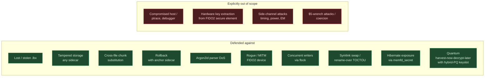
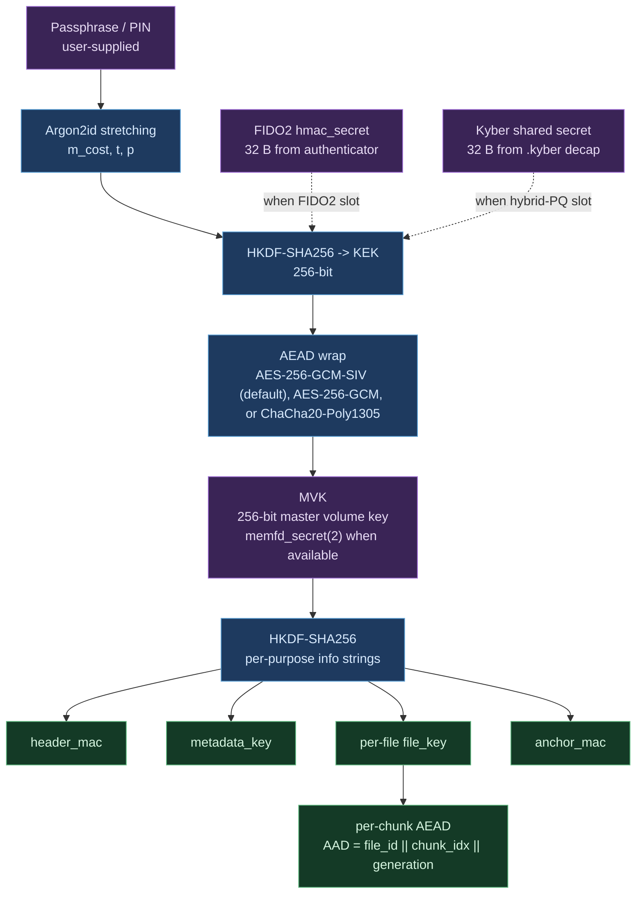
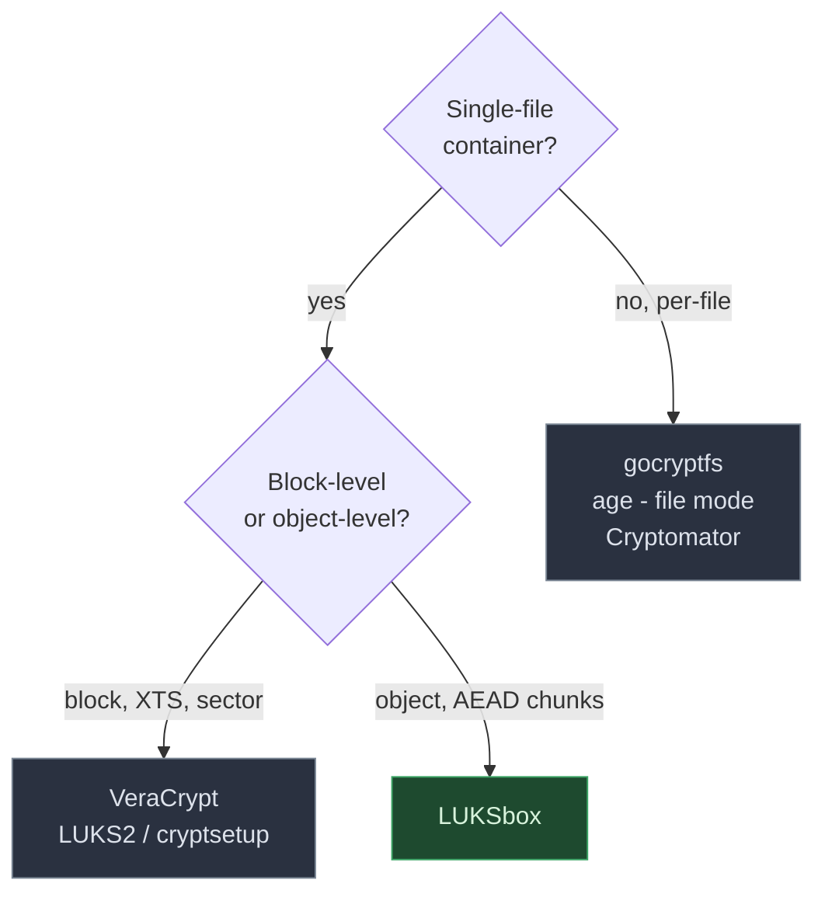
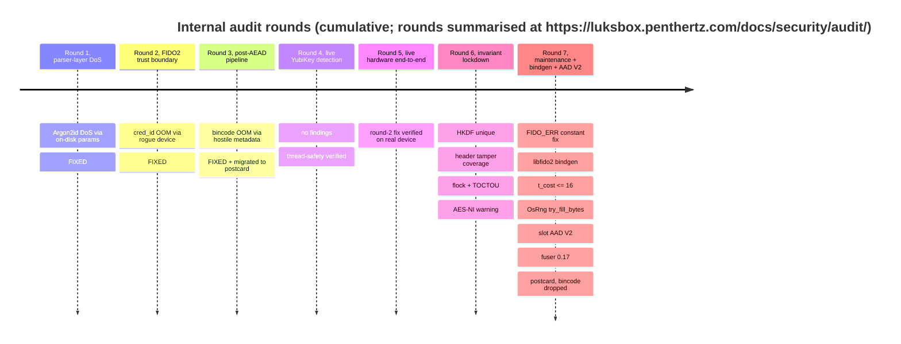
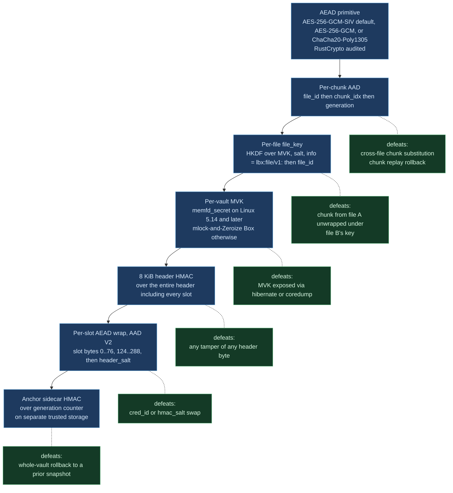

# LUKSbox, Project Overview

> A position paper. Why we built LUKSbox, what it defends against,
> and how it compares to existing offline encrypted-vault tools.

**Author:** Sébastien Dudek, Penthertz
**Status:** pre-release
**Audience:** prospective users, security reviewers, decision-makers
choosing between offline encrypted-vault tools

---

## 1. TL;DR

LUKSbox is an **offline encrypted-vault tool**: take a directory tree,
put it inside a single `.lbx` file, retrieve it later with a
passphrase, a hardware authenticator (FIDO2 / YubiKey), or both,
optionally with **post-quantum** key encapsulation so the vault stays
confidential even against an adversary recording today's ciphertexts
in the hope of decrypting them with a future quantum computer.

Three properties we care about that existing tools partially miss:

1. **Defense in depth across every authentication surface.** Slot
   AEAD covers the cred_id and hmac_salt fields too, not just the
   keyslot AAD prefix. Header HMAC covers the whole 8 KB header.
   Per-chunk AEAD authenticates `(file_id || chunk_idx || generation)`
   so cross-file substitution and rollback are caught.
2. **Hybrid post-quantum out of the box.** ML-KEM-768 / ML-KEM-1024
   (FIPS 203) combined with the classical KEK via HKDF, both halves
   required to unlock. Targets the harvest-now-decrypt-later threat,
   not just "PQ in the brochure."
3. **Operational honesty.** Documented threat model, documented
   gaps, audit log in-tree. No marketing-grade claims; what's tested
   is what the docs say is tested.

---

## 2. Threat model snapshot

LUKSbox is designed to defend against the items on the left, and is
explicit about everything on the right.



The full threat model with test-name citations lives in
[`SECURITY.md`](../SECURITY.md) Sec.3.

---

## 3. Cryptographic construction

### 3.1 Key hierarchy



Every subkey is derived from the MVK with a **distinct HKDF info
string**, the `hkdf_info_strings_are_pairwise_unique` regression
test enforces that none collide and none is a prefix of another
(round 6 audit).

### 3.2 KEK derivation, by keyslot kind

The wrap-key (KEK) is derived from the user's authentication
material. The notation in this section uses three inputs (each is a
byte string):

- `P` = the passphrase bytes the user typed
- `H` = the FIDO2 hmac-secret output, 32 bytes returned by the
  authenticator's CTAP2 `getAssertion` call
- `K` = the ML-KEM shared secret, 32 bytes obtained by decapsulating
  the `.hybrid` sidecar's ciphertext against the user's `.kyber`
  seed file

In every line below, `||` denotes byte concatenation; HKDF and
Argon2id are the standard RustCrypto-backed primitives; `salt` is
per-slot and stored alongside the slot's parameters.

**Passphrase only.**

```
KEK = Argon2id(P, salt, m_cost, t_cost, p_cost)
```

**FIDO2 wrap mode** (passphrase optional second factor).

```
KEK = Argon2id("lbx:fido" || P || H, salt)
```

**FIDO2 direct mode** (no wrap; MVK derived purely from the device).

```
MVK = HKDF-SHA256(ikm = H, salt = salt, info = "lbx:mvk-fido/v1")
```

This mode has **no wrapped MVK on disk**. Lose the device, lose the
vault. The trade-off is: there is nothing for an offline brute-force
attacker to grind on, because there is no Argon2id-stretched
passphrase to attack.

**Hybrid passphrase + ML-KEM-768/1024.**

```
KEK = HKDF-SHA256(
    ikm  = Argon2id(P) || K,
    salt = salt,
    info = "lbx:hybrid-kek/v1",
)
```

**Hybrid FIDO2 + ML-KEM-768/1024.** This hybrid closes the actual
post-quantum gap. ECDH-P256 inside CTAP2 is the only asymmetric
primitive on the FIDO2 wire and is quantum-recoverable from sniffed
USB-HID traffic by a CRQC adversary; mixing in `K` means the
recorded transport does not help the adversary on its own.

```
KEK = HKDF-SHA256(
    ikm  = H || K,
    salt = salt,
    info = "lbx:hybrid-fido-kek/v1",
)
```

The ML-KEM shared secret `K` always comes from decapsulating the
ciphertext stored in the `.hybrid` sidecar against the user's
`.kyber` seed file, kept on **separate trusted storage**.

### 3.3 Per-chunk AAD (the rollback / substitution defense)

Every chunk is encrypted with:

```
ct[i] = AEAD(
    key       = file_key,
    nonce     = nonce[i],
    aad       = file_id || i || g,
    plaintext = plaintext[i],
)
```

where `g` is the chunk's monotonic per-vault generation counter. A
chunk slot from file A cannot be moved to file B (different
`file_id` would not match the AAD), and an old version of a chunk
cannot be replayed (different `g` would not match). Tested in
`crates/luksbox-vfs/tests/security_invariants.rs`.

### 3.4 Slot AAD coverage + layout (V1 / V2 / V3)

Pre-V2 (audit round 6 noted this), the slot's AEAD AAD covered
offsets `0..76` of the slot bytes, kind, uuid, kdf_params,
kdf_salt, aead_nonce. The cred_id and hmac_salt fields lived at
`124..288` and were authenticated only by the header HMAC. V2
widens the slot AEAD AAD to also cover those fields:

```
aad_V2 = slot[0..76] || slot[124..288] || header_salt
```

V3 (current default) repurposes the previously-padding region
`288..512` to extend the cred_id capacity from 128 to 352 bytes,
accommodating FIDO2 authenticators that produce cred IDs larger
than the typical YubiKey 64-byte case. Reported sizes: Google
Titan 288 bytes, SoloKey stateless mode 140 bytes; the exact
format varies per vendor and is not always publicly documented.
V3 layout: cred_id at offsets `128..480`, hmac_salt at `480..512`.
AAD scope expands to match:

```
aad_V3 = slot[0..76] || slot[124..512] || header_salt
```

Tampering cred_id or hmac_salt breaks the slot AEAD tag directly,
belt-and-suspenders against the header-HMAC layer. Per-slot byte at
offset 1 selects the AAD shape AND the on-disk layout; future
format extensions get a new version byte at the same location.
Existing V1/V2 vaults remain readable; new slots default to V3.

---

## 4. Comparison with existing tools

| Property                              | LUKSbox          | VeraCrypt           | LUKS2 / cryptsetup | age              | Cryptomator       | gocryptfs         |
|---------------------------------------|------------------|---------------------|--------------------|------------------|-------------------|-------------------|
| **Single-file vault**                 |               |                  | (with detached) |               | (per-file)     | (per-file)     |
| **Hardware-key support**              | FIDO2 (CTAP2)    | YubiKey HMAC-SHA1   | systemd-cryptenroll FIDO2 |        |                |                |
| **Post-quantum hybrid**               | ML-KEM-768/1024 |                | (LUKS3 planned) | [1]             |                |                |
| **Detached header**                   |               |                  |                 | n/a              |                |                |
| **Rollback detection (anchor)**       |               |                  |                 |               |                |                |
| **Per-chunk AEAD with replay AAD**    | (file_id||idx||gen, default GCM-SIV) | XTS (no AAD)    | XTS (no AAD)       | n/a              | per-chunk AES-GCM | per-chunk AES-GCM |
| **memfd_secret for MVK**              | (Linux >= 5.14)|                  | (kernel keyring)| n/a              |                |                |
| **Crash-safe master-key rotation**    |               |                  |                 | n/a              |                |                |
| **Open source**                       |               |                  |                 |               |                |                |
| **Pure memory-safe language**         | Rust          | C/C++            | C               | Go            | Java + JNI     | Go             |
| **`unsafe` Rust surface**             | 1,400 LOC [2]    | n/a                 | n/a                | n/a              | n/a               | n/a               |
| **Single-file format with mount**     | FUSE          | block device     | block device    |               | FUSE / Dokany  | FUSE           |
| **Audit log in-tree**                 | 7 rounds      | not in repo         | upstream papers    |               | external          | external          |

[1] age supports plugin-based PQ via `age-plugin-yubikey` and similar
external tooling, but no native ML-KEM hybrid.

[2] LUKSbox unsafe surface concentrated in three files: libfido2 FFI,
FUSE adapter, and `memfd_secret` allocator. Audited internally
(round 7B); external audit package ready in
the third-party FIDO2 FFI engagement scope package (available on request to `security@penthertz.com`).

### 4.1 Where each tool fits



LUKSbox sits in the same niche as VeraCrypt and LUKS2 (single-file
container, mountable filesystem, optional detached header), but with
**chunk-AEAD instead of XTS** and **PQ hybrids native**. The chunk-
AEAD choice has one small downside (8 % space overhead from the per-
chunk nonce + tag) and several upsides (replay detection,
substitution detection, no IV-reuse risk under writes that don't
align to sector boundaries).

### 4.2 The "PQ-ready" claim, made specific

| Adversary capability | Plain passphrase | FIDO2 (wrap) | FIDO2 (direct) | Hybrid passphrase + ML-KEM | Hybrid FIDO2 + ML-KEM |
|---|---|---|---|---|---|
| Offline brute-force the passphrase | exposed if weak | exposed if weak | n/a | exposed if weak | n/a |
| Steal the FIDO2 device | n/a | also need passphrase | vault is dead | n/a | also need .kyber |
| **Quantum-recover ECDH-P256 from sniffed CTAP2 traffic** | n/a | breaks the FIDO2 leg -> recovers KEK | breaks the FIDO2 leg -> recovers MVK | n/a (no FIDO2) | **does NOT break the KEK alone**, also needs .kyber |
| **Quantum-recover AES-256 via Grover** | breaks [1] | breaks | breaks | breaks [1] | breaks |
| Recover .kyber seed file | irrelevant | irrelevant | irrelevant | needed for hybrid mode | needed for hybrid mode |

[1] Grover's algorithm gives quadratic speed-up: AES-256 effective
strength against a quantum attacker is 128 bits. Not breakable by any
known timeline, but worth flagging.

The **only mode where a CRQC adversary's pre-recorded CTAP2 traffic
doesn't recover the vault key** is the bottom-right cell: hybrid
FIDO2 + ML-KEM.

---

## 5. Performance characterization

### 5.1 Methodology

Measured against `target/release/luksbox` on commit at the time of
writing, on:

| | |
|---|---|
| CPU | AMD Ryzen AI 9 HX 370 (Zen 5), 4 vCores allocated to the test VM |
| Hardware AES | Yes (`aes`, `pclmulqdq`, `vaes` flags present) |
| Memory | 16 GB available to VM |
| Storage | NVMe-backed virtual disk (host-mediated; not a true block device benchmark) |
| OS | Linux 6.17 |
| Build | `profile.release` with `lto=thin`, `codegen-units=1`, `opt-level=3` |
| Wall clock | `/usr/bin/time -f "%e"`; n=3-5 runs per cell, median reported |

Each timing run starts from a freshly-created vault (no warm cache);
the passphrase is provided via the `LUKSBOX_PASSPHRASE` env var so
prompt-time is excluded.

### 5.2 Unlock latency

Argon2id dominates every passphrase-bearing path. ML-KEM decap is
sub-millisecond; FIDO2 touches add operator-side variability and are
not represented here.

| KDF preset | Argon2id params | Unlock cost (median) |
|---|---|---|
| `interactive` (default) | 256 MiB, t=3, p=4 | **540 ms** |
| `moderate` | 512 MiB, t=4, p=4 | 870 ms |
| `sensitive` | 1 GiB, t=5, p=4 | **1.10 s** |

Hybrid-PQ overhead vs non-hybrid: **<1 ms** measured (within run
noise). The KEM step is 50-100 us of CPU; everything else is the
same Argon2id.

### 5.3 End-to-end I/O throughput

100 MB single-file `put` (encrypt + write) and `get` (decrypt + read)
on an `interactive`-KDF vault. Numbers include the per-operation
unlock cost (540 ms each, every CLI invocation re-unlocks).

| | AES-256-GCM (AES-NI) | ChaCha20-Poly1305 |
|---|---|---|
| `put` 100 MB total wall | **0.91-1.06 s** | **1.03-1.10 s** |
| `get` 100 MB total wall | **0.69-0.73 s** | **0.74-0.78 s** |
| `put` net (subtract unlock) | 0.40 s | 0.50 s |
| `get` net (subtract unlock) | 0.17 s | 0.22 s |
| Effective `put` throughput | **250 MB/s** | **200 MB/s** |
| Effective `get` throughput | **590 MB/s** | **455 MB/s** |

(Numbers above were measured before the GCM-SIV variant was added.
AES-256-GCM-SIV is 3-5 % slower than vanilla GCM on AES-NI hardware
because of the extra POLYVAL pass it does for nonce-misuse resistance.
A re-bench is on the post-Finding-1 punch list; rough expectation is
240 MB/s put / 560 MB/s get with SIV.)

A long-running mounted FUSE session amortizes the unlock across many
operations and shifts the bottleneck to disk + AEAD; on this machine
all three ciphers saturate the virtual disk before the CPU.

**AES-256-GCM-SIV** (RFC 8452) is the default for new vaults from the
Finding-1 audit patch onward. Same 12-byte nonce + 16-byte tag wire
shape as vanilla GCM, but nonce-misuse-resistant: a nonce collision
under the same key reveals only that two messages had identical
(nonce, AAD, plaintext) tuples, never the GHASH key or the XOR of
plaintexts. Closes the per-chunk birthday-bound concern at the cost
of 3-5 % AES-NI throughput.

**AES-256-GCM** is kept for compatibility with vaults created before
the audit patch, and as an explicit `--cipher gcm` option for users
who prefer the marginal throughput edge over the misuse-resistance.

**ChaCha20-Poly1305** is roughly 20-25 % slower on AES-NI hardware but
**constant-time on every platform**, right choice on older / minimal
CPUs. The startup-time AES-NI detector emits a one-line warning to
stderr when running on non-accelerated CPUs, recommending
`--cipher chacha`.

### 5.4 On-disk overhead

| | Size |
|---|---|
| Header (constant) | 8 KiB |
| Metadata region (v0.2.1+ default; configurable via `--metadata-size`) | 64 MiB |
| Per-chunk overhead (12 B nonce + 16 B AEAD tag) | **28 B per 4096 B plaintext** = 0.7 % |
| `.kyber` seed file (ML-KEM-768) | 122 B |
| `.kyber` seed file (ML-KEM-1024) | 123 B |
| `.hybrid` sidecar entry (ML-KEM-768) | 2.3 KB |
| `.hybrid` sidecar entry (ML-KEM-1024) | 3.1 KB |
| `.anchor` sidecar | 48 B |
| `.lbx.header-bak` sidecar (v0.2.1+, NOT in deniable vaults) | 8 KiB |
| `.lbx.meta-bak` sidecar (v0.2.1+, NOT in deniable vaults) | = metadata region size |

The two `*-bak` sidecars hold previous-good copies of the
critical regions for crash-safety recovery. They are absent on
deniable vaults to preserve the >=7.99 bits/byte entropy property
of the on-disk artefact set. For new v0.2.1+ vaults the total
crash-safety overhead is roughly **64 MiB + 8 KiB** alongside
the .lbx file; for upgraded v0.2.0 vaults the mirror tracks the
existing region size (typically 16 MiB).

#### Capacity guidance

The metadata region holds the encoded directory tree. With v5 the
inline chunk-ref spill threshold drops to 256 chunks per inode
(~1 MiB plaintext per file), so large files spill their chunk
lists to the data area and consume only a small inode stub in the
metadata blob. Practical encoded-size estimate: ~60-90 bytes per
inode plus ~30 bytes per directory entry. A 64 MiB region holds
roughly **500k typical-shape files** before approaching capacity.

LUKSbox emits a soft notification when the metadata region passes
75% (informational) or 90% (warning) usage: CLI users see the
message on stderr, GUI users get a one-shot toast. Once a
warning fires, options are:

1. `luksbox info <vault>` to inspect the current size.
2. Recreate the vault with a larger `--metadata-size` (up to the
   64 MiB cap) and `luksbox cp` content over.
3. Avoid storing very many tiny files; combine into archives
   where it makes sense.

Hard `MetadataBudgetExhausted` at 100% surfaces as ENOSPC at the
FUSE / WinFsp / FUSE-T layer so the OS file manager surfaces a
"no space left on device" error the user already understands.

#### Tested boundary (v0.2.1)

LUKSbox v0.2.1 has been ground-truth validated up to roughly
**30 GiB of stored content** with several thousand files via the
real FUSE mount path (create, write, mount, copy, unmount,
reopen, verify). The format is engineered for larger vaults but
that usage has not yet been explicitly tested.

A one-shot advisory fires when a vault file on disk crosses
30 GiB:

- CLI: a single eprintln from `Vfs::flush` ("vault on-disk size
  is beyond the tested boundary; please verify unlocks and
  report issues").
- GUI: a non-blocking toast surfaced via the same notification
  helper.

The advice is to close and reopen the vault periodically (the
v0.2.0 failure mode that motivated the durability fix was "vault
won't reopen after force-quit"; periodic reopens catch that
class early) and to report anomalies at
<https://github.com/PentHertz/LUKSbox/issues>. The boundary will
be raised in subsequent releases as more validated usage
accumulates.

---

## 6. Security: what's been done



Total automated test count at last run: **194** (on Linux/macOS, GUI
crate excluded since it has no automated tests). 9 fuzz harnesses,
30M+ iterations to date.

`cargo audit` on Linux/macOS: **zero** advisories, 0 vulns, 0
unsound, 0 unmaintained.

External audit: **not yet performed**. The handover package is ready
in the third-party FIDO2 FFI engagement scope package (available on request to `security@penthertz.com`), scope, threat model,
call graph, 30 invariants the auditor should verify, test entry
points, and the residual gaps that internal review can't credibly
close (notably formal lifetime/aliasing proofs of the 1,400 LOC of
unsafe Rust in the FIDO2 FFI and FUSE adapters).

---

## 7. Why it's secure: a structured argument

The argument is *not* "we use AES-256-GCM-SIV, so it's secure." That's
necessary but trivial. The argument is the **layered defense**,
each layer raises the bar an attacker must clear, and an attack must
defeat every layer it touches.



A successful attack on a LUKSbox vault must defeat **every** layer it
touches. The audit log walks each of these layers and proves (via
regression tests) that single-bit tampering at the relevant level is
caught.

---

## 8. Honest about what's not done

- **No third-party audit yet**, package ready, engagement not
  commissioned.
- **No reproducible builds, no signed releases**, operational
  pipeline work, not crypto work, but it matters for supply-chain
  trust.
- **No constant-time / side-channel verification on hardware**,
  `subtle::ConstantTimeEq` everywhere appropriate, no early-exit
  unlock loop, but unmeasured.
- **GUI master-key rotation is passphrase-only.** A "Rotate master
  key" button is now wired into the Keyslots view; the engine
  (`Container::begin_atomic_rotation` / `commit_atomic_rotation`)
  is the same as the CLI's. Vaults with FIDO2-wrap slots route to
  `luksbox rotate-mvk` (which delegates to the wizard's interactive
  multi-touch flow); FIDO2-direct and hybrid-PQ slots are
  un-rotatable in any UI today. The CLI command was rewired in this
  release to call the same wizard logic.
- **No plausible-deniability hidden volumes**, VeraCrypt's headline
  feature; LUKSbox does not implement it.
- **Yubico-only on the hardware test bench**, SoloKey, Nitrokey,
  Token2, OnlyKey, Google Titan all use libfido2 over USB-HID and
  *should* work, but are unverified. Documented in SECURITY.md Sec.5.

---

## 9. When LUKSbox is the right pick

**Yes**, choose LUKSbox if:

- You want a single-file encrypted vault for offline use
  (USB-stick, cloud-storage object, separate backup drive).
- You care about post-quantum protection of *today's* sensitive data
  (research data, journalism source files, healthcare records, legal
  files with a long confidentiality horizon).
- You have a YubiKey or other FIDO2 authenticator and want it to
  carry real cryptographic weight, not just be an unlock convenience.
- You want the rollback / substitution / TOCTOU defenses native, not
  bolted on by user practice.
- You're on Linux or macOS (Windows port exists but is less tested).

**No**, look elsewhere if:

- You need plausible-deniability hidden volumes -> VeraCrypt.
- You need full-disk encryption -> LUKS2 / cryptsetup.
- You need cloud-friendly per-file encryption with name obfuscation
  -> Cryptomator.
- You need a tiny single-binary tool for `gpg-style` per-file
  encryption with no filesystem semantics -> age.
- You can't accept a pre-release status, wait for v1.0 + a
  third-party audit.

---

## 10. Summary

LUKSbox is the answer to: *"give me a tool with the durability
properties of LUKS2 (audited primitives, hardware-key support,
detached headers, rotatable master key) but with PQ hybrids out of
the box and chunk-level AEAD that catches substitution and rollback
attacks, written in memory-safe Rust, with the audit log in-tree."*

It is **pre-release**. The cryptographic core has been internally
reviewed across 7 audit rounds and is in shape an external auditor
would call solid. The remaining work is operational (signed
releases, reproducible builds) and the third-party audit itself.

For more depth:

- [`SECURITY.md`](../SECURITY.md), threat model, what's defended, what isn't, operational guidance
- [the audit history on the website](https://luksbox.penthertz.com/docs/security/audit/), the audit log
- the third-party FIDO2 FFI engagement scope package (available on request to `security@penthertz.com`), external-auditor handover package
- [`README.md`](../README.md), install + quick start
- [`DEVELOPMENT.md`](../DEVELOPMENT.md), maintainer reference

---

## 11. Reverse-engineering resistance

### 11.1 What anti-RE is, and what it isn't

> The cryptographic security of LUKSbox **does not depend on the
> binary being hard to reverse-engineer.** All cryptographic
> primitives, key derivation paths, and on-disk formats are public.
> A determined attacker with the binary, the source, and unlimited
> time learns *nothing about anyone's vault key*, that's the point
> of a Kerckhoffs-compliant design.

What hardening the binary *does* buy:

- **Friction for casual analysts**, security researchers, threat
  intel pulling samples, decompiler-only "review my malware" sites.
- **Smaller attack-surface signal in the binary**, fewer named
  symbols means less for `binwalk`/`strings`/`Ghidra` autonames to
  point at. Useful when the binary is dropped on a forensics image.
- **Reduced panic-message leakage**, Rust release builds keep
  panic strings (`called \`Result::unwrap()\` on an \`Err\` value`,
  filename, line number). Disabling unwind tables removes these.
- **Slightly harder symbolic execution**, heavier inlining +
  stripped symbols defeats trivial CFG recovery; doesn't defeat
  determined work.

What hardening the binary **does not** buy:

- Protection against an attacker who has the source (always: it's
  public).
- Protection against runtime memory inspection (ptrace, debugger,
  coredump). That class is already documented out-of-scope in
  SECURITY.md Sec.3.
- Defense against patched binaries (an attacker who can replace
  `luksbox` on the user's machine wins by definition).

### 11.2 Concrete defaults, `profile.release-hardened`

Shipped in `Cargo.toml` as a separate profile so day-to-day
`cargo build --release` stays debug-friendly:

```toml
[profile.release-hardened]
inherits = "release"
lto = "fat"
codegen-units = 1
opt-level = 3
panic = "abort"
strip = "symbols"
debug = false
overflow-checks = false
incremental = false
```

Build:

```bash
cargo build --profile release-hardened -p luksbox-cli
ls -la target/release-hardened/luksbox
```

What each flag buys, in priority order:

| Flag | Effect on a reverse-engineer |
|---|---|
| `panic = "abort"` | Removes unwind metadata + most embedded panic strings. The binary loses 50-200 KB of `.eh_frame` and `panic_str` segments that Ghidra/IDA otherwise auto-name as `panic_at(file, line)` cross-references. |
| `strip = "symbols"` | Drops the symbol table entirely. `nm` returns nothing. Function-boundary recovery requires CFG analysis on the raw text section. |
| `debug = false` | No DWARF, Ghidra's "Import DWARF" pass is a no-op. The disassembly has no source-line correlation. |
| `lto = "fat"` | Aggressive cross-crate inlining: per-crate function boundaries disappear into one giant inlined main. Defeats simple "find `luksbox_core::keyslot::wrap_mvk`" attacks. |
| `codegen-units = 1` | Better dead-code elimination + harder static analysis (no per-CGU artefacts to diff). |
| `incremental = false` | Deterministic build, supports reproducible-builds workflow (also valuable for supply-chain trust). |

### 11.3 Beyond release-profile flags

Things we considered and the reasoning for each:

| Technique | Status | Why |
|---|---|---|
| `cargo-auditable` (embed SBOM in the binary) | **recommended** | Adds 50 KB of metadata describing every dep version. Helpful for triage when an advisory drops; trivially stripped by an attacker who cares but useful in honest hands. Add `cargo install cargo-auditable && cargo auditable build --profile release-hardened`. |
| String obfuscation (`obfstr`) | **deferred** | Hides string literals from `strings`. We don't have any sensitive strings, no embedded test-vector keys, no API endpoints. Marginal anti-RE gain. |
| Anti-debugging (`ptrace(PTRACE_TRACEME)` self-trace) | **rejected** | Trivially patched out. Confuses legitimate ops (`strace`, `gdb` for SIGSEGV diagnostics). Would harm users more than attackers. |
| Anti-VM detection | **rejected** | Same reasoning. Plus: many users (CI, sandboxes, virtualized desktops) ARE in VMs. |
| Custom packer / runtime decryptor | **rejected** | Would require a non-encrypted-but-shipped key; security theatre. Patched in 30 minutes by anyone with `unlhq` or similar. |
| `tinyrick`-style control-flow flattening | **deferred** | Requires LLVM passes we don't ship. The Rust ecosystem doesn't have a maintained CFG-flattener. Could be revisited if a need emerges. |
| Statically link libfido2, libfuse, openssl | **planned for v1.0** | Removes the `.so`-name leak in dynamic-link tables. Bigger binary (+5-8 MB) but fewer external surfaces in the import table. |
| `cargo-bloat` audit before each release | **recommended** | Flags unexpectedly-large symbols (often points at debug-string leaks our flags missed). |
| Reproducible builds via `crane`/Nix | **roadmap** | Not anti-RE per se, but supports the audit chain. Documented as a v1.0 requirement in SECURITY.md Sec.6. |

### 11.4 What still leaks

Be honest. Even with `release-hardened` + `cargo auditable` + a
static-link build, the following are visible to a patient analyst:

- The set of **call signatures into libc** (`open`, `read`, `write`,
  `mmap`, `getrandom`, `flock`, `unlink`, `fork`, ...) is intrinsic to
  the syscall traces and can't be hidden.
- The **AEAD nonce + tag layout per chunk** (12 + 16 = 28 bytes) is
  observable on any decrypted-then-re-encrypted file.
- **String constants** that genuinely need to be in the binary,
  HKDF info strings (`"lbx:file/v1:"`, `"lbx:hybrid-kek/v1"`,
  `"LBM\x02"`, etc.) are required for cryptographic
  domain-separation, by design. They tell an analyst nothing about
  any vault's key.
- **The fact that the binary uses ML-KEM-768/1024**, visible from
  the ml-kem crate's exported symbols even after stripping (the
  RustCrypto codebase doesn't compile-time-name-mangle for
  obfuscation).

### 11.5 Cumulative effect

A `release-hardened` build of `luksbox` is roughly comparable to a
`/MTd /O2 /GS-` MSVC build of a stripped C++ project plus
`cargo-auditable`'s SBOM annotation: not impenetrable, but enough to
make casual reverse engineering a meaningful chore. Determined
analysts will still get there, but they get nothing that matters,
because the cryptographic security argument is independent of the
binary being a black box.
