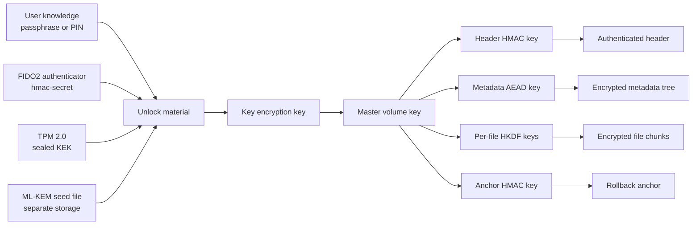
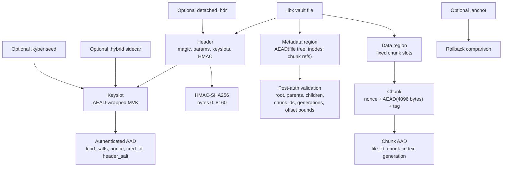
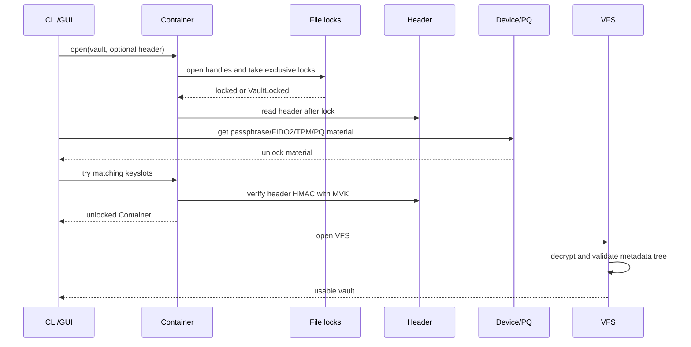

# LUKSbox security architecture

Status: 2026-05-06.

This document is the security map for LUKSbox. It explains what is
protected, which mechanisms provide that protection, where attacks fail,
and which attacks can still succeed. It complements `docs/CRYPTO_SPEC.md`
and the public architecture page at https://luksbox.penthertz.com/docs/security/architecture/ (per-finding internal ground-truth catalogue is available on request).

LUKSbox is a local encrypted vault. It can protect data at rest against an
attacker who steals, copies, tampers with, or rolls back vault files. It does
not protect plaintext from malware, a hostile kernel, or a compromised user
session after the vault has been unlocked.

## 1. Trust boundaries

The Master Volume Key (MVK) is the root secret for the vault. Keyslots do
not encrypt file data directly; they only wrap the MVK. Once a valid keyslot
unwraps the MVK, LUKSbox derives separate subkeys for header HMAC,
metadata encryption, per-file encryption, and anchor authentication.

## 2. On-disk protection graph

Important properties:

- Header tampering is detected by HMAC after a keyslot unwraps the MVK.
- Keyslot tampering is detected by AEAD. The AAD covers slot type and all
  security-sensitive slot fields.
- Metadata is encrypted and authenticated, then structurally validated before
  use. Malicious authenticated metadata cannot wrap chunk offsets or create
  broken inode graphs.
- Chunks are encrypted independently. Chunk AAD binds each chunk to its file,
  position, and generation counter.
- Detached headers remove the visible vault header from the `.lbx`; without
  the sidecar, the vault file is random-looking data.

## 3. Unlock flow

The lock-before-read rule is security-relevant. A second process can no
longer read an old header before the first process enrolls or revokes a
keyslot, wait for the lock, and later persist stale keyslot state.

## 4. Concurrency and crash safety

```mermaid
flowchart LR
    Open["Container::open"] --> Lock["Exclusive lock on vault handle"]
    Lock --> ReadHeader["Read header only after lock"]
    ReadHeader --> Mutate["Enroll, revoke, metadata write, rotation"]
    Mutate --> Flush["flush file data"]
    Flush --> Fsync["fsync file"]
    Fsync --> Rename["atomic rename when replacing files"]
    Rename --> DirSync["fsync parent directory"]
    DirSync --> Durable["directory entry durable on POSIX"]
```

Current guarantees:

- One normal LUKSbox writer per vault path is allowed at a time.
- Detached-header opens lock both the vault file and the header sidecar.
- Atomic sidecar writes use owner-only temp files, fsync the temp file, rename
  into place, then fsync the parent directory on Unix.
- Inline MVK rotation writes to a rotating temp file, fsyncs it, renames it
  over the original vault, then fsyncs the parent directory.

Current limitation:

- Detached-header MVK rotation is still not a two-file atomic commit. A crash
  in detached-header rotation can leave the vault/header pair inconsistent.
  Back up the detached header before rotating in that mode.

## 5. Mechanism inventory

| Area | Mechanism | Security effect |
|---|---|---|
| Passphrases | Argon2id with bounded parameters | Slows offline guessing and rejects hostile KDF cost values |
| Key wrapping | AEAD over MVK with authenticated slot AAD | Slot field tampering becomes unlock failure |
| Header | HMAC-SHA256 under MVK-derived key | Header tampering becomes unlock failure |
| Metadata | AEAD plus post-auth tree validation | Tampering fails; malicious MVK-holder metadata cannot wrap offsets or panic VFS paths |
| File chunks | AEAD per 4096-byte chunk | Chunk tampering or substitution fails |
| Replay inside one current metadata tree | Chunk generation in AAD | Old chunk content cannot replace current chunk content at same position |
| Full rollback | Optional external anchor | Detects rollback only if anchor is not rolled back with the vault |
| FIDO2 | CTAP2 hmac-secret | Device secret stays inside authenticator |
| TPM | TPM sealed KEK | KEK can be bound to the local TPM and optional PIN |
| PQ hybrid | ML-KEM shared secret mixed into KEK derivation | Hybrid slots require the classical factor and PQ seed side |
| Filesystem permissions | 0600 files, 0700 created directories | Reduces accidental local multi-user exposure |
| Runtime memory | Zeroizing buffers and Linux `memfd_secret` where available | Reduces post-use memory disclosure, not a defense against a hostile kernel |

## 6. Attack scenarios

| Scenario | Can attacker succeed? | Expected outcome |
|---|---:|---|
| Steals `.lbx` and has no unlock factor | No practical success with strong factors | Header/keyslot brute force is the main path; Argon2id and hardware/PQ factors block it |
| Steals `.lbx` and user chose a weak passphrase | Possibly | Offline guessing can eventually find weak passphrases |
| Steals `.lbx` but not detached `.hdr` | No practical unlock path | The vault file lacks keyslots and header metadata |
| Steals `.lbx` and `.hdr`, but not FIDO2/TPM/PQ factor | No practical unlock path | Matching keyslot cannot derive the KEK |
| Tampers with header bytes | No plaintext; denial of service possible | HMAC or keyslot AEAD rejects |
| Tampers with metadata ciphertext | No plaintext; denial of service possible | Metadata AEAD rejects |
| Crafts authenticated metadata with huge chunk IDs | No | VFS rejects metadata before offset arithmetic is used |
| Substitutes chunks between files or positions | No | Chunk AAD binds file ID, chunk index, and generation |
| Replays one old chunk into current metadata | No | Generation mismatch makes AEAD fail |
| Rolls back the entire vault and data together | Yes, unless anchor is external and newer | Full rollback is not detectable without trusted external state |
| Rolls back vault while external anchor is newer | No | Anchor comparison reports rollback |
| Swaps `.hybrid` sidecar between vaults | No plaintext; denial of service possible | Binding and keyslot AEAD reject |
| Uses rogue FIDO2/TPM output | No plaintext | Wrong KEK fails AEAD |
| Opens same vault concurrently from two LUKSbox processes | No normal success | Second opener gets `VaultLocked` before header read |
| Power loss during atomic sidecar replacement | Old or new sidecar should survive on POSIX | Temp file and parent directory sync close the rename durability gap |
| Power loss during inline MVK rotation | Old or new vault should survive on POSIX | Rotation temp file is fsynced, renamed, and parent directory synced |
| Malware runs as the user after unlock | Yes | It can read plaintext through the mounted/accessed vault |
| Root/admin or hostile kernel inspects live process | Possibly | Memory hardening helps but cannot defeat the platform owner |
| Keylogger or screen recorder captures passphrase/PIN | Yes | Out of scope for cryptography |

## 7. Residual risks and operating rules

- Use high-entropy passphrases. Argon2id slows guessing; it does not make
  weak passphrases safe.
- Store detached headers, `.kyber` seed files, and `.anchor` files on media
  separate from the vault when using those features for separation or rollback
  protection.
- Treat an unlocked vault as plaintext available to the user session. Do not
  unlock on a compromised machine.
- Keep only one LUKSbox writer active per vault. The application enforces this
  for normal opens, but bypassing locks with `LUKSBOX_NO_LOCK=1` can corrupt
  the vault.
- Detached-header MVK rotation needs a future two-file commit protocol before
  it has the same crash guarantees as inline rotation.

## 8. Fixed in the 2026-05-06 security pass

- `Container::open` now locks vault/header handles before reading the header.
- After taking the lock, `Container::open` re-stats the path and rejects the
  open with `PathSubstituted` if the inode no longer matches the locked
  handle, closing the narrow open-then-lock substitution window.
- CLI FIDO2 unlock now passes `--header` through to detached-header opens.
- Atomic sidecar writes and inline MVK rotation now fsync the parent directory
  after rename on both Unix (via `sync_all` on a directory handle) and Windows
  (via `FILE_FLAG_BACKUP_SEMANTICS` + `sync_all` → `FlushFileBuffers`).
- VFS chunk offsets and MVK rotation chunk offsets use checked arithmetic.
- Authenticated metadata trees are validated for root/parent/child integrity,
  duplicate chunks, free-list sanity, generation sanity, and chunk offset bounds.
- VFS file, chunk, and generation counters fail cleanly instead of wrapping.
- `luksbox-fido2::is_windows_hello_path` is exported in no-default builds so
  the workspace can compile without the hardware feature.
- Secret-bearing intermediates along the MVK derivation chain are now
  consistently wrapped in `Zeroizing`: AEAD plaintext from keyslot unwrap,
  HKDF input/output buffers in all KEK derivations (TPM+FIDO2, hybrid PQ,
  hybrid TPM+PQ, hybrid TPM+FIDO2+PQ, FIDO2-derived MVK), the ML-KEM
  shared-secret destination buffer, and the CLI TPM-PIN copy. The TPM PIN
  is now passed by slice into `Auth::try_from` to skip an extra
  unzeroized `Vec<u8>` round-trip.
- Plaintext extraction (`luksbox get` / wizard / GUI) opens destination
  paths with `O_NOFOLLOW` on Unix, refusing pre-existing symlinks at the
  final component so an attacker who can pre-stage a symlink at the
  destination (e.g. `/tmp/output -> /etc/passwd`) cannot redirect the
  decrypted write into the symlink target.
